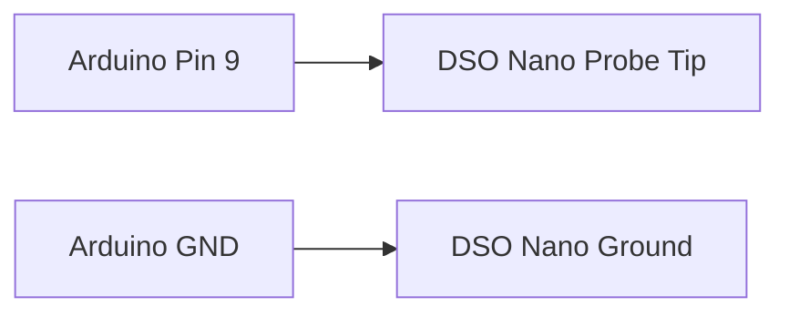
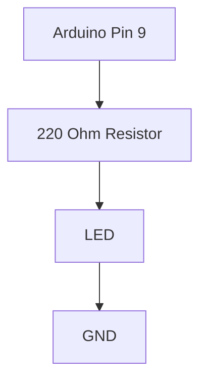

# Project 1 - PWM Fundamentals and Oscilloscope Measurements

## Prerequisites

Complete:

- 00_Introduction.md
- 00B_Oscilloscope_Familiarisation.md

---

# Objective

In this project you will learn:

- What PWM is
- How Arduino generates PWM
- How to use the DSO Nano oscilloscope
- Frequency
- Period
- Duty cycle
- Average voltage
- LED brightness control

This project introduces one of the most important concepts in modern electronics.

PWM is used in:

- LED dimmers
- DC motor drives
- Buck converters
- Boost converters
- Inverters
- Switching power supplies
- Control systems

---

# Learning Outcomes

At the end of this project you should be able to:

✅ Explain PWM

✅ Calculate duty cycle

✅ Measure frequency

✅ Measure period

✅ Use the DSO Nano

✅ Generate PWM using Arduino

✅ Explain how PWM controls power

---

# Theory

## What is PWM?

PWM stands for:

**Pulse Width Modulation**

Arduino cannot produce a true analog voltage.

Instead it switches rapidly between:

```text
0 V
```

and

```text
5 V
```

creating a square wave.

```text
5V ──────      ──────
         │      │
         │      │
0V ______│______│________
```

Although the signal is digital, the average energy delivered to a load can be continuously varied.

---

# Period

The period is the duration of one complete cycle.

Symbol:

$$
T
$$

Units:

- seconds (s)
- milliseconds (ms)
- microseconds (µs)

```text
<------ T ------>
```

```text
5V ──────
         │
         │
0V ______│______
```

---

# Frequency

Frequency is the number of cycles occurring per second.

$$
f = \frac{1}{T}
$$

Where:

- $f$ = Frequency (Hz)
- $T$ = Period (s)

### Example

If:

$$
T = 1 \text{ ms}
$$

Then:

$$
f = \frac{1}{0.001}
$$

$$
f = 1000 \text{ Hz}
$$

Or:

$$
f = 1 \text{ kHz}
$$

---

# Duty Cycle

Duty cycle describes how long a signal remains HIGH.

$$
D = \frac{T_{ON}}{T}
$$

Where:

- $D$ = Duty Cycle
- $T_{ON}$ = Time signal is HIGH
- $T$ = Total period

---

## 25% Duty Cycle

```text
5V ──
      │
      │
0V ___│__________
```

---

## 50% Duty Cycle

```text
5V ─────
         │
         │
0V ______│______
```

---

## 75% Duty Cycle

```text
5V ─────────
            │
            │
0V __________│__
```

---

# Average Voltage

The average output voltage of a PWM waveform is approximately:

$$
V_{AVG} = D \cdot V_S
$$

Where:

- $V_{AVG}$ = Average Voltage
- $D$ = Duty Cycle
- $V_S$ = Supply Voltage

### Example

Given:

$$
V_S = 5V
$$

and:

$$
D = 0.5
$$

Then:

$$
V_{AVG} = 0.5 \cdot 5
$$

$$
V_{AVG} = 2.5V
$$

---

# PWM on Arduino Uno

The Arduino function:

```cpp
analogWrite()
```

generates PWM.

Valid values:

```text
0 → 255
```

Examples:

| PWM Value | Approximate Duty Cycle |
|------------|------------|
| 0 | 0% |
| 64 | 25% |
| 128 | 50% |
| 192 | 75% |
| 255 | 100% |

For this experiment we will use:

```text
Pin 9
```

---

# Required Components

## SparkFun Inventor Kit

- Arduino Uno
- Breadboard
- LED
- 220 Ω resistor
- Jumper wires

## Equipment

- DSO Nano Oscilloscope

---

# Experiment 1 - Generate a PWM Signal

## Objective

Generate PWM and observe it with the DSO Nano.

---

# Wiring



---

# Arduino Code

```cpp
void setup()
{
    pinMode(9, OUTPUT);
}

void loop()
{
    analogWrite(9, 128);
}
```

---

# Why 128?

Arduino uses a PWM range of:

```text
0 to 255
```

Therefore:

$$
\frac{128}{255}
=
0.502
$$

which is approximately:

$$
50\%
$$

---

# DSO Nano Setup

Vertical Scale:

```text
2 V/div
```

Horizontal Scale:

```text
500 µs/div
```

Trigger:

```text
Edge
```

```text
Rising Edge
```

---

# Expected Waveform

```text
5V ─────      ─────
         │      │
         │      │
0V ______│______│______
```

---

# Measurements

## Frequency

Measure the PWM frequency.

Expected:

$$
f \approx 490 \text{ Hz}
$$

Record:

```text
Measured Frequency:
________________
```

---

## Period

Using:

$$
T = \frac{1}{f}
$$

Expected:

$$
T \approx 2 \text{ ms}
$$

Record:

```text
Measured Period:
________________
```

---

## Peak Voltage

Expected:

$$
V_{PEAK} \approx 5V
$$

Record:

```text
Measured Peak Voltage:
________________
```

---

# Experiment 2 - Duty Cycle Investigation

## Objective

Observe how duty cycle affects the PWM waveform.

---

## Test A

Upload:

```cpp
analogWrite(9, 64);
```

Expected duty cycle:

$$
\frac{64}{255}
\approx 25\%
$$

Observe waveform.

---

## Test B

Upload:

```cpp
analogWrite(9, 128);
```

Expected:

$$
50\%
$$

Observe waveform.

---

## Test C

Upload:

```cpp
analogWrite(9, 192);
```

Expected:

$$
75\%
$$

Observe waveform.

---

# Results Table

| PWM Value | Expected Duty Cycle | Measured Duty Cycle |
|------------|-------------------|---------------------|
| 64 | 25% | |
| 128 | 50% | |
| 192 | 75% | |
| 255 | 100% | |

---

# Experiment 3 - LED Brightness Control

## Objective

Use PWM to control LED brightness.

---

# Circuit



---

# Step 1

Upload:

```cpp
analogWrite(9, 64);
```

Observe brightness.

---

# Step 2

Upload:

```cpp
analogWrite(9, 128);
```

Observe brightness.

---

# Step 3

Upload:

```cpp
analogWrite(9, 192);
```

Observe brightness.

---

# Step 4

Upload:

```cpp
analogWrite(9, 255);
```

Observe brightness.

---

# Results Table

| PWM Value | Brightness |
|------------|------------|
| 64 | |
| 128 | |
| 192 | |
| 255 | |

---

# Why Does Brightness Change?

The LED is switching ON and OFF approximately:

$$
490 \text{ times per second}
$$

Your eyes cannot distinguish individual flashes.

Instead they perceive the average light output.

A higher duty cycle means:

- More ON time
- More delivered energy
- Higher brightness

---

# MATLAB Exercise

Plot average voltage versus duty cycle.

```matlab
D = 0:0.01:1;

Vavg = 5 .* D;

plot(D,Vavg,'LineWidth',2)

grid on

xlabel('Duty Cycle')
ylabel('Average Voltage (V)')

title('PWM Average Voltage')
```

---

# Expected Result

According to:

$$
V_{AVG} = D \cdot V_S
$$

the graph of average voltage versus duty cycle should be a straight line.

---

# Engineering Applications

PWM is used in:

## LED Dimmers

Control light intensity efficiently.

## Motor Controllers

Control speed.

## Buck Converters

Control output voltage.

## Switching Power Supplies

Improve efficiency.

## Control Systems

Drive actuators.

---

# Knowledge Check

## Question 1

What frequency did you measure?

Answer:

```text
____________________
```

---

## Question 2

What period did you measure?

Answer:

```text
____________________
```

---

## Question 3

What duty cycle corresponds to:

```cpp
analogWrite(9,128);
```

Answer:

```text
____________________
```

---

## Question 4

Why does PWM control LED brightness?

Answer:

```text
____________________
```

---

# Common Mistakes

## No Signal Visible

Check:

- Probe connection
- Ground connection
- Arduino uploaded successfully

---

## LED Does Not Light

Check:

- LED polarity
- Resistor
- Wiring

---

## Unstable Waveform

Check:

- Trigger settings
- Scope grounding

---

# Troubleshooting Checklist

✅ Arduino powered

✅ Sketch uploaded

✅ Probe on Pin 9

✅ Probe ground on GND

✅ Trigger enabled

✅ Correct time scale

✅ Correct voltage scale

---

# Project Summary

In this project you learned:

✅ Frequency

✅ Period

✅ Duty cycle

✅ PWM

✅ Average voltage

✅ Arduino PWM generation

✅ DSO Nano measurements

✅ LED brightness control

These concepts will appear repeatedly throughout the rest of this repository.

---

# Next Project

**02_RC_Circuits.md**

Topics:

- Capacitor Charging
- Capacitor Discharging
- Time Constants
- First-Order Systems
- Exponential Response
- Transient Measurements
