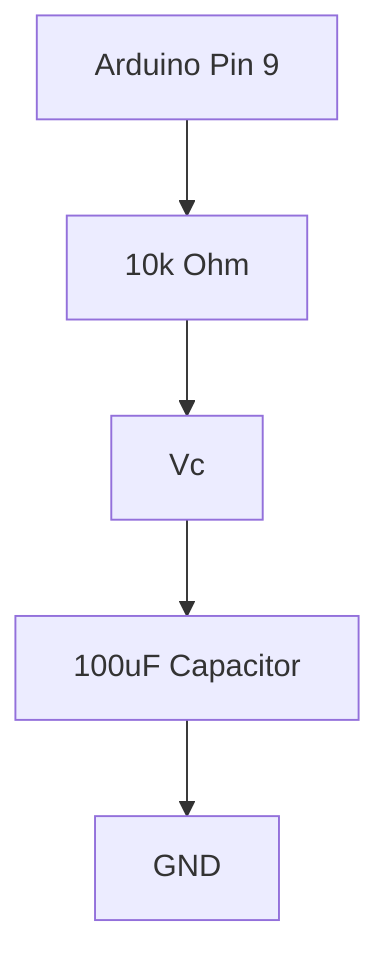

# Project 2 - RC Circuits and Time Constants

## Prerequisites

Complete:

- 00_Introduction.md
- 00B_Oscilloscope_Familiarisation.md
- 01_PWM_Fundamentals.md

---

# Objective

In this project you will learn:

- How capacitors work
- How capacitors charge and discharge
- What a time constant is
- How to calculate a time constant
- How to measure a time constant using the DSO Nano
- What a first-order system is
- How theory compares with real measurements

This is one of the most important projects in the entire course because it introduces **dynamic systems**.

Many real-world systems behave similarly:

- Batteries charging
- Temperature control
- Sensor filtering
- Control systems
- Buck converter output filters

---

# Learning Outcomes

At the end of this project you should be able to:

✅ Explain how a capacitor works

✅ Explain capacitor charging

✅ Explain capacitor discharging

✅ Calculate a time constant

✅ Measure a time constant

✅ Understand exponential responses

✅ Understand first-order systems

✅ Compare theory against measurements

---

# Theory

## What is a Capacitor?

A capacitor stores energy in an electric field.

Capacitor symbol:

```text
      ||
------||------
      ||
```

Unlike a resistor:

- A resistor dissipates energy.

A capacitor:

- Stores energy.
- Releases energy later.

---

# Capacitor Energy

The energy stored in a capacitor is:

$$
E = \frac{1}{2}CV^2
$$

Where:

- $E$ = Energy (J)
- $C$ = Capacitance (F)
- $V$ = Voltage (V)

---

# The RC Circuit

An RC circuit contains:

- One resistor
- One capacitor

Circuit:

```text
5V
 |
 |
 R
 |
 +------ Vc
 |
 C
 |
 |
GND
```

We will observe:

$$
V_C
$$

the voltage across the capacitor.

---

# Why Does the Capacitor Not Charge Instantly?

The resistor limits current.

This causes the capacitor voltage to increase gradually.

The capacitor therefore follows a smooth curve rather than an immediate jump.

---

# Capacitor Charging

When power is applied:

```text
0V -> 5V
```

the capacitor voltage rises exponentially.

Equation:

$$
V_C(t)=V_F\left(1-e^{-t/(RC)}\right)
$$

Where:

- $V_C(t)$ = Capacitor voltage at time $t$
- $V_F$ = Final voltage
- $R$ = Resistance
- $C$ = Capacitance
- $t$ = Time

---

# Capacitor Discharging

When the supply is disconnected:

$$
V_C(t)=V_0e^{-t/(RC)}
$$

Where:

- $V_0$ = Initial capacitor voltage

---

# Time Constant

The quantity:

$$
\tau = RC
$$

is called the:

**Time Constant**

This is one of the most important equations in electronics and control engineering.

---

# Physical Meaning of Time Constant

After:

$$
t = \tau
$$

the capacitor reaches:

$$
63.2\%
$$

of its final value.

---

# Charging Table

| Time | Charge Level |
|--------|--------------|
| 1τ | 63.2% |
| 2τ | 86.5% |
| 3τ | 95.0% |
| 4τ | 98.2% |
| 5τ | 99.3% |

After:

$$
5\tau
$$

the capacitor is considered fully charged.

---

# MATLAB Simulation

Before building the circuit, simulate the charging and discharging curves to predict what you will observe on the oscilloscope.

## Simulate Charging and Discharging

```matlab
R = 10000;
C = 100e-6;
tau = R * C;

t = 0:0.001:5;

% Charging: 0 to 5V
Vc_charge = 5 * (1 - exp(-t / tau));

% Discharging: 5V to 0V
Vc_discharge = 5 * exp(-t / tau);

figure;
subplot(2,1,1);
plot(t, Vc_charge, 'b', 'LineWidth', 2);
yline(3.16, 'r--', '63.2% = 3.16V');
xline(tau, 'k--', sprintf('\\tau = %.1fs', tau));
grid on;
xlabel('Time (s)'); ylabel('Voltage (V)');
title('RC Charging — R=10k\Omega, C=100\muF');
ylim([0 5.5]);

subplot(2,1,2);
plot(t, Vc_discharge, 'r', 'LineWidth', 2);
yline(5*0.368, 'b--', '36.8% = 1.84V');
xline(tau, 'k--', sprintf('\\tau = %.1fs', tau));
grid on;
xlabel('Time (s)'); ylabel('Voltage (V)');
title('RC Discharging — R=10k\Omega, C=100\muF');
ylim([0 5.5]);
```

## Simulate All Component Combinations

Compare how changing R and C affects the time constant:

```matlab
t = 0:0.001:2;

combinations = [
    10000, 100e-6;   % Experiment 1: baseline
    10000,  10e-6;   % Experiment 3: smaller C
     1000, 100e-6;   % Experiment 4: smaller R
];
labels = {'R=10k, C=100\muF (\tau=1.0s)', ...
          'R=10k, C=10\muF (\tau=0.1s)', ...
          'R=1k,  C=100\muF (\tau=0.1s)'};

figure; hold on;
for i = 1:3
    tau_i = combinations(i,1) * combinations(i,2);
    plot(t, 5*(1-exp(-t/tau_i)), 'LineWidth', 2, 'DisplayName', labels{i});
end
grid on;
xlabel('Time (s)'); ylabel('Capacitor Voltage (V)');
title('RC Charging — Component Comparison');
legend('Location','southeast');
```

## Prediction Table

Record your predicted time constants before measuring:

| R | C | Predicted τ |
|--------|--------|-------------|
| 10 kΩ | 100 µF | |
| 10 kΩ | 10 µF | |
| 1 kΩ | 100 µF | |

---

# Components Required

From the SparkFun Inventor Kit:

- Arduino Uno
- Breadboard
- Jumper wires
- 10 kΩ resistor
- 100 µF capacitor

Equipment:

- DSO Nano Oscilloscope

---

# Verify Component Values

Before building the circuit:

Resistor:

```text
10 kΩ
```

Capacitor:

```text
100 µF
```

---

# Capacitor Polarity

Electrolytic capacitors are polarized.

The negative lead is usually marked:

```text
-------
-------
-------
```

on the body.

Always connect:

```text
Negative Lead -> GND
```

---

# Calculate the Theoretical Time Constant

Given:

$$
R = 10000 \Omega
$$

and:

$$
C = 100\mu F
$$

Convert capacitance:

$$
100\mu F = 100 \times 10^{-6}F
$$

$$
C = 0.0001F
$$

Now calculate:

$$
\tau = RC
$$

$$
\tau = 10000 \times 0.0001
$$

Result:

$$
\tau = 1s
$$

---

# Prediction

After:

$$
1s
$$

the capacitor should reach:

$$
63.2\%
$$

of:

$$
5V
$$

---

# Calculate Expected Voltage at One Time Constant

Calculate:

$$
0.632 \times 5
$$

Result:

$$
V_C = 3.16V
$$

Prediction:

After:

$$
1s
$$

the capacitor voltage should be approximately:

$$
3.16V
$$

---

# Circuit



---

# Oscilloscope Connections

Probe Tip:

```text
Vc
```

Probe Ground:

```text
GND
```

---

# Physical Connection Diagram

```text
Arduino Pin 9
      |
     10kΩ
      |
      o---- Vc ---- Probe Tip
      |
    100uF
      |
     GND ---------- Probe Ground
```

---

# Experiment 1 - Observe Charging and Discharging

## Objective

Observe the capacitor charging and discharging.

---

# Arduino Code

```cpp
void setup()
{
    pinMode(9, OUTPUT);
}

void loop()
{
    digitalWrite(9, HIGH);

    delay(3000);

    digitalWrite(9, LOW);

    delay(3000);
}
```

---

# What Does This Program Do?

Pin 9 stays:

```text
HIGH for 3 seconds
```

then:

```text
LOW for 3 seconds
```

The capacitor therefore:

```text
Charges
```

and then:

```text
Discharges
```

continuously.

---

# DSO Nano Settings

Vertical Scale:

```text
1 V/div
```

Horizontal Scale:

```text
500 ms/div
```

Trigger:

```text
Rising Edge
```

---

# Expected Charging Curve

You should observe something similar to:

```text
5V |
   |          _______
   |       /
   |     /
   |   /
0V +-----------------
        Time
```

Notice:

- Fast initial rise
- Slower rise near the top

---

# Expected Discharging Curve

```text
5V |
   |\
   | \
   |  \
   |   \______
0V +-----------------
        Time
```

Notice:

- Fast initial drop
- Slower drop near the bottom

---

# Experiment 2 - Measure the Time Constant

## Objective

Verify the theoretical time constant.

---

# Step 1

Locate:

$$
V_C = 3.16V
$$

on the charging curve.

---

# Step 2

Measure the time required to reach this voltage.

---

# Prediction

The measured time should be approximately:

$$
1s
$$

---

# Results Table

| Parameter | Theory | Measurement |
|------------|----------|-------------|
| Resistance | 10kΩ | |
| Capacitance | 100µF | |
| Time Constant | 1.0s | |
| Voltage at τ | 3.16V | |

---

# Experiment 3 - Change the Capacitor

Replace:

```text
100 µF
```

with:

```text
10 µF
```

---

# Calculate New Time Constant

Convert:

$$
10\mu F = 10 \times 10^{-6}F
$$

$$
C = 0.00001F
$$

Calculate:

$$
\tau = RC
$$

$$
\tau = 10000 \times 0.00001
$$

$$
\tau = 0.1s
$$

---

# Prediction

The charging curve should be much faster.

---

# Results Table

| Capacitor | Time Constant |
|------------|---------------|
| 100µF | 1.0s |
| 10µF | 0.1s |

---

# Experiment 4 - Change the Resistor

Replace:

```text
10 kΩ
```

with:

```text
1 kΩ
```

Return capacitor to:

```text
100 µF
```

---

# Calculate

$$
\tau = RC
$$

$$
\tau = 1000 \times 0.0001
$$

$$
\tau = 0.1s
$$

---

# Prediction

The capacitor should charge much faster.

---

# Results Table

| Resistor | Time Constant |
|-----------|--------------|
| 10kΩ | 1.0s |
| 1kΩ | 0.1s |

---

# Understanding First-Order Systems

An RC circuit is called a:

**First-Order System**

because it contains only:

```text
One energy storage element
```

The capacitor.

Many real systems can be approximated by:

$$
G(s)=\frac{K}{\tau s + 1}
$$

where:

- $K$ = Gain
- $\tau$ = Time constant

We will revisit this equation many times throughout the course.

---

# MATLAB Comparison

Now overlay your measured time constant against the theoretical curve.

## Enter Your Measured Time Constant

From Experiment 2, record the time at which Vc reached 3.16V:

```matlab
R = 10000;
C = 100e-6;
tau_theory = R * C;          % theoretical: 1.0s
tau_measured = 1.0;          % replace with your measured value (s)

t = 0:0.001:5;

Vc_theory   = 5 * (1 - exp(-t / tau_theory));
Vc_measured = 5 * (1 - exp(-t / tau_measured));

figure; hold on;
plot(t, Vc_theory,   'b--', 'LineWidth', 2, 'DisplayName', ...
    sprintf('Theory  \\tau = %.3fs', tau_theory));
plot(t, Vc_measured, 'r',   'LineWidth', 2, 'DisplayName', ...
    sprintf('Measured \\tau = %.3fs', tau_measured));
yline(3.16, 'k:', '63.2% threshold');
grid on;
xlabel('Time (s)'); ylabel('Capacitor Voltage (V)');
title('RC Charging — Theory vs Measurement');
legend('Location','southeast');
```

## Reflection

- Does your measured τ match the theoretical value?
- If not, what could explain the difference? (component tolerances, contact resistance, oscilloscope probe loading)
- How close is close enough for an engineering application?

---

# Engineering Applications

RC circuits are used in:

## Filters

Remove noise.

---

## Sensors

Condition signals.

---

## Timing Circuits

Create delays.

---

## Power Electronics

Reduce voltage ripple.

---

## Control Systems

Model first-order dynamics.

---

# Knowledge Check

## Question 1

What is a time constant?

Answer:

```text
______________________
```

---

## Question 2

What voltage should the capacitor reach after one time constant when charging to 5V?

Answer:

```text
______________________
```

---

## Question 3

What happens when capacitance increases?

Answer:

```text
______________________
```

---

## Question 4

What happens when resistance increases?

Answer:

```text
______________________
```

---

## Question 5

Why is an RC circuit considered a first-order system?

Answer:

```text
______________________
```

---

## Question 6

Your MATLAB simulation predicted τ = 1.0s but you measured τ = 1.15s. Name two physical reasons that could explain this discrepancy.

Answer:

```text
______________________
```

---

# Common Mistakes

## Capacitor Connected Backwards

Check polarity carefully.

---

## Flat Line On Oscilloscope

Check:

- Probe location
- Ground connection
- Arduino code

---

## Time Constant Not Matching

Check:

- Actual resistor value
- Capacitor tolerance
- Scope time scale

---

# Troubleshooting Checklist

✅ Capacitor polarity correct

✅ Probe connected to Vc

✅ Probe ground connected to GND

✅ Arduino powered

✅ Sketch uploaded

✅ DSO Nano set to approximately 500 ms/div

✅ Trigger enabled

---

# Project Summary

In this project you learned:

✅ Capacitor operation

✅ Energy storage

✅ RC circuits

✅ Exponential charging

✅ Exponential discharging

✅ Time constants

✅ First-order systems

✅ DSO Nano transient measurements

✅ MATLAB modelling

These concepts provide the foundation for:

- Transfer functions
- Control systems
- Filters
- Converter output stages
- PI/PID tuning

---

# Next Project

**03_RLC_Circuits.md**

Topics:

- Inductors
- Resonance
- Ringing
- Natural Frequency
- Damping Ratio
- Second-Order Systems
- Oscillatory Response
