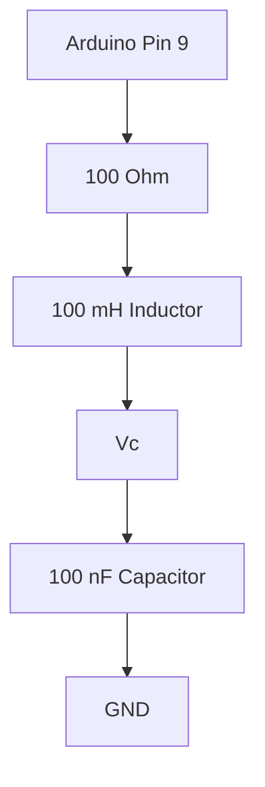

# Project 3 - RLC Circuits, Resonance and Second-Order Systems

## Prerequisites

Complete:

- 00_Introduction.md
- 00B_Oscilloscope_Familiarisation.md
- 01_PWM_Fundamentals.md
- 02_RC_Circuits.md

---

# Objective

In this project you will learn:

- How inductors work
- How energy moves between inductors and capacitors
- What resonance is
- What ringing is
- What natural frequency is
- What damping is
- How second-order systems behave
- How to measure oscillations using the DSO Nano

This project marks the transition from first-order systems to second-order systems.

These concepts are fundamental to:

- Control theory
- PID controllers
- Motor control
- Buck converters
- Boost converters
- Inverters
- Filter design

---

# Learning Outcomes

At the end of this project you should be able to:

✅ Explain resonance

✅ Explain natural frequency

✅ Explain damping

✅ Observe ringing

✅ Estimate resonant frequency

✅ Understand second-order systems

✅ Compare theory, simulation and measurements

---

# Theory

## What is an Inductor?

An inductor stores energy in a magnetic field.

Symbol:

```text
----LLLL----
```

Unlike a capacitor which resists changes in voltage:

An inductor resists changes in current.

---

# Inductor Voltage Equation

The voltage across an inductor is:

$$
V_L = L \frac{di}{dt}
$$

Where:

- $V_L$ = Inductor Voltage
- $L$ = Inductance (H)
- $\frac{di}{dt}$ = Rate of change of current

---

# Inductor Energy

The energy stored in an inductor is:

$$
E = \frac{1}{2}LI^2
$$

Where:

- $E$ = Energy (J)
- $L$ = Inductance (H)
- $I$ = Current (A)

---

# Building an RLC Circuit

An RLC circuit contains:

- Resistor
- Inductor
- Capacitor

Together:

```text
R + L + C
```

---

# Circuit Diagram

```text
Vin
 |
 R
 |
 L
 |
 +----- Vc
 |
 C
 |
GND
```

---

# What Makes RLC Circuits Different?

In Project 2 the capacitor stored energy.

Now we have:

- Capacitor stores energy electrically
- Inductor stores energy magnetically

Energy can move back and forth between them.

This causes oscillation.

---

# Mechanical Analogy

An RLC circuit behaves similarly to a:

```text
Mass
Spring
Damper
```

system.

Equivalent model:

| Mechanical System | Electrical System |
|-------------------|-------------------|
| Mass | Inductor |
| Spring | Capacitor |
| Damper | Resistor |

This analogy appears frequently in control engineering.

---

# Second-Order Systems

An RC circuit is:

```text
First Order
```

because it has one energy storage element.

An RLC circuit is:

```text
Second Order
```

because it has two energy storage elements:

- Capacitor
- Inductor

---

# Governing Equation

The series RLC circuit obeys:

$$
L\frac{d^2i}{dt^2}
+
R\frac{di}{dt}
+
\frac{1}{C}i
=
0
$$

You do not need to solve this equation.

For now, it is enough to understand:

- It describes oscillation.
- It describes resonance.
- It describes damping.

---

# Natural Frequency

The most important property of an RLC circuit is its natural frequency.

Natural frequency is:

$$
\omega_n = \frac{1}{\sqrt{LC}}
$$

Where:

- $\omega_n$ = Natural Frequency (rad/s)
- $L$ = Inductance (H)
- $C$ = Capacitance (F)

---

# Converting to Hertz

To convert from radians per second to Hertz:

$$
f_n = \frac{\omega_n}{2\pi}
$$

Where:

- $f_n$ = Frequency (Hz)

---

# Example Calculation

Given:

$$
L = 100mH
$$

$$
L = 0.1H
$$

and:

$$
C = 100nF
$$

$$
C = 100 \times 10^{-9}F
$$

---

Calculate:

$$
\omega_n = \frac{1}{\sqrt{0.1 \cdot 100\times10^{-9}}}
$$

Result:

$$
\omega_n \approx 10000 \text{ rad/s}
$$

---

Convert to Hertz:

$$
f_n = \frac{10000}{2\pi}
$$

Result:

$$
f_n \approx 1591Hz
$$

---

# Damping

The resistor removes energy from the system.

This process is called:

```text
Damping
```

More resistance means:

```text
More damping
```

Less resistance means:

```text
Less damping
```

---

# Damping Ratio

The damping ratio is:

$$
\zeta = \frac{R}{2}\sqrt{\frac{C}{L}}
$$

Where:

- $\zeta$ = Damping Ratio

---

# Types of Response

## Underdamped

$$
\zeta < 1
$$

Characteristics:

- Oscillation
- Ringing
- Overshoot

---

## Critically Damped

$$
\zeta = 1
$$

Characteristics:

- Fastest non-oscillatory response

---

## Overdamped

$$
\zeta > 1
$$

Characteristics:

- No oscillation
- Slow response

---

# MATLAB Simulation

Before building the circuit, simulate the step response for each resistor value to predict what you will observe on the oscilloscope.

## Calculate Damping Ratios

```matlab
L = 0.1;
C = 100e-9;
wn = 1 / sqrt(L * C);
fn = wn / (2 * pi);

R_values = [47, 100, 470];

fprintf('Natural frequency: %.1f Hz\n', fn);
fprintf('%-8s %-12s %s\n', 'R (Ohm)', 'zeta', 'Response type');
for i = 1:3
    zeta = (R_values(i) / 2) * sqrt(C / L);
    if zeta < 1,     rtype = 'Underdamped';
    elseif zeta == 1, rtype = 'Critically damped';
    else,             rtype = 'Overdamped'; end
    fprintf('%-8d %-12.4f %s\n', R_values(i), zeta, rtype);
end
```

## Simulate Step Responses

```matlab
L = 0.1;
C = 100e-9;
R_values = [47, 100, 470];
labels   = {'R=47\Omega', 'R=100\Omega', 'R=470\Omega'};

t = 0:1e-6:3e-3;

figure; hold on;
for i = 1:3
    R = R_values(i);
    num = [1/C];
    den = [L, R, 1/C];
    G = tf(num, den);
    [y, ~] = step(G, t);
    plot(t * 1e3, y, 'LineWidth', 2, 'DisplayName', labels{i});
end
grid on;
xlabel('Time (ms)'); ylabel('Capacitor Voltage (V)');
title('RLC Step Response \mdash Damping Comparison');
legend('Location', 'northeast');
```

## Prediction Table

Record your predictions before measuring:

| R | Predicted ζ | Expected behaviour |
|-------|------------|--------------------|
| 47 Ω | | |
| 100 Ω | | |
| 470 Ω | | |

---

# Components Required

Additional components:

- 100 mH Inductor
- 100 nF Capacitor
- 100 Ω Resistor

Existing tools:

- Arduino Uno
- Breadboard
- Jumper wires
- DSO Nano Oscilloscope

---

# Circuit



---

# Probe Location

Probe Tip:

```text
Vc
```

Probe Ground:

```text
GND
```

---

# Physical Layout

```text
Arduino Pin 9
      |
    100Ω
      |
   100mH
      |
      o----- Vc ----- Probe Tip
      |
   100nF
      |
     GND ----- Probe Ground
```

---

# Experiment 1 - Observe Ringing

## Objective

Observe the oscillatory response of a second-order system.

---

# Arduino Code

```cpp
void setup()
{
    pinMode(9, OUTPUT);
}

void loop()
{
    digitalWrite(9, HIGH);
    delayMicroseconds(500);

    digitalWrite(9, LOW);
    delayMicroseconds(500);
}
```

---

# Why Use a Square Wave?

A square wave contains fast transitions.

These transitions excite the natural dynamics of the RLC circuit.

This allows us to observe resonance.

---

# DSO Nano Setup

Vertical:

```text
1 V/div
```

Horizontal:

```text
100 us/div
```

Trigger:

```text
Rising Edge
```

---

# Expected Waveform

Instead of a simple square wave you should observe:

```text
         /\_
        /   \_
       /      \_
______/         \____
```

This oscillation is called:

```text
Ringing
```

---

# Why Does Ringing Occur?

Energy is exchanged between:

```text
Capacitor
```

and

```text
Inductor
```

The resistor gradually removes energy.

As energy decreases:

- Oscillation decreases
- Ringing fades away

---

# Experiment 2 - Measure Resonant Frequency

## Objective

Estimate the natural frequency.

---

# Step 1

Zoom into the ringing waveform.

Try:

```text
50 us/div
```

if necessary.

---

# Step 2

Measure one oscillation period.

Record:

```text
Measured Period =
_____________
```

---

# Step 3

Calculate frequency.

Use:

$$
f = \frac{1}{T}
$$

Example:

If:

$$
T = 630\mu s
$$

Then:

$$
T = 0.00063s
$$

Result:

$$
f = \frac{1}{0.00063}
$$

$$
f \approx 1587Hz
$$

---

# Compare with Theory

Theoretical value:

$$
f_n \approx 1591Hz
$$

Measured value:

```text
_____________
```

---

# Results Table

| Parameter | Theory | Measured |
|------------|---------|-----------|
| L | 100mH | |
| C | 100nF | |
| fn | 1591Hz | |
| Ringing Observed | Yes | |

---

# Experiment 3 - Increase Damping

Replace:

```text
100 Ω
```

with:

```text
470 Ω
```

---

# Prediction

Higher resistance means:

- More damping
- Less ringing
- Faster energy dissipation

---

# Observe

Describe the waveform:

```text
_________________________________
```

---

# Results Table

| Resistance | Ringing |
|------------|----------|
| 100Ω | |
| 470Ω | |

---

# Experiment 4 - Reduce Damping

Replace:

```text
100 Ω
```

with:

```text
47 Ω
```

---

# Prediction

Lower resistance means:

- Less damping
- More oscillation
- Longer ringing

---

# Observe

Describe the waveform:

```text
_________________________________
```

---

# Results Table

| Resistance | Response |
|------------|-----------|
| 47Ω | |
| 100Ω | |
| 470Ω | |

---

# Understanding Overshoot

An underdamped system often exceeds its final value.

This is called:

```text
Overshoot
```

Typical waveform:

```text
Target
-------
       /\_
      /   \__
_____/       \____
```

Overshoot is extremely important in:

- PID control
- Servo systems
- Power converters

---

# MATLAB Comparison

Now overlay your measured resonant frequency against the theoretical simulation.

## Enter Your Measured Period

From Experiment 2, record the oscillation period you measured on the DSO Nano:

```matlab
L = 0.1;
C = 100e-9;
R = 100;

T_measured = 630e-6;         % replace with your measured period (s)
f_measured  = 1 / T_measured;
f_theory    = 1 / (2 * pi * sqrt(L * C));

fprintf('Theory  fn = %.1f Hz\n', f_theory);
fprintf('Measured fn = %.1f Hz\n', f_measured);
fprintf('Error = %.2f%%\n', 100 * abs(f_measured - f_theory) / f_theory);

% Overlay simulated vs measured-frequency waveforms
t = 0:1e-6:3e-3;

num_t = [1/C]; den_t = [L, R, 1/C];
G_theory = tf(num_t, den_t);
[y_theory, ~] = step(G_theory, t);

% Reconstruct waveform at measured frequency using same zeta
wn_m = 2 * pi * f_measured;
zeta = (R / 2) * sqrt(C / L);
den_m = [1, 2*zeta*wn_m, wn_m^2];
G_meas = tf([wn_m^2], den_m);
[y_meas, ~] = step(G_meas, t);

figure; hold on;
plot(t * 1e3, y_theory, 'b--', 'LineWidth', 2, 'DisplayName', ...
    sprintf('Theory  fn=%.0fHz', f_theory));
plot(t * 1e3, y_meas,   'r',   'LineWidth', 2, 'DisplayName', ...
    sprintf('Measured fn=%.0fHz', f_measured));
grid on;
xlabel('Time (ms)'); ylabel('Voltage (V)');
title('RLC Step Response \mdash Theory vs Measurement');
legend('Location', 'northeast');
```

## Pole Locations

Inspect the poles to understand stability and oscillation:

```matlab
R = 100; L = 0.1; C = 100e-9;
p = roots([L, R, 1/C]);
fprintf('Poles: %.1f %+.1fi  and  %.1f %+.1fi\n', ...
    real(p(1)), imag(p(1)), real(p(2)), imag(p(2)));
pzmap(tf([1/C], [L, R, 1/C])); grid on;
title('Pole-Zero Map');
```

## Reflection

- How close is your measured fn to the theoretical value?
- Are the poles real or complex? What does that tell you about the response?
- What would happen to the poles if you increased R to 470Ω?

---

# Engineering Applications

RLC systems appear in:

## Radio Tuners

Frequency selection.

---

## Filters

Signal processing.

---

## Buck Converters

Output filter dynamics.

---

## Boost Converters

Energy transfer systems.

---

## Motor Drives

Current loop behaviour.

---

## Control Systems

Second-order system models.

---

# Knowledge Check

## Question 1

What is resonance?

Answer:

```text
__________________________
```

---

## Question 2

What is natural frequency?

Answer:

```text
__________________________
```

---

## Question 3

What causes ringing?

Answer:

```text
__________________________
```

---

## Question 4

What happens when resistance increases?

Answer:

```text
__________________________
```

---

## Question 5

Why is an RLC circuit a second-order system?

Answer:

```text
__________________________
```

---

## Question 6

Your MATLAB simulation predicted fn = 1591 Hz but you measured fn = 1520 Hz. Name two physical reasons that could explain this discrepancy.

Answer:

```text
__________________________
```

---

# Common Mistakes

## No Ringing Visible

Check:

- Inductor value
- Capacitor value
- Horizontal scale

---

## Frequency Does Not Match Theory

Check:

- Component tolerances
- Measurement accuracy

---

## Unstable Display

Adjust:

```text
Trigger Level
```

or

```text
Time Base
```

---

# Troubleshooting Checklist

✅ Arduino powered

✅ Code uploaded

✅ Probe connected to Vc

✅ Probe ground connected to GND

✅ Correct component values

✅ DSO Nano triggering correctly

✅ Appropriate time scale selected

---

# Project Summary

In this project you learned:

✅ Inductor behaviour

✅ Energy storage

✅ Resonance

✅ Ringing

✅ Natural frequency

✅ Damping

✅ Overshoot

✅ Second-order systems

✅ Oscilloscope measurements of oscillatory systems

✅ MATLAB simulation of dynamic behaviour

These concepts form the foundation of:

- Transfer functions
- Pole-zero analysis
- Control theory
- PID tuning
- Buck converters
- Boost converters
- Inverters

---

# Next Project

**04_MOSFET_Fundamentals.md**

Topics:

- MOSFET operation
- Switching
- Gate control
- Power electronics
- PWM switching stages
- Foundations of DC-DC converters
