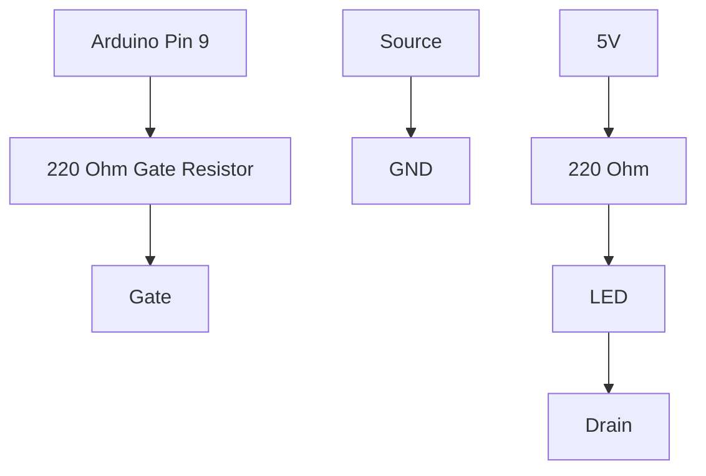

# Project 4 - MOSFET Fundamentals and Electronic Switching

## Prerequisites

Complete:

- 00_Introduction.md
- 00B_Oscilloscope_Familiarisation.md
- 01_PWM_Fundamentals.md
- 02_RC_Circuits.md
- 03_RLC_Circuits.md

---

# Objective

In this project you will learn:

- What a MOSFET is
- How a MOSFET works
- How Arduino controls a MOSFET
- Why MOSFETs are used in power electronics
- How PWM and MOSFETs work together
- How to use the DSO Nano to measure switching signals
- Why switching converters are efficient

This project marks the beginning of:

- Power electronics
- Motor drives
- Buck converters
- Boost converters
- DC-DC converters
- Inverters

---

# Learning Outcomes

At the end of this project you should be able to:

✅ Explain MOSFET operation

✅ Identify Gate, Drain and Source

✅ Use a MOSFET as a switch

✅ Drive a MOSFET from Arduino

✅ Measure PWM on the MOSFET gate

✅ Explain switching losses

✅ Understand the foundation of power electronics

---

# Theory

## What is a MOSFET?

MOSFET stands for:

**Metal Oxide Semiconductor Field Effect Transistor**

A MOSFET behaves like an electronic switch.

Instead of using your finger to open and close a switch:

```text
Arduino controls the switch electronically.
```

---

# Why MOSFETs Are Important

Imagine controlling:

- A DC motor
- An LED strip
- A Buck Converter
- A Power Supply

All require more current than Arduino can safely provide.

A MOSFET allows:

```text
Small Control Signal
        ↓
Large Power Control
```

---

# MOSFET Symbol

Simplified N-Channel MOSFET:

```text
       Drain
         |
         |
         |
Gate ----|
         |
         |
         |
       Source
```

---

# MOSFET Terminals

Every MOSFET has:

## Gate (G)

Control terminal.

Equivalent to:

```text
Switch Handle
```

---

## Drain (D)

Current enters here.

---

## Source (S)

Current exits here.

---

# How an N-Channel MOSFET Works

When:

$$
V_{GS}=0V
$$

MOSFET is:

```text
OFF
```

---

When:

$$
V_{GS}=5V
$$

MOSFET is:

```text
ON
```

Where:

$$
V_{GS}=V_G-V_S
$$

---

# Logic Level MOSFETs

For Arduino projects always use a:

```text
Logic Level MOSFET
```

Recommended:

- IRLZ44N
- IRLZ34N
- IRL540N
- AO3400

Avoid:

- IRFZ44N

for beginner Arduino projects.

---

# Why a MOSFET is Efficient

Power loss is:

$$
P = V \cdot I
$$

When the MOSFET is OFF:

$$
I \approx 0
$$

Therefore:

$$
P \approx 0
$$

---

When the MOSFET is ON:

$$
V \approx 0
$$

Therefore:

$$
P \approx 0
$$

---

This is why switching devices are efficient.

---

# Components Required

## Purchase

Recommended:

```text
IRLZ44N MOSFET
```

---

## Existing Components

From SparkFun Inventor Kit:

- Arduino Uno
- LED
- 220 Ω resistor
- Breadboard
- Jumper wires

Equipment:

- DSO Nano Oscilloscope

---

# Verify MOSFET Pinout

For an IRLZ44N:

Front View:

```text
      _________
     |         |
     |         |
     |_________|

       | | |

       G D S
```

Always verify with the datasheet.

---

# Project Circuit

We will use the MOSFET as an electronic switch to control an LED.

---

# Circuit Diagram



---

# Simplified Wiring Diagram

```text
Arduino Pin 9
      |
     220Ω
      |
     Gate

     MOSFET

Drain ---- LED ---- 220Ω ---- 5V

Source ---------------- GND
```

---

# Understanding Current Flow

## MOSFET OFF

Gate:

$$
V_G = 0V
$$

Current:

$$
I = 0
$$

LED:

```text
OFF
```

---

## MOSFET ON

Gate:

$$
V_G = 5V
$$

Current flows.

LED:

```text
ON
```

---

# Experiment 1 - MOSFET as an Electronic Switch

## Objective

Switch an LED ON and OFF using a MOSFET.

---

# Arduino Code

```cpp
void setup()
{
    pinMode(9, OUTPUT);
}

void loop()
{
    digitalWrite(9, HIGH);

    delay(1000);

    digitalWrite(9, LOW);

    delay(1000);
}
```

---

# Expected Behaviour

The LED should:

```text
ON for 1 second

OFF for 1 second
```

continuously.

---

# DSO Nano Measurement

## Objective

Measure the gate voltage.

---

# Probe Location

Probe Tip:

```text
Gate
```

Probe Ground:

```text
GND
```

---

# DSO Nano Setup

Vertical:

```text
2 V/div
```

Horizontal:

```text
200 ms/div
```

Trigger:

```text
Rising Edge
```

---

# Expected Waveform

```text
5V ────────
           │
           │
0V ________│________
```

---

# Record Measurements

| Parameter | Expected | Measured |
|------------|-----------|-----------|
| Gate LOW | 0V | |
| Gate HIGH | 5V | |

---

# Experiment 2 - PWM Controlled MOSFET

## Objective

Control the MOSFET using PWM.

---

# Arduino Code

```cpp
void setup()
{
    pinMode(9, OUTPUT);
}

void loop()
{
    analogWrite(9,128);
}
```

---

# What Is Happening?

Arduino produces:

$$
50\%
$$

duty cycle PWM.

The MOSFET switches:

```text
ON

OFF

ON

OFF
```

approximately:

$$
490Hz
$$

---

# Probe Location

Measure:

```text
Gate Voltage
```

again.

---

# DSO Nano Setup

Vertical:

```text
2V/div
```

Horizontal:

```text
500 us/div
```

Trigger:

```text
Rising Edge
```

---

# Expected Waveform

```text
5V ─────      ─────
         │      │
         │      │
0V ______│______│______
```

---

# Record Measurements

| Parameter | Measured |
|------------|-----------|
| Frequency | |
| Duty Cycle | |
| Peak Voltage | |

---

# Experiment 3 - LED Brightness Control

## Objective

Use PWM to control LED brightness.

---

## Case 1

Upload:

```cpp
analogWrite(9,64);
```

Expected:

$$
25\%
$$

duty cycle.

LED should appear dim.

---

## Case 2

Upload:

```cpp
analogWrite(9,128);
```

Expected:

$$
50\%
$$

LED should appear moderately bright.

---

## Case 3

Upload:

```cpp
analogWrite(9,192);
```

Expected:

$$
75\%
$$

LED should appear bright.

---

## Case 4

Upload:

```cpp
analogWrite(9,255);
```

Expected:

$$
100\%
$$

LED should be fully ON.

---

# Results Table

| PWM Value | Duty Cycle | Brightness |
|------------|------------|------------|
| 64 | 25% | |
| 128 | 50% | |
| 192 | 75% | |
| 255 | 100% | |

---

# Why PWM Works

Average voltage is:

$$
V_{AVG}=D \cdot V_S
$$

Where:

- $D$ = Duty Cycle
- $V_S$ = Supply Voltage

Example:

$$
D=0.5
$$

and:

$$
V_S=5V
$$

Then:

$$
V_{AVG}=2.5V
$$

The LED receives less average power.

---

# Why Arduino Needs a MOSFET

Arduino output current is limited.

Typical safe current per pin:

```text
20 mA
```

Many loads require:

```text
Hundreds of milliamps

or

Several amps
```

A MOSFET allows Arduino to control these loads safely.

---

# Practical Example

Arduino:

```text
5V

20mA
```

controls

```text
12V

2A
```

motor via MOSFET.

---

# MATLAB Exercise

Plot average voltage versus duty cycle.

```matlab
D = 0:0.01:1;

Vavg = 5 .* D;

plot(D,Vavg,'LineWidth',2)

grid on

xlabel('Duty Cycle')
ylabel('Average Voltage (V)')

title('MOSFET PWM Control')
```

---

# Expected Result

The graph should be linear because:

$$
V_{AVG}=D \cdot V_S
$$

---

# Engineering Applications

MOSFETs are used in:

## LED Drivers

Adjust brightness.

---

## DC Motor Drives

Adjust speed.

---

## Buck Converters

Step voltage down.

---

## Boost Converters

Step voltage up.

---

## Inverters

Convert DC to AC.

---

## Solar Controllers

Battery charging and regulation.

---

# Knowledge Check

## Question 1

What does MOSFET stand for?

Answer:

```text
____________________
```

---

## Question 2

What are the three MOSFET terminals?

Answer:

```text
____________________
```

---

## Question 3

What controls the MOSFET?

Answer:

```text
____________________
```

---

## Question 4

Why are MOSFETs used in power electronics?

Answer:

```text
____________________
```

---

## Question 5

Why can't Arduino drive large motors directly?

Answer:

```text
____________________
```

---

# Common Mistakes

## LED Never Turns ON

Check:

- MOSFET pinout
- LED polarity
- Wiring

---

## MOSFET Gets Hot

Check:

- Correct MOSFET type
- Correct wiring

Use a logic-level MOSFET.

---

## No PWM Visible

Check:

- Trigger settings
- Probe location
- Arduino code

---

# Troubleshooting Checklist

✅ MOSFET orientation correct

✅ Shared ground between Arduino and MOSFET

✅ Probe on Gate

✅ Probe ground on GND

✅ Correct trigger settings

✅ Correct PWM signal measured

---

# Project Summary

In this project you learned:

✅ MOSFET operation

✅ Gate, Drain and Source

✅ Electronic switching

✅ PWM-controlled switching

✅ MOSFET efficiency

✅ How Arduino controls larger loads

✅ Foundations of power electronics

These ideas are the building blocks for:

- Motor controllers
- Buck converters
- Boost converters
- Inverters
- Switching power supplies

---

# Next Project

**05_PWM_Motor_Control.md**

Topics:

- DC Motor Fundamentals
- Open-Loop Speed Control
- PWM Motor Drives
- Motor Time Constants
- First-Order Motor Models
- Measuring Motor Response with the DSO Nano
