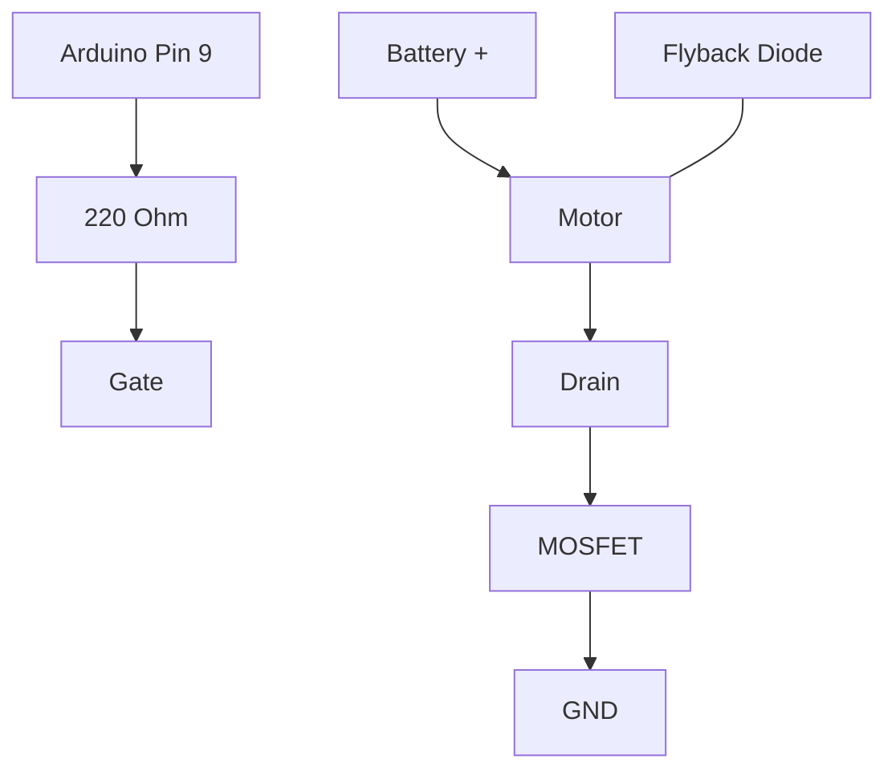

# Project 5 - PWM Motor Control and First-Order System Dynamics

## Prerequisites

Complete:

- 00_Introduction.md
- 00B_Oscilloscope_Familiarisation.md
- 01_PWM_Fundamentals.md
- 02_RC_Circuits.md
- 03_RLC_Circuits.md
- 04_MOSFET_Fundamentals.md

---

# Objective

In this project you will learn:

- How DC motors work
- How PWM controls motor speed
- How a MOSFET controls motor power
- What motor inertia is
- Why motors do not respond instantly
- What a first-order dynamic system is
- How to estimate motor time constants

This project bridges the gap between:

```text
Electronics
```

and

```text
Control Systems
```

The motor will become our first real-world dynamic plant.

---

# Learning Outcomes

At the end of this project you should be able to:

✅ Explain DC motor operation

✅ Control motor speed with PWM

✅ Drive a motor using a MOSFET

✅ Measure PWM signals using the DSO Nano

✅ Explain motor inertia

✅ Understand motor time constants

✅ Model a motor as a first-order system

---

# Theory

## What Is a DC Motor?

A DC motor converts:

```text
Electrical Energy
```

into:

```text
Mechanical Energy
```

When voltage is applied:

- Current flows through motor windings.
- A magnetic field is created.
- Torque is produced.
- The shaft begins to rotate.

---

# Simplified Motor Model

```text
Voltage
   |
   ↓
Current
   |
   ↓
Torque
   |
   ↓
Speed
```

---

# Why Doesn't a Motor Reach Full Speed Instantly?

Motors have:

```text
Mass
```

and

```text
Inertia
```

Just like a car cannot instantly accelerate from:

```text
0 mph
```

to

```text
70 mph
```

a motor cannot instantly reach maximum speed.

Instead speed rises gradually.

---

# Example Motor Response

```text
Speed

100% |           ________
     |         /
     |       /
     |     /
     |   /
   0 +---------------------
            Time
```

Notice how the response resembles the RC charging curve from Project 2.

---

# First-Order Motor Model

A DC motor can often be approximated by:

$$
G(s)=\frac{K}{\tau s+1}
$$

Where:

- $K$ = System Gain
- $\tau$ = Motor Time Constant

This is exactly the same form as the RC circuit studied previously.

---

# PWM Motor Control

PWM controls the average voltage applied to the motor.

Average voltage:

$$
V_{AVG}=D \cdot V_S
$$

Where:

- $D$ = Duty Cycle
- $V_S$ = Supply Voltage

---

# Example

Given:

$$
D=0.5
$$

and:

$$
V_S=5V
$$

Then:

$$
V_{AVG}=2.5V
$$

The motor receives less average voltage and therefore rotates more slowly.

---

# Why Use PWM Instead of a Resistor?

Resistor control wastes energy.

PWM control is much more efficient.

The MOSFET is either:

```text
Fully ON
```

or

```text
Fully OFF
```

which minimises power loss.

---

# MATLAB Simulation

Before building the circuit, simulate the motor's first-order step response and PWM voltage to predict what you will observe.

## First-Order Step Response — Effect of Time Constant

```matlab
K      = 1;
tau_values = [0.2, 0.5, 1.0, 2.0];   % range of plausible motor time constants
labels = {'\tau=0.2s','\tau=0.5s','\tau=1.0s','\tau=2.0s'};

t = 0:0.01:10;

figure; hold on;
for i = 1:4
    G = tf(K, [tau_values(i), 1]);
    [y, ~] = step(G, t);
    plot(t, y, 'LineWidth', 2, 'DisplayName', labels{i});
end
yline(0.632, 'k--', '63.2%');
grid on;
xlabel('Time (s)'); ylabel('Normalised Speed');
title('First-Order Motor Model \mdash Step Response');
legend('Location', 'southeast');
```

## PWM Average Voltage — Operating Points

```matlab
D    = 0:0.01:1;
Vavg = 5 .* D;

D_exp    = [0.25, 0.50, 0.75, 1.00];
Vavg_exp = 5 .* D_exp;

figure;
plot(D, Vavg, 'b', 'LineWidth', 2); hold on;
scatter(D_exp, Vavg_exp, 80, 'r', 'filled', 'DisplayName', 'Experiment points');
grid on;
xlabel('Duty Cycle'); ylabel('Average Motor Voltage (V)');
title('Motor Voltage vs Duty Cycle');
legend('Theory', 'Experiment points', 'Location', 'northwest');
```

## Prediction Table

Before running Experiment 4, estimate the motor time constant by looking at the simulation:

| Parameter | Predicted value |
|-----------|----------------|
| Motor time constant τ (s) | |
| Speed at 1τ (% of max) | 63.2% |
| Approximate settling time (5τ) | |

---

# Required Components

## Hardware

- Arduino Uno
- Breadboard
- Jumper Wires
- Logic-Level MOSFET (IRLZ44N recommended)
- DC Motor
- Flyback Diode (1N4001-1N4007)
- External Battery Pack

## Equipment

- DSO Nano Oscilloscope

---

# Important Safety Note

Never connect a motor directly to an Arduino output pin.

Motors can draw significantly more current than the Arduino can safely provide.

Always use:

```text
MOSFET Driver Circuit
```

---

# Why Is a Flyback Diode Needed?

Motors are inductive loads.

When current is interrupted, a high voltage spike can occur.

The flyback diode protects:

- Arduino
- MOSFET
- Other electronics

---

# Motor Driver Circuit



---

# Simplified Wiring Diagram

```text
Battery +
    |
    |
  Motor
    |
    |
 Drain

MOSFET

Source
    |
   GND

Arduino Pin 9
      |
    220Ω
      |
    Gate

Flyback Diode Across Motor
```

---

# Experiment 1 - Full-Speed Motor Control

## Objective

Turn the motor fully ON and OFF.

---

# Arduino Code

```cpp
void setup()
{
    pinMode(9, OUTPUT);
}

void loop()
{
    digitalWrite(9, HIGH);

    delay(3000);

    digitalWrite(9, LOW);

    delay(3000);
}
```

---

# Observation

Notice:

- Motor accelerates gradually.
- Motor decelerates gradually.

Unlike an LED:

```text
The response is not instantaneous.
```

---

# Questions

Why does speed increase slowly?

```text
________________________________
```

---

Why does speed decrease slowly?

```text
________________________________
```

---

# Experiment 2 - PWM Speed Control

## Objective

Control motor speed using PWM.

---

# Arduino Code

```cpp
void setup()
{
    pinMode(9, OUTPUT);
}

void loop()
{
    analogWrite(9,128);
}
```

---

# Expected Result

The motor should rotate at a lower speed than full power.

---

# DSO Nano Measurement

Probe Location:

```text
MOSFET Gate
```

Ground:

```text
Circuit Ground
```

---

# DSO Nano Settings

Vertical:

```text
2 V/div
```

Horizontal:

```text
500 us/div
```

Trigger:

```text
Rising Edge
```

---

# Expected Waveform

```text
5V ─────      ─────
         │      │
         │      │
0V ______│______│______
```

---

# Measurements

| Measurement | Expected |
|------------|----------|
| Frequency | ~490Hz |
| Gate Voltage | ~5V |
| Duty Cycle | ~50% |

---

# Experiment 3 - Speed Versus Duty Cycle

## Objective

Investigate the relationship between PWM and motor speed.

---

# Test 1

```cpp
analogWrite(9,64);
```

Expected:

$$
25\%
$$

Motor speed:

```text
Low
```

---

# Test 2

```cpp
analogWrite(9,128);
```

Expected:

$$
50\%
$$

Motor speed:

```text
Medium
```

---

# Test 3

```cpp
analogWrite(9,192);
```

Expected:

$$
75\%
$$

Motor speed:

```text
High
```

---

# Test 4

```cpp
analogWrite(9,255);
```

Expected:

$$
100\%
$$

Motor speed:

```text
Maximum
```

---

# Results Table

| PWM Value | Duty Cycle | Relative Speed |
|------------|------------|----------------|
| 64 | 25% | |
| 128 | 50% | |
| 192 | 75% | |
| 255 | 100% | |

---

# Experiment 4 - Motor Step Response

## Objective

Observe motor dynamics.

This experiment introduces:

```text
Control Theory
```

---

# Arduino Code

```cpp
void setup()
{
    pinMode(9, OUTPUT);
}

void loop()
{
    analogWrite(9,255);

    delay(5000);

    analogWrite(9,0);

    delay(5000);
}
```

---

# Observation

The motor speed should respond like:

```text
Speed

100% |          ________
     |        /
     |      /
     |    /
     |  /
0%  +---------------------
           Time
```

---

# Why?

The motor possesses:

- Inertia
- Mechanical friction
- Electromagnetic dynamics

These create a first-order response.

---

# Estimating A Time Constant

Observe:

```text
Motor Start
```

and estimate the time required to reach:

$$
63.2\%
$$

of final speed.

This estimated time is approximately:

$$
\tau
$$

the motor time constant.

---

# First-Order Comparison

## RC Circuit

$$
\tau = RC
$$

---

## Motor System

Motor time constant:

$$
\tau_m
$$

determined by:

- Rotor inertia
- Friction
- Motor electrical properties

---

# MATLAB Comparison

Now fit your measured step response to the first-order model using the time constant you estimated in Experiment 4.

## Enter Your Measured Time Constant

```matlab
K            = 1;
tau_measured = 0.5;      % replace with your estimated tau from Experiment 4 (s)

t = 0:0.01:5 * tau_measured * 3;

% Sweep nearby tau values to bracket your measurement
tau_theory_low  = tau_measured * 0.7;
tau_theory_high = tau_measured * 1.3;

G_low  = tf(K, [tau_theory_low,  1]);
G_mid  = tf(K, [tau_measured,    1]);
G_high = tf(K, [tau_theory_high, 1]);

[y_low,  ~] = step(G_low,  t);
[y_mid,  ~] = step(G_mid,  t);
[y_high, ~] = step(G_high, t);

figure; hold on;
plot(t, y_low,  'b--', 'LineWidth', 1.5, 'DisplayName', ...
    sprintf('\\tau = %.2fs (low)', tau_theory_low));
plot(t, y_mid,  'r',   'LineWidth', 2.5, 'DisplayName', ...
    sprintf('\\tau = %.2fs (measured)', tau_measured));
plot(t, y_high, 'b--', 'LineWidth', 1.5, 'DisplayName', ...
    sprintf('\\tau = %.2fs (high)', tau_theory_high));
yline(0.632, 'k:', '63.2% threshold');
xline(tau_measured, 'r:', sprintf('\\tau = %.2fs', tau_measured));
grid on;
xlabel('Time (s)'); ylabel('Normalised Speed');
title('First-Order Motor Model \mdash Measured \tau Fit');
legend('Location', 'southeast');
```

## Record Your Model Parameters

| Parameter | Value |
|-----------|-------|
| Estimated τ (s) | |
| Gain K | 1 (normalised) |
| Transfer function G(s) | K / (τs + 1) |

> Keep this table. Projects 6, 7 and 8 will use this motor model as the plant for P, PI and PID controller design.

## Reflection

- Does the simulated curve match the shape you observed on the motor?
- What physical factors determine the motor time constant?
- How would a heavier load (more inertia) change τ?

---

# Engineering Applications

PWM motor control is used in:

## Electric Vehicles

Motor speed control.

---

## Robotics

Wheel speed control.

---

## Drones

Propeller speed control.

---

## Industrial Automation

Conveyors and actuators.

---

## CNC Machines

Position and speed control.

---

# Knowledge Check

## Question 1

Why can't a motor reach full speed instantly?

Answer:

```text
________________________
```

---

## Question 2

What controls motor speed in this experiment?

Answer:

```text
________________________
```

---

## Question 3

Why is a flyback diode required?

Answer:

```text
________________________
```

---

## Question 4

Why is a MOSFET used?

Answer:

```text
________________________
```

---

## Question 5

Why can a motor often be modelled as a first-order system?

Answer:

```text
________________________
```

---

## Question 6

You estimated τ = 0.5s from the step response. How would you verify this estimate, and why does an accurate τ matter for designing the controller in Project 6?

Answer:

```text
________________________
```

---

# Common Mistakes

## Motor Doesn't Spin

Check:

- Battery connected
- MOSFET wiring
- Ground connections

---

## Arduino Resets

Check:

- Shared power supply issues
- Missing flyback diode

---

## MOSFET Gets Hot

Check:

- Logic-level MOSFET
- Wiring
- Motor current rating

---

## PWM Not Visible

Check:

- Scope connections
- Trigger settings
- Horizontal scale

---

# Troubleshooting Checklist

✅ Flyback diode installed

✅ Battery connected

✅ MOSFET pinout verified

✅ Shared ground between Arduino and motor supply

✅ DSO Nano probing gate correctly

✅ PWM observed

---

# Project Summary

In this project you learned:

✅ DC motor fundamentals

✅ PWM speed control

✅ MOSFET motor driving

✅ Flyback diode protection

✅ First-order dynamic behaviour

✅ Motor time constants

✅ Open-loop control

✅ DSO Nano motor measurements

The motor is the first real plant we will control.

In the next projects we will add:

```text
Feedback
```

and begin building true control systems.

---

# Next Project

**06_P_Controller.md**

Topics:

- Feedback
- Error Signals
- Open Loop vs Closed Loop Control
- Proportional Control
- BOE-Bot Line Following
- Controller Gain
- Stability
