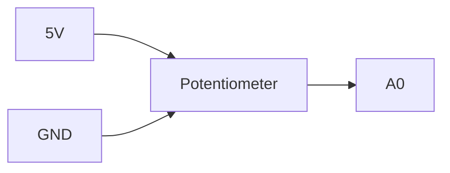

# Project 6 - Proportional Control (P Control) and Feedback Systems

## Prerequisites

Complete:

- 00_Introduction.md
- 00B_Oscilloscope_Familiarisation.md
- 01_PWM_Fundamentals.md
- 02_RC_Circuits.md
- 03_RLC_Circuits.md
- 04_MOSFET_Fundamentals.md
- 05_PWM_Motor_Control.md

---

# Objective

In this project you will learn:

- What feedback is
- What a control system is
- The difference between open-loop and closed-loop control
- What an error signal is
- How a proportional controller works
- How proportional gain affects system behaviour
- The limitations of proportional control

This project introduces the foundations of modern control engineering.

---

# Learning Outcomes

At the end of this project you should be able to:

✅ Explain feedback

✅ Explain open-loop control

✅ Explain closed-loop control

✅ Calculate an error signal

✅ Implement a proportional controller

✅ Tune proportional gain

✅ Understand steady-state error

✅ Explain why higher gain is not always better

---

# Theory

## What is a Control System?

A control system attempts to make a system behave in a desired manner.

Examples:

- Maintain motor speed
- Regulate converter voltage
- Control robot position
- Control room temperature

Every control system has:

```text
Reference
↓
Controller
↓
Plant
↓
Output
```

---

# Open-Loop Control

Open-loop control means:

```text
No Feedback
```

The controller sends commands without measuring the result.

Example:

```text
Apply 50% PWM to a motor
```

The controller assumes the motor behaves correctly.

---

# Open-Loop Block Diagram


---

# Problems with Open-Loop Control

Suppose a motor is running at:

```text
500 RPM
```

and an extra load is applied.

The speed drops to:

```text
300 RPM
```

The controller does not know this has happened.

Therefore:

```text
No correction occurs
```

---

# Closed-Loop Control

Closed-loop control uses:

```text
Feedback
```

The output is measured and returned to the controller.

The controller continuously compares:

```text
Desired Value
```

with

```text
Actual Value
```

---

# Closed-Loop Block Diagram


---

# Advantages of Feedback

Feedback can:

✅ Reduce error

✅ Improve accuracy

✅ Reject disturbances

✅ Improve repeatability

✅ Maintain performance despite varying conditions

---

# Reference Signal

The reference is the desired value.

Examples:

```text
Desired Speed

Desired Voltage

Desired Position

Desired Temperature
```

Symbol:

$$
r(t)
$$

---

# Output Signal

The output is the actual measured value.

Examples:

```text
Actual Speed

Actual Voltage

Actual Position

Actual Temperature
```

Symbol:

$$
y(t)
$$

---

# Error Signal

The error is the difference between the desired value and the measured value.

$$
e(t)=r(t)-y(t)
$$

Where:

- $e(t)$ = Error Signal
- $r(t)$ = Reference Signal
- $y(t)$ = Output Signal

---

# Example

Given:

$$
r=100
$$

and

$$
y=70
$$

Then:

$$
e=r-y
$$

$$
e=100-70
$$

$$
e=30
$$

---

# Proportional Control

The simplest controller is:

```text
P Controller
```

The controller output is proportional to the error.

---

# Proportional Control Equation

$$
u(t)=K_Pe(t)
$$

Where:

- $u(t)$ = Controller Output
- $K_P$ = Proportional Gain
- $e(t)$ = Error Signal

---

# Understanding Gain

The gain determines how strongly the controller reacts to error.

---

## Small Gain Example

Given:

$$
K_P=0.5
$$

and

$$
e=20
$$

Then:

$$
u=K_Pe
$$

$$
u=0.5 \cdot 20
$$

$$
u=10
$$

The controller responds gently.

---

## Large Gain Example

Given:

$$
K_P=5
$$

and

$$
e=20
$$

Then:

$$
u=5 \cdot 20
$$

$$
u=100
$$

The controller responds aggressively.

---

# Control Concept

```text
Error
  ↓
Controller
  ↓
Correction
  ↓
Reduced Error
```

---

# MATLAB Simulation

Before building the circuit, simulate the closed-loop P controller applied to the first-order motor model from Project 5.

## Closed-Loop Step Response — Effect of Kp

The closed-loop transfer function for a P controller with a first-order plant is:

$$
T(s) = \frac{K_P G(s)}{1 + K_P G(s)}
$$

where:

$$
G(s) = \frac{K}{\tau s + 1}
$$

```matlab
% Use the motor model identified in Project 5
K   = 1;
tau = 0.5;          % replace with your measured tau from Project 5

G = tf(K, [tau, 1]);

Kp_values = [0.5, 1.0, 2.0, 5.0, 10.0];
labels    = {'Kp=0.5','Kp=1','Kp=2','Kp=5','Kp=10'};

t = 0:0.01:5;

figure; hold on;
for i = 1:5
    T = feedback(Kp_values(i) * G, 1);
    [y, ~] = step(T, t);
    plot(t, y, 'LineWidth', 2, 'DisplayName', labels{i});
end
yline(1.0, 'k--', 'Reference');
grid on;
xlabel('Time (s)'); ylabel('Normalised Output');
title('P Controller \mdash Closed-Loop Step Response');
legend('Location', 'southeast');
```

## Steady-State Error vs Kp

For a first-order plant with unity feedback, the steady-state error is:

$$
e_{ss} = \frac{1}{1 + K_P K}
$$

```matlab
Kp_range = 0.1:0.1:20;
K = 1;
ess = 1 ./ (1 + Kp_range .* K);

figure;
plot(Kp_range, ess * 100, 'b', 'LineWidth', 2);
grid on;
xlabel('Kp'); ylabel('Steady-State Error (%)');
title('P Controller \mdash Steady-State Error vs Gain');
```

## Prediction Table

Record your predicted steady-state error before experimenting:

| Kp | Predicted e\_{ss} (%) | Expected behaviour |
|----|----------------------|--------------------|
| 0.5 | | |
| 1.0 | | |
| 2.0 | | |
| 5.0 | | |
| 10.0 | | |

---

# Components Required

From your existing kit:

- Arduino Uno
- Breadboard
- Potentiometer (speed setpoint)
- IRLZ44N MOSFET
- DC Motor
- Flyback diode (1N4001–1N4007)
- 220 Ω resistor (gate resistor)
- 2 × 10 kΩ resistors (back-EMF voltage divider)
- Jumper wires
- External battery pack

Equipment:

- DSO Nano Oscilloscope

---

# Experiment 1 - Create a Reference Signal

## Objective

Generate a user-adjustable reference input using the potentiometer.

---

# Wiring



---

# Arduino Code

```cpp
void setup()
{
    Serial.begin(9600);
}

void loop()
{
    int reference = analogRead(A0);

    Serial.println(reference);

    delay(100);
}
```

---

# Expected Behaviour

Rotating the potentiometer changes the measured value between approximately:

```text
0 and 1023
```

This value represents the desired motor speed setpoint.

---

# Experiment 2 - Closed-Loop P Controller with Back-EMF Feedback

## Objective

Close the feedback loop using the motor's back-EMF voltage as a proxy for speed.

When a DC motor spins it generates a voltage proportional to speed — this is called back-EMF. A resistor divider on the motor terminals feeds this voltage into the Arduino ADC, giving a real feedback signal without a dedicated speed sensor.

> Note: Back-EMF is not a perfect speed measurement — it is affected by winding resistance and load current. It is however sufficient to demonstrate true closed-loop behaviour and observe steady-state error with a P controller.

---

# Back-EMF Sensing Circuit

Add a voltage divider from the motor positive terminal to GND:

```text
Battery +
    |
  Motor
    |--- Flyback diode (cathode to Battery+)
    |
    +--- 10kΩ ---+--- A1
                 |
               10kΩ
                 |
                GND
  Drain
  MOSFET (IRLZ44N)
  Source
    |
   GND

Arduino Pin 9 --- 220Ω --- Gate
Potentiometer centre pin --- A0
```

The divider scales the motor terminal voltage by 0.5 so it stays within the 0–5V ADC range.

---

# Arduino Code

```cpp
float Kp = 0.5;

void setup()
{
    pinMode(9, OUTPUT);
    Serial.begin(9600);
}

void loop()
{
    int reference = analogRead(A0);   // desired speed setpoint (0-1023)
    int feedback  = analogRead(A1);   // back-EMF proxy (0-1023, scaled x2 for actual)

    int error  = reference - feedback;
    int output = (int)(Kp * error);
    output     = constrain(output, 0, 255);

    analogWrite(9, output);

    Serial.print("Ref: ");  Serial.print(reference);
    Serial.print("  Fbk: "); Serial.print(feedback);
    Serial.print("  Err: "); Serial.print(error);
    Serial.print("  PWM: "); Serial.println(output);

    delay(50);
}
```

---

# What Is Happening?

The potentiometer sets the reference:

$$
r
$$

The back-EMF divider measures actual motor speed (proxy):

$$
y
$$

The P controller computes:

$$
u = K_P (r - y)
$$

This is now a **true closed loop** — the controller reacts to the difference between desired and actual speed.

---

# Observe

With the loop closed:

1. Set a mid-range reference with the potentiometer. Observe the motor settle.
2. Gently load the motor shaft with your finger. Observe the PWM increase as the controller fights the disturbance.
3. Release. Observe the PWM return toward its previous value.

Record observations:

```text
____________________________________
```

---

# Experiment 3 - Investigate Controller Gain

## Objective

Observe how Kp changes closed-loop behaviour.

Use the same closed-loop code from Experiment 2. Change only the Kp value.

---

## Test A

```cpp
Kp = 0.1;
```

Observation:

```text
______________________
```

---

## Test B

```cpp
Kp = 0.25;
```

Observation:

```text
______________________
```

---

## Test C

```cpp
Kp = 0.5;
```

Observation:

```text
______________________
```

---

## Test D

```cpp
Kp = 1.0;
```

Observation:

```text
______________________
```

---

# Results Table

| Kp | Motor behaviour | PWM saturates? |
|----|----------------|----------------|
| 0.1 | | |
| 0.25 | | |
| 0.5 | | |
| 1.0 | | |

---

# Experiment 4 - Error Calculation

Suppose the desired speed corresponds to:

$$
r = 200
$$

and the measured output is:

$$
y = 150
$$

Calculate error:

$$
e = r - y = 200 - 150 = 50
$$

If:

$$
K_P = 2
$$

Then:

$$
u = K_P e = 2 \times 50 = 100
$$

The controller increases PWM to reduce the error.

---

# Control Loop Representation


---

# DSO Nano Exercise

Observe how the PWM duty cycle changes as you rotate the potentiometer.

---

# Probe Connections

Probe Tip:

```text
MOSFET Gate (Pin 9)
```

Probe Ground:

```text
GND
```

---

# DSO Nano Settings

Vertical:

```text
2 V/div
```

Horizontal:

```text
500 us/div
```

Trigger:

```text
Rising Edge
```

---

# Observation

Rotate the potentiometer slowly from minimum to maximum.

Observe:

- PWM duty cycle increases
- Motor speed increases
- At high Kp, PWM saturates at 100% before pot reaches maximum

Record:

```text
____________________________________
```

---

# Steady-State Error

One limitation of a proportional controller is:

```text
Steady-State Error
```

The output often remains slightly different from the reference.

---

# Example

Reference:

$$
r=100
$$

Output:

$$
y=95
$$

Therefore:

$$
e=r-y
$$

$$
e=100-95
$$

$$
e=5
$$

The controller gets close to the target but does not completely eliminate the error.

---

# Limitations of Proportional Control

Increasing gain usually reduces error.

However excessively high gain can cause:

- Oscillation
- Instability
- Overshoot

A balance must be found between:

```text
Responsiveness
```

and

```text
Stability
```

---

# MATLAB Comparison

Now simulate the closed-loop response using your actual Kp values from Experiment 3 and the motor model from Project 5.

## Enter Your Parameters

```matlab
K   = 1;
tau = 0.5;       % your measured tau from Project 5 (s)

G = tf(K, [tau, 1]);

Kp_tested = [0.1, 0.25, 0.5, 1.0];   % your Experiment 3 values
labels    = {'Kp=0.1','Kp=0.25','Kp=0.5','Kp=1.0'};

t = 0:0.01:5;

figure; hold on;
for i = 1:4
    T = feedback(Kp_tested(i) * G, 1);
    [y, ~] = step(T, t);
    ess = 1 / (1 + Kp_tested(i) * K);
    plot(t, y, 'LineWidth', 2, 'DisplayName', ...
        sprintf('%s  e_{ss}=%.1f%%', labels{i}, ess*100));
end
yline(1.0, 'k--', 'Reference');
grid on;
xlabel('Time (s)'); ylabel('Normalised Output');
title('P Controller \mdash Closed-Loop Response (Motor Plant)');
legend('Location', 'southeast');
```

## Reflection

- Which Kp gave the fastest response without saturation?
- Does the simulated steady-state error match the formula $e_{ss} = 1/(1 + K_P K)$?
- What would happen to the response if τ were larger (heavier motor load)?
- The back-EMF feedback is a proxy for speed, not a true tachometer. How does winding resistance affect the accuracy of this feedback signal, and in which direction would it bias the steady-state error?

---

# Engineering Applications

Proportional control is used in:

## Motor Speed Control

Basic regulation.

---

## Temperature Control

Simple thermostats.

---

## Position Control

Actuator systems.

---

## Voltage Regulation

Basic power electronics.

---

## Robotics

Basic servo control loops.

---

# Knowledge Check

## Question 1

What is feedback?

Answer:

```text
____________________
```

---

## Question 2

What is the error signal?

Answer:

```text
____________________
```

---

## Question 3

Write the proportional controller equation.

Answer:

```text
____________________
```

---

## Question 4

What happens when Kp increases?

Answer:

```text
____________________
```

---

## Question 5

Why can a proportional controller still have steady-state error?

Answer:

```text
____________________
```

---

## Question 6

Your simulation shows e_ss = 16.7% at Kp = 5. What would Kp need to be to reduce e_ss below 5%? Show your working using the formula $e_{ss} = 1/(1 + K_P K)$.

Answer:

```text
____________________
```

---

# Common Mistakes

## Motor Doesn't Respond to Pot

Check:

- MOSFET wiring
- Battery connected
- Shared ground between Arduino and motor supply
- Flyback diode installed

---

## PWM Saturates Immediately

Check:

- Kp value (reduce it)
- Potentiometer reading in Serial Monitor

---

## Potentiometer Not Responding

Check:

- Centre pin connected to A0
- 5V and GND connected to outer pins

---

## No PWM Visible on DSO Nano

Check:

- Probe on MOSFET gate
- Trigger setting
- Arduino code uploaded

---

# Troubleshooting Checklist

✅ Motor circuit wired correctly (MOSFET + flyback diode)

✅ Back-EMF divider connected to A1

✅ Shared ground between Arduino and battery

✅ Potentiometer reading changes in Serial Monitor

✅ Feedback reading changes with motor speed in Serial Monitor

✅ PWM duty cycle visible on DSO Nano

✅ Motor speed changes with potentiometer

✅ Controller reacts to manual load disturbance

✅ Kp value produces unsaturated PWM range

---

# Project Summary

In this project you learned:

✅ Open-loop control

✅ Closed-loop control

✅ Back-EMF feedback sensing

✅ Feedback

✅ Error signals

✅ Proportional control

✅ Gain tuning

✅ Steady-state error

✅ Disturbance rejection (manual load test)

✅ Controller behaviour

These concepts are the foundation of all modern control systems.

---

# Next Project

**07_PI_Controller.md**

Topics:

- Integral Action
- Error Accumulation
- Eliminating Steady-State Error
- PI Control
- Controller Tuning
- Improved Closed-Loop Performance
