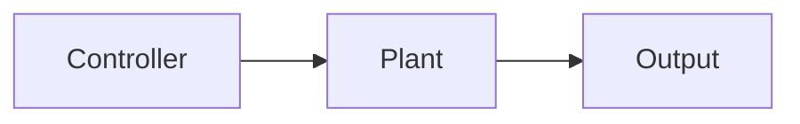
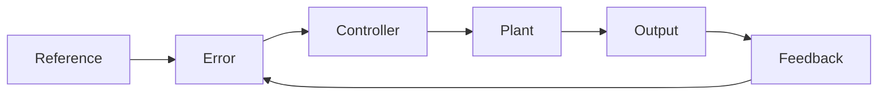
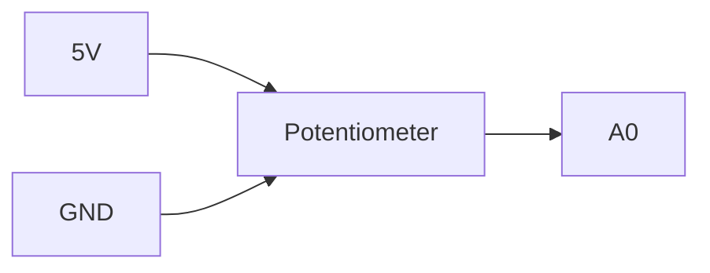
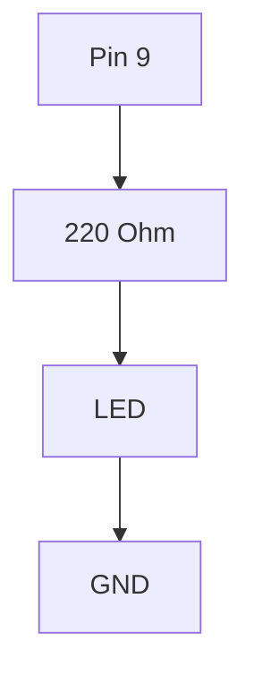
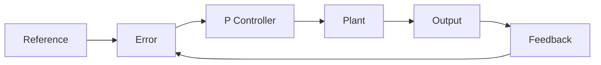

# Project 6 - Proportional Control (P Control) and Feedback Systems

## Prerequisites

Complete:

- 00_Introduction.md
- 00A_DSO_Nano_Familiarisation.md
- 01_PWM_Fundamentals.md
- 02_RC_Circuits.md
- 03_RLC_Circuits.md
- 04_MOSFET_Fundamentals.md
- 05_PWM_Motor_Control.md

---

# Objective

In this project you will learn:

- What feedback is
- What a control system is
- The difference between open-loop and closed-loop control
- What an error signal is
- How a proportional controller works
- How proportional gain affects system behaviour
- The limitations of proportional control

This project introduces the foundations of modern control engineering.

---

# Learning Outcomes

At the end of this project you should be able to:

✅ Explain feedback

✅ Explain open-loop control

✅ Explain closed-loop control

✅ Calculate an error signal

✅ Implement a proportional controller

✅ Tune proportional gain

✅ Understand steady-state error

✅ Explain why higher gain is not always better

---

# Theory

## What is a Control System?

A control system attempts to make a system behave in a desired manner.

Examples:

- Maintain motor speed
- Regulate converter voltage
- Control robot position
- Control room temperature

Every control system has:

```text
Reference
↓
Controller
↓
Plant
↓
Output
```

---

# Open-Loop Control

Open-loop control means:

```text
No Feedback
```

The controller sends commands without measuring the result.

Example:

```text
Apply 50% PWM to a motor
```

The controller assumes the motor behaves correctly.

---

# Open-Loop Block Diagram



---

# Problems with Open-Loop Control

Suppose a motor is running at:

```text
500 RPM
```

and an extra load is applied.

The speed drops to:

```text
300 RPM
```

The controller does not know this has happened.

Therefore:

```text
No correction occurs
```

---

# Closed-Loop Control

Closed-loop control uses:

```text
Feedback
```

The output is measured and returned to the controller.

The controller continuously compares:

```text
Desired Value
```

with

```text
Actual Value
```

---

# Closed-Loop Block Diagram



---

# Advantages of Feedback

Feedback can:

✅ Reduce error

✅ Improve accuracy

✅ Reject disturbances

✅ Improve repeatability

✅ Maintain performance despite varying conditions

---

# Reference Signal

The reference is the desired value.

Examples:

```text
Desired Speed

Desired Voltage

Desired Position

Desired Temperature
```

Symbol:

$$
r(t)
$$

---

# Output Signal

The output is the actual measured value.

Examples:

```text
Actual Speed

Actual Voltage

Actual Position

Actual Temperature
```

Symbol:

$$
y(t)
$$

---

# Error Signal

The error is the difference between the desired value and the measured value.

$$
e(t)=r(t)-y(t)
$$

Where:

- $e(t)$ = Error Signal
- $r(t)$ = Reference Signal
- $y(t)$ = Output Signal

---

# Example

Given:

$$
r=100
$$

and

$$
y=70
$$

Then:

$$
e=r-y
$$

$$
e=100-70
$$

$$
e=30
$$

---

# Proportional Control

The simplest controller is:

```text
P Controller
```

The controller output is proportional to the error.

---

# Proportional Control Equation

$$
u(t)=K_Pe(t)
$$

Where:

- $u(t)$ = Controller Output
- $K_P$ = Proportional Gain
- $e(t)$ = Error Signal

---

# Understanding Gain

The gain determines how strongly the controller reacts to error.

---

## Small Gain Example

Given:

$$
K_P=0.5
$$

and

$$
e=20
$$

Then:

$$
u=K_Pe
$$

$$
u=0.5 \cdot 20
$$

$$
u=10
$$

The controller responds gently.

---

## Large Gain Example

Given:

$$
K_P=5
$$

and

$$
e=20
$$

Then:

$$
u=5 \cdot 20
$$

$$
u=100
$$

The controller responds aggressively.

---

# Control Concept

```text
Error
  ↓
Controller
  ↓
Correction
  ↓
Reduced Error
```

---

# Components Required

From the SparkFun Inventor Kit:

- Arduino Uno
- Breadboard
- Potentiometer
- LED
- 220 Ω resistor
- Jumper wires

Equipment:

- DSO Nano Oscilloscope

---

# Experiment 1 - Create a Reference Signal

## Objective

Generate a user-adjustable reference input.

---

# Wiring



---

# Arduino Code

```cpp
void setup()
{
    Serial.begin(9600);
}

void loop()
{
    int reference = analogRead(A0);

    Serial.println(reference);

    delay(100);
}
```

---

# Expected Behaviour

Rotating the potentiometer changes the measured value between approximately:

```text
0 and 1023
```

---

# Experiment 2 - Simple Proportional Controller

## Objective

Control LED brightness using proportional gain.

---

# Wiring



---

# Arduino Code

```cpp
float Kp = 0.25;

void setup()
{
    pinMode(9, OUTPUT);
}

void loop()
{
    int reference = analogRead(A0);

    int output = (int)(Kp * reference);

    output = constrain(output,0,255);

    analogWrite(9, output);
}
```

---

# What Is Happening?

The potentiometer generates:

$$
r
$$

The controller computes:

$$
u=K_Pr
$$

The LED brightness represents:

```text
Controller Output
```

---

# Experiment 3 - Investigate Controller Gain

## Objective

Observe how gain changes controller behaviour.

---

## Test A

```cpp
Kp = 0.1;
```

Observation:

```text
______________________
```

---

## Test B

```cpp
Kp = 0.25;
```

Observation:

```text
______________________
```

---

## Test C

```cpp
Kp = 0.5;
```

Observation:

```text
______________________
```

---

## Test D

```cpp
Kp = 1.0;
```

Observation:

```text
______________________
```

---

# Results Table

| Kp | Behaviour |
|----|----------|
| 0.1 | |
| 0.25 | |
| 0.5 | |
| 1.0 | |

---

# Experiment 4 - Error Calculation

Suppose:

Reference:

$$
r=200
$$

Measured Output:

$$
y=150
$$

Calculate error:

$$
e=r-y
$$

$$
e=200-150
$$

$$
e=50
$$

---

If:

$$
K_P=2
$$

Then:

$$
u=K_Pe
$$

$$
u=2 \cdot 50
$$

$$
u=100
$$

The controller increases its output to reduce the error.

---

# Control Loop Representation



---

# DSO Nano Exercise

Observe the PWM signal generated by the controller.

---

# Probe Connections

Probe Tip:

```text
Pin 9
```

Probe Ground:

```text
GND
```

---

# DSO Nano Settings

Vertical:

```text
2 V/div
```

Horizontal:

```text
500 us/div
```

Trigger:

```text
Rising Edge
```

---

# Observation

Rotate the potentiometer.

Observe how the PWM duty cycle changes.

Record:

```text
____________________________________
```

---

# Steady-State Error

One limitation of a proportional controller is:

```text
Steady-State Error
```

The output often remains slightly different from the reference.

---

# Example

Reference:

$$
r=100
$$

Output:

$$
y=95
$$

Therefore:

$$
e=r-y
$$

$$
e=100-95
$$

$$
e=5
$$

The controller gets close to the target but does not completely eliminate the error.

---

# Limitations of Proportional Control

Increasing gain usually reduces error.

However excessively high gain can cause:

- Oscillation
- Instability
- Overshoot

A balance must be found between:

```text
Responsiveness
```

and

```text
Stability
```

---

# MATLAB Exercise

Plot controller output versus error.

```matlab
e = 0:100;

Kp = 0.5;

u = Kp .* e;

plot(e,u,'LineWidth',2)

grid on

xlabel('Error')
ylabel('Controller Output')

title('Proportional Controller')
```

---

# Expected Result

The graph should be a straight line because:

$$
u=K_Pe
$$

---

# Engineering Applications

Proportional control is used in:

## Motor Speed Control

Basic regulation.

---

## Temperature Control

Simple thermostats.

---

## Position Control

Actuator systems.

---

## Voltage Regulation

Basic power electronics.

---

## Robotics

Basic servo control loops.

---

# Knowledge Check

## Question 1

What is feedback?

Answer:

```text
____________________
```

---

## Question 2

What is the error signal?

Answer:

```text
____________________
```

---

## Question 3

Write the proportional controller equation.

Answer:

```text
____________________
```

---

## Question 4

What happens when Kp increases?

Answer:

```text
____________________
```

---

## Question 5

Why can a proportional controller still have steady-state error?

Answer:

```text
____________________
```

---

# Common Mistakes

## LED Always Fully ON

Check:

- Gain value
- PWM saturation
- Potentiometer wiring

---

## Potentiometer Not Responding

Check:

- Centre pin connected to A0
- 5V connected
- GND connected

---

## No PWM Visible

Check:

- Probe location
- Trigger setting
- Arduino code

---

# Troubleshooting Checklist

✅ Potentiometer reading changes

✅ PWM output present

✅ LED brightness changes

✅ DSO Nano connected correctly

✅ Gain value correct

✅ PWM duty cycle responds to potentiometer movement

---

# Project Summary

In this project you learned:

✅ Open-loop control

✅ Closed-loop control

✅ Feedback

✅ Error signals

✅ Proportional control

✅ Gain tuning

✅ Steady-state error

✅ Controller behaviour

These concepts are the foundation of all modern control systems.

---

# Next Project

**07_PI_Controller.md**

Topics:

- Integral Action
- Error Accumulation
- Eliminating Steady-State Error
- PI Control
- Controller Tuning
- Improved Closed-Loop Performance