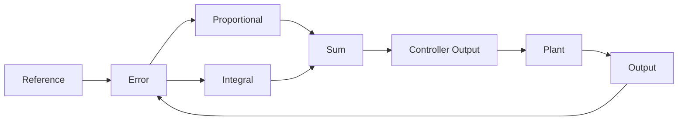
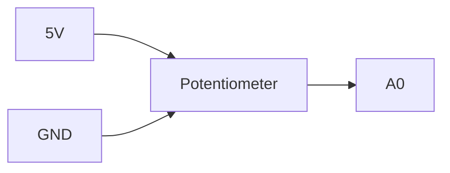

# Project 7 - PI Control and Eliminating Steady-State Error

## Prerequisites

Complete:

- 00_Introduction.md
- 00A_DSO_Nano_Familiarisation.md
- 01_PWM_Fundamentals.md
- 02_RC_Circuits.md
- 03_RLC_Circuits.md
- 04_MOSFET_Fundamentals.md
- 05_PWM_Motor_Control.md
- 06_P_Controller.md

---

# Objective

In this project you will learn:

- Why proportional control has limitations
- What steady-state error is
- What integral action is
- How a PI controller works
- How integral gain affects performance
- How PI controllers improve accuracy
- How PI controllers are used in industrial systems

The PI controller is one of the most important controllers in engineering.

Many practical systems use:

```text
PI Control
```

instead of:

```text
P Control
```

because it can eliminate steady-state error.

---

# Learning Outcomes

At the end of this project you should be able to:

✅ Explain integral action

✅ Explain steady-state error

✅ Implement a PI controller

✅ Tune proportional gain

✅ Tune integral gain

✅ Explain integral windup

✅ Understand why PI controllers are widely used

---

# Review of Proportional Control

The proportional controller is:

$$
u(t)=K_Pe(t)
$$

Where:

- $u(t)$ = Controller Output
- $K_P$ = Proportional Gain
- $e(t)$ = Error Signal

---

# The Limitation of P Control

Suppose:

$$
r=100
$$

and eventually:

$$
y=95
$$

Then:

$$
e=r-y
$$

$$
e=100-95
$$

$$
e=5
$$

The controller still has an error.

This remaining error is called:

```text
Steady-State Error
```

---

# Why Does Steady-State Error Occur?

As the error becomes smaller:

$$
u=K_Pe
$$

also becomes smaller.

Eventually the correction is no longer large enough to eliminate the remaining error.

---

# Introducing Integral Action

The solution is to accumulate error over time.

This accumulated error is called:

```text
Integral Action
```

---

# The Integral Term

The integral term is:

$$
\int e(t)\,dt
$$

This represents:

```text
Total Accumulated Error
```

---

# Understanding Accumulated Error

Imagine an error of:

$$
e=10
$$

that persists for a long time.

Even though the error is small:

```text
The accumulated error becomes large.
```

The controller therefore continues increasing its output.

---

# Everyday Analogy

Imagine filling a bucket.

The bucket records:

```text
How much water has been added
```

not merely:

```text
Current Flow Rate
```

Similarly, the integral term records:

```text
Accumulated Error
```

not just instantaneous error.

---

# PI Controller Equation

A PI controller combines:

- Proportional Action
- Integral Action

The controller equation is:

$$
u(t)=K_Pe(t)+K_I\int e(t)\,dt
$$

Where:

- $u(t)$ = Controller Output
- $K_P$ = Proportional Gain
- $K_I$ = Integral Gain
- $e(t)$ = Error Signal

---

# Effect of Each Term

## Proportional Term

Provides:

```text
Immediate Response
```

Equation:

$$
K_Pe(t)
$$

---

## Integral Term

Provides:

```text
Long-Term Correction
```

Equation:

$$
K_I\int e(t)\,dt
$$

---

# Why PI Controllers Work

Suppose a small error remains.

The proportional term may become small.

However:

$$
\int e(t)\,dt
$$

continues growing.

Eventually the controller produces enough output to eliminate the error completely.

---

# PI Controller Block Diagram



---

# Components Required

From the SparkFun Inventor Kit:

- Arduino Uno
- Breadboard
- Potentiometer
- LED
- 220 Ω resistor
- Jumper wires

Equipment:

- DSO Nano Oscilloscope

---

# Experiment 1 - Build a PI Controller

## Objective

Implement a simple PI controller in Arduino.

---

# Wiring

Potentiometer:



LED:


---

# Arduino Code

```cpp
float Kp = 0.2;
float Ki = 0.02;

float integral = 0;

void setup()
{
    pinMode(9, OUTPUT);
}

void loop()
{
    int reference = analogRead(A0);

    int feedback = 0;

    float error = reference - feedback;

    integral = integral + error;

    float output =
        Kp * error
      + Ki * integral;

    output = constrain(output,0,255);

    analogWrite(9,(int)output);

    delay(10);
}
```

---

# What Is Happening?

The controller calculates:

$$
e=r-y
$$

Then accumulates:

$$
\int e(t)\,dt
$$

Then applies:

$$
u=K_Pe+K_I\int e(t)\,dt
$$

---

# Experiment 2 - Effect of Integral Gain

## Objective

Observe the effect of changing:

$$
K_I
$$

---

## Test A

```cpp
Ki = 0;
```

Result:

```text
Pure P Controller
```

Observation:

```text
_______________________
```

---

## Test B

```cpp
Ki = 0.01;
```

Observation:

```text
_______________________
```

---

## Test C

```cpp
Ki = 0.05;
```

Observation:

```text
_______________________
```

---

## Test D

```cpp
Ki = 0.1;
```

Observation:

```text
_______________________
```

---

# Results Table

| Ki | Behaviour |
|----|-----------|
| 0 | |
| 0.01 | |
| 0.05 | |
| 0.10 | |

---

# Experiment 3 - Effect of Proportional Gain

Keep:

```cpp
Ki = 0.02;
```

Change:

```cpp
Kp
```

---

## Test A

```cpp
Kp = 0.1;
```

---

## Test B

```cpp
Kp = 0.5;
```

---

## Test C

```cpp
Kp = 1.0;
```

---

# Results Table

| Kp | Behaviour |
|----|-----------|
| 0.1 | |
| 0.5 | |
| 1.0 | |

---

# Understanding Integral Windup

One common problem is:

```text
Integral Windup
```

---

# What Is Windup?

Suppose:

```text
Large Error
```

persists for a long time.

The integral value becomes very large.

When conditions change the controller may overreact.

Result:

- Overshoot
- Oscillation
- Slow recovery

---

# Example

The integral term keeps growing:

$$
\int e(t)\,dt
$$

while the actuator is already at maximum output.

The stored integral value becomes excessive.

---

# Anti-Windup

A simple solution is to limit the integral value.

Example:

```cpp
integral = constrain(integral,-1000,1000);
```

This technique is called:

```text
Anti-Windup
```

---

# DSO Nano Exercise

Observe the controller PWM output.

---

# Probe Location

Probe Tip:

```text
Pin 9
```

Probe Ground:

```text
GND
```

---

# DSO Nano Settings

Vertical:

```text
2 V/div
```

Horizontal:

```text
500 us/div
```

Trigger:

```text
Rising Edge
```

---

# Observation

As:

```text
Reference Changes
```

observe how:

```text
PWM Duty Cycle Changes
```

Record observations:

```text
__________________________________
```

---

# Comparing P and PI Control

| Property | P Controller | PI Controller |
|-----------|-------------|--------------|
| Simple | Yes | Yes |
| Fast Response | Good | Good |
| Steady-State Error | Present | Eliminated |
| Tuning Difficulty | Easy | Moderate |
| Integral Windup | No | Yes |

---

# MATLAB Exercise

Create a simple PI control law.

```matlab
e = 1;

Kp = 2;
Ki = 1;

t = 0:0.1:10;

u = Kp*e + Ki*t;

plot(t,u,'LineWidth',2)

grid on

xlabel('Time (s)')
ylabel('Controller Output')

title('PI Controller Integral Action')
```

---

# Expected Result

The controller output increases with time because:

$$
\int e(t)\,dt
$$

grows continuously.

---

# Engineering Applications

PI controllers are widely used in:

## Motor Speed Control

Industrial drives.

---

## Power Supplies

Voltage regulation.

---

## Buck Converters

Output voltage control.

---

## Boost Converters

Feedback regulation.

---

## Process Control

Flow, pressure and temperature control.

---

# Knowledge Check

## Question 1

What is steady-state error?

Answer:

```text
____________________
```

---

## Question 2

What does the integral term represent?

Answer:

```text
____________________
```

---

## Question 3

Write the PI controller equation.

Answer:

```text
____________________
```

---

## Question 4

Why does integral action eliminate steady-state error?

Answer:

```text
____________________
```

---

## Question 5

What is integral windup?

Answer:

```text
____________________
```

---

# Common Mistakes

## Output Saturates

Check:

- Gain values
- Integral growth

---

## Oscillation Appears

Reduce:

```text
Ki
```

or

```text
Kp
```

---

## LED Always Fully ON

Check:

- Output limiting
- Integral windup

---

# Troubleshooting Checklist

✅ Potentiometer operating correctly

✅ PWM output present

✅ DSO Nano measuring output

✅ Integral term limited

✅ Controller gains reasonable

✅ PWM changes with reference

---

# Project Summary

In this project you learned:

✅ Integral action

✅ PI control

✅ Steady-state error

✅ Integral gain

✅ Integral windup

✅ Controller tuning

✅ PWM control through feedback

PI controllers are among the most widely used controllers in engineering because they combine:

- Simplicity
- Good performance
- Zero steady-state error

---

# Next Project

**08_PID_Controller.md**

Topics:

- Derivative Action
- Overshoot Reduction
- Damping Improvement
- PID Controllers
- Controller Tuning
- Stability Improvements