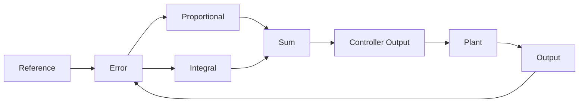

# Project 7 - PI Control and Eliminating Steady-State Error

## Prerequisites

Complete:

- 00_Introduction.md
- 00B_Oscilloscope_Familiarisation.md
- 01_PWM_Fundamentals.md
- 02_RC_Circuits.md
- 03_RLC_Circuits.md
- 04_MOSFET_Fundamentals.md
- 05_PWM_Motor_Control.md
- 06_P_Controller.md

---

# Objective

In this project you will learn:

- Why proportional control has limitations
- What steady-state error is
- What integral action is
- How a PI controller works
- How integral gain affects performance
- How PI controllers improve accuracy
- How PI controllers are used in industrial systems

The PI controller is one of the most important controllers in engineering.

Many practical systems use:

```text
PI Control
```

instead of:

```text
P Control
```

because it can eliminate steady-state error.

---

# Learning Outcomes

At the end of this project you should be able to:

✅ Explain integral action

✅ Explain steady-state error

✅ Implement a PI controller

✅ Tune proportional gain

✅ Tune integral gain

✅ Explain integral windup

✅ Understand why PI controllers are widely used

---

# Review of Proportional Control

The proportional controller is:

$$
u(t)=K_Pe(t)
$$

Where:

- $u(t)$ = Controller Output
- $K_P$ = Proportional Gain
- $e(t)$ = Error Signal

---

# The Limitation of P Control

Suppose:

$$
r=100
$$

and eventually:

$$
y=95
$$

Then:

$$
e=r-y
$$

$$
e=100-95
$$

$$
e=5
$$

The controller still has an error.

This remaining error is called:

```text
Steady-State Error
```

---

# Why Does Steady-State Error Occur?

As the error becomes smaller:

$$
u=K_Pe
$$

also becomes smaller.

Eventually the correction is no longer large enough to eliminate the remaining error.

---

# Introducing Integral Action

The solution is to accumulate error over time.

This accumulated error is called:

```text
Integral Action
```

---

# The Integral Term

The integral term is:

$$
\int e(t)\,dt
$$

This represents:

```text
Total Accumulated Error
```

---

# Understanding Accumulated Error

Imagine an error of:

$$
e=10
$$

that persists for a long time.

Even though the error is small:

```text
The accumulated error becomes large.
```

The controller therefore continues increasing its output.

---

# Everyday Analogy

Imagine filling a bucket.

The bucket records:

```text
How much water has been added
```

not merely:

```text
Current Flow Rate
```

Similarly, the integral term records:

```text
Accumulated Error
```

not just instantaneous error.

---

# PI Controller Equation

A PI controller combines:

- Proportional Action
- Integral Action

The controller equation is:

$$
u(t)=K_Pe(t)+K_I\int e(t)\,dt
$$

Where:

- $u(t)$ = Controller Output
- $K_P$ = Proportional Gain
- $K_I$ = Integral Gain
- $e(t)$ = Error Signal

---

# Effect of Each Term

## Proportional Term

Provides:

```text
Immediate Response
```

Equation:

$$
K_Pe(t)
$$

---

## Integral Term

Provides:

```text
Long-Term Correction
```

Equation:

$$
K_I\int e(t)\,dt
$$

---

# Why PI Controllers Work

Suppose a small error remains.

The proportional term may become small.

However:

$$
\int e(t)\,dt
$$

continues growing.

Eventually the controller produces enough output to eliminate the error completely.

---

# PI Controller Block Diagram



---

# MATLAB Simulation

Before building the circuit, simulate the closed-loop PI response on the first-order motor model to predict how integral action eliminates steady-state error.

## PI Closed-Loop Transfer Function

The PI controller in the s-domain is:

$$
C(s) = K_P + \frac{K_I}{s}
$$

Applied to the first-order motor plant:

$$
G(s) = \frac{K}{\tau s + 1}
$$

## Effect of Ki — Fixed Kp

```matlab
K   = 1;
tau = 0.5;        % your measured tau from Project 5
Kp  = 0.5;        % fixed from Project 6

G = tf(K, [tau, 1]);

Ki_values = [0, 0.5, 1.0, 2.0, 5.0];
labels    = {'Ki=0 (P only)','Ki=0.5','Ki=1.0','Ki=2.0','Ki=5.0'};

t = 0:0.01:8;

figure; hold on;
for i = 1:5
    C = tf([Kp, Ki_values(i)], [1, 0]);   % Kp + Ki/s
    T = feedback(C * G, 1);
    [y, ~] = step(T, t);
    plot(t, y, 'LineWidth', 2, 'DisplayName', labels{i});
end
yline(1.0, 'k--', 'Reference');
grid on;
xlabel('Time (s)'); ylabel('Normalised Output');
title('PI Controller \mdash Effect of K_I (Motor Plant)');
legend('Location', 'southeast');
```

## P vs PI Comparison

```matlab
K   = 1;
tau = 0.5;
Kp  = 0.5;
Ki  = 1.0;

G    = tf(K, [tau, 1]);
C_P  = tf(Kp, 1);
C_PI = tf([Kp, Ki], [1, 0]);

T_P  = feedback(C_P  * G, 1);
T_PI = feedback(C_PI * G, 1);

t = 0:0.01:8;
[y_P,  ~] = step(T_P,  t);
[y_PI, ~] = step(T_PI, t);

figure; hold on;
plot(t, y_P,  'b--', 'LineWidth', 2, 'DisplayName', ...
    sprintf('P only  e_{ss}=%.1f%%', 100/(1+Kp*K)));
plot(t, y_PI, 'r',   'LineWidth', 2, 'DisplayName', 'PI  e_{ss}=0%');
yline(1.0, 'k--', 'Reference');
grid on;
xlabel('Time (s)'); ylabel('Normalised Output');
title('P vs PI \mdash Steady-State Error Elimination');
legend('Location', 'southeast');
```

## Prediction Table

| Kp | Ki | Predicted e\_{ss} | Expected overshoot? |
|----|----|------------------|---------------------|
| 0.5 | 0 | | |
| 0.5 | 0.5 | | |
| 0.5 | 1.0 | | |
| 0.5 | 2.0 | | |
| 0.5 | 5.0 | | |

---

# Components Required

Same circuit as Project 6:

- Arduino Uno
- Breadboard
- Potentiometer (setpoint)
- IRLZ44N MOSFET
- DC Motor
- Flyback diode (1N4001–1N4007)
- 220 Ω resistor (gate resistor)
- 2 × 10 kΩ resistors (back-EMF divider — already installed from Project 6)
- Jumper wires
- External battery pack

Equipment:

- DSO Nano Oscilloscope

---

# Experiment 1 - Build a Closed-Loop PI Motor Controller

## Objective

Implement a PI controller with back-EMF feedback closing the loop on the motor.
The potentiometer sets the speed reference. The back-EMF divider on A1 provides the feedback signal.

---

# Circuit

Same as Project 6 — back-EMF divider already in place:

```text
Battery +
    |
  Motor
    |--- Flyback diode (cathode to Battery+)
    |
    +--- 10kΩ ---+--- A1  (back-EMF feedback)
                 |
               10kΩ
                 |
                GND
  Drain
  MOSFET (IRLZ44N)
  Source
    |
   GND

Arduino Pin 9 --- 220Ω --- Gate
Potentiometer centre pin --- A0
```

---

# Arduino Code

```cpp
float Kp = 0.5;
float Ki = 1.0;

const float dt      = 0.05;    // sample time (s) — matches delay(50)
const float int_max = 500.0;   // anti-windup limit

float integral = 0;

void setup()
{
    pinMode(9, OUTPUT);
    Serial.begin(9600);
}

void loop()
{
    int reference = analogRead(A0);   // desired speed setpoint (0-1023)
    int feedback  = analogRead(A1);   // back-EMF proxy (0-1023)

    float error = reference - feedback;

    integral = integral + error * dt;
    integral = constrain(integral, -int_max, int_max);

    float output = Kp * error + Ki * integral;
    output = constrain(output, 0, 255);

    analogWrite(9, (int)output);

    Serial.print("Ref: ");  Serial.print(reference);
    Serial.print("  Fbk: "); Serial.print(feedback);
    Serial.print("  Err: "); Serial.print((int)error);
    Serial.print("  Int: "); Serial.print(integral, 2);
    Serial.print("  PWM: "); Serial.println((int)output);

    delay(50);
}
```

---

# What Is Happening?

The potentiometer sets the reference $r$.

The back-EMF divider on A1 measures actual motor speed (proxy) $y$.

The PI controller computes:

$$
e = r - y
$$

$$
u = K_P e + K_I \int e\,dt
$$

With the loop closed, the integral term drives the error toward zero — you should observe the feedback reading converge toward the reference in the Serial Monitor.

---

# Experiment 2 - Effect of Integral Gain

## Objective

Observe the effect of changing:

$$
K_I
$$

---

## Test A

```cpp
Ki = 0;
```

Result:

```text
Pure P Controller
```

Observation:

```text
_______________________
```

---

## Test B

```cpp
Ki = 0.01;
```

Observation:

```text
_______________________
```

---

## Test C

```cpp
Ki = 0.05;
```

Observation:

```text
_______________________
```

---

## Test D

```cpp
Ki = 0.1;
```

Observation:

```text
_______________________
```

---

# Results Table

| Ki | Behaviour |
|----|-----------|
| 0 | |
| 0.01 | |
| 0.05 | |
| 0.10 | |

---

# Experiment 3 - Effect of Proportional Gain

Keep:

```cpp
Ki = 0.02;
```

Change:

```cpp
Kp
```

---

## Test A

```cpp
Kp = 0.1;
```

---

## Test B

```cpp
Kp = 0.5;
```

---

## Test C

```cpp
Kp = 1.0;
```

---

# Results Table

| Kp | Behaviour |
|----|-----------|
| 0.1 | |
| 0.5 | |
| 1.0 | |

---

# Understanding Integral Windup

One common problem is:

```text
Integral Windup
```

---

# What Is Windup?

Suppose:

```text
Large Error
```

persists for a long time.

The integral value becomes very large.

When conditions change the controller may overreact.

Result:

- Overshoot
- Oscillation
- Slow recovery

---

# Example

The integral term keeps growing:

$$
\int e(t)\,dt
$$

while the actuator is already at maximum output.

The stored integral value becomes excessive.

---

# Anti-Windup

A simple solution is to limit the integral value.

Example:

```cpp
integral = constrain(integral,-1000,1000);
```

This technique is called:

```text
Anti-Windup
```

---

# DSO Nano Exercise

Observe the controller PWM output.

---

# Probe Location

Probe Tip:

```text
Pin 9
```

Probe Ground:

```text
GND
```

---

# DSO Nano Settings

Vertical:

```text
2 V/div
```

Horizontal:

```text
500 us/div
```

Trigger:

```text
Rising Edge
```

---

# Observation

As:

```text
Reference Changes
```

observe how:

```text
PWM Duty Cycle Changes
```

Record observations:

```text
__________________________________
```

---

# Comparing P and PI Control

| Property | P Controller | PI Controller |
|-----------|-------------|--------------|
| Simple | Yes | Yes |
| Fast Response | Good | Good |
| Steady-State Error | Present | Eliminated |
| Tuning Difficulty | Easy | Moderate |
| Integral Windup | No | Yes |

---

# MATLAB Comparison

Now simulate the closed-loop PI response using your actual Kp and Ki values from Experiments 2 and 3, and compare P vs PI directly.

## Enter Your Parameters

```matlab
K   = 1;
tau = 0.5;       % your measured tau from Project 5
Kp  = 0.5;       % your Experiment 3 value
Ki  = 1.0;       % your Experiment 2 value

G    = tf(K, [tau, 1]);
C_P  = tf(Kp, 1);
C_PI = tf([Kp, Ki], [1, 0]);

T_P  = feedback(C_P  * G, 1);
T_PI = feedback(C_PI * G, 1);

t = 0:0.01:8;
[y_P,  ~] = step(T_P,  t);
[y_PI, ~] = step(T_PI, t);

figure; hold on;
plot(t, y_P,  'b--', 'LineWidth', 2, 'DisplayName', ...
    sprintf('P  Kp=%.2f  e_{ss}=%.1f%%', Kp, 100/(1+Kp*K)));
plot(t, y_PI, 'r',   'LineWidth', 2, 'DisplayName', ...
    sprintf('PI Kp=%.2f Ki=%.2f  e_{ss}=0%%', Kp, Ki));
yline(1.0, 'k--', 'Reference');
grid on;
xlabel('Time (s)'); ylabel('Normalised Output');
title('P vs PI \mdash Motor Plant Comparison');
legend('Location', 'southeast');

% Print settling time and overshoot
info_PI = stepinfo(T_PI);
fprintf('PI Settling time: %.2fs\n', info_PI.SettlingTime);
fprintf('PI Overshoot:     %.1f%%\n', info_PI.Overshoot);
```

## Reflection

- Does the PI simulation confirm zero steady-state error compared to P only?
- At what Ki did overshoot first appear in your experiments?
- How does the simulated settling time compare to what you observed on the motor?
- With the loop closed via back-EMF, does the feedback reading converge to the reference in the Serial Monitor? If a residual offset remains, what physical effect could cause it?

---

# Engineering Applications

PI controllers are widely used in:

## Motor Speed Control

Industrial drives.

---

## Power Supplies

Voltage regulation.

---

## Buck Converters

Output voltage control.

---

## Boost Converters

Feedback regulation.

---

## Process Control

Flow, pressure and temperature control.

---

# Knowledge Check

## Question 1

What is steady-state error?

Answer:

```text
____________________
```

---

## Question 2

What does the integral term represent?

Answer:

```text
____________________
```

---

## Question 3

Write the PI controller equation.

Answer:

```text
____________________
```

---

## Question 4

Why does integral action eliminate steady-state error?

Answer:

```text
____________________
```

---

## Question 5

What is integral windup?

Answer:

```text
____________________
```

---

## Question 6

Your PI simulation shows overshoot at Ki = 5.0 but not at Ki = 1.0. Explain why increasing Ki too much causes overshoot, and how anti-windup helps.

Answer:

```text
____________________
```

---

# Common Mistakes

## Motor Doesn't Respond

Check:

- MOSFET wiring
- Battery connected
- Shared ground
- Flyback diode installed

---

## Output Saturates Immediately

Check:

- Kp and Ki values (reduce both)
- Anti-windup limit
- Potentiometer reading in Serial Monitor

---

## Oscillation Appears

Reduce:

```text
Ki
```

or

```text
Kp
```

---

## Integral Grows Without Bound

Check:

- Anti-windup constrain() is present in code
- Sample time (delay) is consistent

---

# Troubleshooting Checklist

✅ Motor circuit wired correctly (same as Project 6)

✅ Back-EMF divider connected to A1

✅ Shared ground between Arduino and battery

✅ Potentiometer reading visible in Serial Monitor

✅ Feedback reading changes with motor speed in Serial Monitor

✅ PWM duty cycle visible on DSO Nano

✅ Anti-windup limit in code

✅ Motor speed changes with potentiometer

✅ Integral drives feedback toward reference

---

# Project Summary

In this project you learned:

✅ Integral action

✅ PI control

✅ Closed-loop operation with back-EMF feedback

✅ Steady-state error

✅ Integral gain

✅ Integral windup

✅ Controller tuning

✅ PWM control through feedback

PI controllers are among the most widely used controllers in engineering because they combine:

- Simplicity
- Good performance
- Zero steady-state error

---

# Next Project

**08_PID_Controller.md**

Topics:

- Derivative Action
- Overshoot Reduction
- Damping Improvement
- PID Controllers
- Controller Tuning
- Stability Improvements
