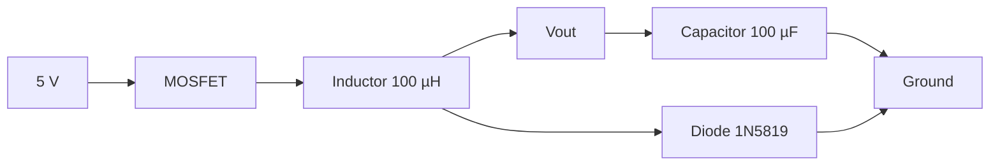

# Project 08 - Buck Converter Fundamentals

### Prerequisites

Complete:

- 00_Introduction.md
- 00B_Oscilloscope_Familiarisation.md
- 01_PWM_Fundamentals.md
- 02_RC_Circuits.md
- 03_RLC_Circuits.md
- 04_MOSFET_Fundamentals.md
- 10_PWM_Motor_Control.md
- 12_P_Controller.md
- 13_PI_Controller.md
- 14_PID_Controller.md

---

## Objective

In this project you will learn:

- What a Buck Converter is
- How a Buck Converter reduces voltage
- How PWM controls output voltage
- The role of the MOSFET
- The role of the inductor
- The role of the capacitor
- The role of the freewheel diode
- How energy is transferred in switched-mode power supplies
- How to measure converter waveforms using an oscilloscope (OWON HDS272S recommended, DSO Nano compatible)

This project combines concepts from:

- PWM
- RC Circuits
- RLC Circuits
- MOSFET Switching
- Control Theory

and forms the foundation of modern power electronics.

Simulation companion:

```text
08A_Buck_Simulink_Simscape.md
```

Use that companion page if you want to build an ideal MATLAB model, a Simulink PWM/control model, and a Simscape Electrical power-stage model alongside this hardware lab.

---

## Learning Outcomes

At the end of this project you should be able to:

✅ Explain Buck Converter operation

✅ Explain inductor energy storage

✅ Explain capacitor filtering

✅ Calculate ideal output voltage

✅ Measure PWM switching signals

✅ Measure output ripple

✅ Understand duty-cycle control

✅ Relate converter operation to previous projects

---

## Introduction

A Buck Converter is a:

```text
DC-to-DC Converter
```

that reduces voltage.

Examples:

```text
12 V → 5 V

24 V → 12 V

48 V → 24 V
```

Unlike resistor-based voltage reduction, a Buck Converter can operate with very high efficiency.

---

## Why Not Use a Resistor?

Suppose we want:

```text
12 V → 5 V
```

A resistor can reduce voltage, but energy is dissipated as heat.

Power loss is:

$$
P = V \cdot I
$$

As current increases, the power loss also increases.

---

## Why Buck Converters Are Efficient

Buck Converters use:

```text
Fast Switching
```

instead of:

```text
Continuous Dissipation
```

The MOSFET is usually either:

```text
Fully ON
```

or

```text
Fully OFF
```

which minimizes power loss.

---

## Basic Buck Converter


---

## Main Components

A basic Buck Converter contains:

1. MOSFET
2. Diode
3. Inductor
4. Capacitor
5. Load

---

## Role of the MOSFET

The MOSFET acts as a high-speed electronic switch.

The controller generates PWM.

PWM controls:

```text
Average Energy Transfer
```

from input to output.

---

## Role of the Inductor

The inductor stores energy in a magnetic field.

Stored energy:

$$
E = \frac{1}{2}LI^2
$$

When the MOSFET switches OFF, the inductor attempts to keep current flowing.

This is one of the key principles behind Buck Converter operation.

---

## Role of the Capacitor

The capacitor smooths the output voltage.

Stored energy:

$$
E = \frac{1}{2}CV^2
$$

The capacitor helps reduce output voltage ripple.

---

## Role of the Diode

When the MOSFET turns OFF:

```text
Inductor Current Must Continue Flowing
```

The diode provides an alternative path for current.

This path is called the:

```text
Freewheel Path
```

---

## Ideal Buck Converter Equation

The ideal Buck Converter voltage relationship is:

$$
V_{OUT}=D \cdot V_{IN}
$$

Where:

- $V_{OUT}$ = Output Voltage
- $V_{IN}$ = Input Voltage
- $D$ = Duty Cycle

---

## Example 1

Given:

$$
V_{IN}=12V
$$

and:

$$
D=0.5
$$

Then:

$$
V_{OUT}=0.5 \cdot 12
$$

$$
V_{OUT}=6V
$$

---

## Example 2

Given:

$$
V_{IN}=12V
$$

and:

$$
D=0.25
$$

Then:

$$
V_{OUT}=0.25 \cdot 12
$$

$$
V_{OUT}=3V
$$

---

## MATLAB Simulation

Before building the circuit, simulate the ideal Buck Converter behaviour to predict what you will measure.

### Vout vs Duty Cycle — 5V Supply

```matlab
Vin = 5;                          % introductory low-voltage test supply
D   = 0:0.01:1;
Vout_ideal = D .* Vin;

D_exp    = [0.25, 0.50, 0.75];
Vout_exp = D_exp .* Vin;

figure;
plot(D, Vout_ideal, 'b', 'LineWidth', 2); hold on;
scatter(D_exp, Vout_exp, 80, 'r', 'filled', 'DisplayName', 'Experiment points');
grid on;
xlabel('Duty Cycle'); ylabel('Output Voltage (V)');
title('Ideal Buck Converter - V_{IN} = 5V');
legend('Ideal V_{OUT} = D \cdot V_{IN}', 'Experiment points', 'Location', 'northwest');
```

### Simulate Inductor Current Waveform

The inductor current ramps up during MOSFET ON and ramps down during MOSFET OFF:

```matlab
Vin  = 5;
D    = 0.5;
Vout = D * Vin;          % ideal
L    = 100e-6;           % 100 uH
fsw  = 490;              % switching frequency (Hz)
Ts   = 1 / fsw;
Iavg = 0.05;             % assumed average load current (A)

% Current ripple
delta_iL = (Vin - Vout) * D * Ts / L;

t_on  = linspace(0,      D*Ts,    100);
t_off = linspace(D*Ts,   Ts,      100);

iL_on  = (Iavg - delta_iL/2) + (Vin - Vout)/L .* t_on;
iL_off = (Iavg + delta_iL/2) - Vout/L .* (t_off - D*Ts);

figure;
plot([t_on, t_off]*1e3, [iL_on, iL_off]*1e3, 'b', 'LineWidth', 2);
grid on;
xlabel('Time (ms)'); ylabel('Inductor Current (mA)');
title(sprintf('Inductor Current Ripple - D=%.0f%%, L=%d\muH, f_{sw}=%dHz', ...
    D*100, L*1e6, fsw));
yline(Iavg*1e3, 'r--', sprintf('I_{avg} = %.0f mA', Iavg*1e3));
```

### Prediction Table

Record your predicted output voltages before measuring:

| PWM Value | Duty Cycle | Predicted V\_{OUT} (V) |
|-----------|------------|------------------------|
| 64 | 25% | |
| 128 | 50% | |
| 192 | 75% | |

---

## Components Required

### Additional Components

Recommended:

- 100 µH Inductor
- 1N5819 Schottky Diode
- 100 µF Electrolytic Capacitor
- IRLZ44N MOSFET

---

### Existing Equipment

- Arduino Uno
- ESP32 DevKit V1 (alternative controller)
- Breadboard
- Jumper Wires
- Oscilloscope (OWON HDS272S recommended, DSO Nano compatible)

---

## Safety Notice

For this introductory project use:

```text
5 V Arduino Supply
```

rather than:

```text
12 V Supply
```

This reduces the risk of component damage while learning.

If using ESP32 gate drive (about 3.3V), choose a logic-level MOSFET with low Rds(on) specified at low Vgs, or use a gate driver.

---

## Experimental Buck Converter



---

## Operating Principle

### MOSFET ON

Current path:

```text
Input
  ↓
MOSFET
  ↓
Inductor
  ↓
Output
```

The inductor stores energy.

---

### MOSFET OFF

Current path:

```text
Inductor
   ↓
 Diode
   ↓
 Output
```

Stored magnetic energy continues supplying current.

---

## Experiment 1 - Generate the Switching Signal

### Objective

Observe the PWM waveform driving the converter.

---

## Arduino Code

```cpp
void setup()
{
    pinMode(9, OUTPUT);
}

void loop()
{
    analogWrite(9,128);
}
```

### ESP32 Equivalent (LEDC PWM)

```cpp
const int PWM_PIN  = 18;
const int PWM_CH   = 0;
const int PWM_FREQ = 500;
const int PWM_RES  = 8;

void setup()
{
  ledcAttach(PWM_PIN, PWM_FREQ, PWM_RES);
}

void loop()
{
  ledcWrite(PWM_PIN, 128);
}
```

---

## Oscilloscope Measurement

Probe Tip:

```text
MOSFET Gate
```

Probe Ground:

```text
Ground
```

---

## Oscilloscope Settings (OWON Baseline)

Recommended scope: OWON HDS272S.

Compatible alternative: DSO Nano.

Vertical:

```text
2 V/div
```

Horizontal:

```text
500 µs/div
```

Trigger:

```text
Rising Edge
```

---

## Expected Waveform

```text
V_S ────      ─────
         │      │
         │      │
0V ______│______│______
```

---

## Measurements

| Parameter | Expected | Measured |
|------------|-----------|-----------|
| Frequency | ~490 Hz | |
| Duty Cycle | ~50% | |
| Gate Voltage | ~V_S (about 5V Arduino or about 3.3V ESP32) | |

---

## Experiment 2 - Duty Cycle Versus Output Voltage

### Objective

Observe how duty cycle changes output voltage.

---

## Test A

Upload:

```cpp
analogWrite(9,64);
```

ESP32 equivalent duty command:

```cpp
ledcWrite(PWM_PIN, 64);
```

Expected Duty Cycle:

```text
25%
```

Measure:

```text
Output Voltage = __________
```

---

## Test B

Upload:

```cpp
analogWrite(9,128);
```

ESP32 equivalent duty command:

```cpp
ledcWrite(PWM_PIN, 128);
```

Expected Duty Cycle:

```text
50%
```

Measure:

```text
Output Voltage = __________
```

---

## Test C

Upload:

```cpp
analogWrite(9,192);
```

ESP32 equivalent duty command:

```cpp
ledcWrite(PWM_PIN, 192);
```

Expected Duty Cycle:

```text
75%
```

Measure:

```text
Output Voltage = __________
```

---

## Results Table

| PWM Value | Duty Cycle | Output Voltage |
|------------|------------|---------------|
| 64 | 25% | |
| 128 | 50% | |
| 192 | 75% | |

---

## Experiment 3 - Observe Output Ripple

### Objective

Measure output voltage ripple.

---

## Probe Location

Probe Tip:

```text
Vout
```

Probe Ground:

```text
Ground
```

---

## Oscilloscope Settings (OWON Baseline)

Use the same scope setup approach as Experiment 1, then increase vertical sensitivity for ripple.

Recommended scope: OWON HDS272S.

Compatible alternative: DSO Nano.

Vertical:

```text
200 mV/div
```

Horizontal:

```text
500 µs/div
```

Trigger:

```text
Rising Edge
```

---

## Expected Observation

The output should not be perfectly DC.

Instead you should observe:

```text
DC Output
~~~~~~~~~
Small Ripple
~~~~~~~~~
```

The ripple should be relatively small compared to the average output voltage.

---

## Why Does Ripple Occur?

The capacitor is repeatedly:

```text
Charging
```

and

```text
Discharging
```

between switching cycles.

As a result:

```text
Small Voltage Variations
```

appear at the output.

---

## How Can Ripple Be Reduced?

Ripple can generally be reduced by:

- Increasing capacitance
- Increasing inductance
- Increasing switching frequency
- Reducing load current variations

---

## Relationship to Previous Projects

### Project 1

PWM controls duty cycle.

---

### Project 2

Capacitors store energy and smooth voltage.

---

### Project 3

Inductors store energy and resist sudden current changes.

---

### Project 4

MOSFETs switch efficiently.

---

### Projects 6 to 8

Controllers can later regulate the output automatically.

---

## MATLAB Comparison

Now overlay your measured output voltages against the ideal theory line to quantify converter losses.

### Enter Your Measured Values

```matlab
Vin = 5;

D_measured    = [0.25,  0.50,  0.75];   % duty cycles tested
Vout_measured = [0.00,  0.00,  0.00];   % replace with your measured voltages (V)

D_ideal  = 0:0.01:1;
Vout_ideal = D_ideal .* Vin;

figure; hold on;
plot(D_ideal, Vout_ideal, 'b--', 'LineWidth', 2, 'DisplayName', 'Ideal: V_{OUT} = D \cdot V_{IN}');
scatter(D_measured, Vout_measured, 80, 'r', 'filled', 'DisplayName', 'Measured');
grid on;
xlabel('Duty Cycle'); ylabel('Output Voltage (V)');
title('Buck Converter - Ideal vs Measured');
legend('Location', 'northwest');

% Calculate and print voltage drop at each operating point
fprintf('%-8s %-12s %-12s %-12s\n', 'D', 'V_ideal(V)', 'V_meas(V)', 'Drop(V)');
for i = 1:3
    V_ideal = D_measured(i) * Vin;
    drop    = V_ideal - Vout_measured(i);
    fprintf('%-8.2f %-12.3f %-12.3f %-12.3f\n', D_measured(i), V_ideal, Vout_measured(i), drop);
end
```

### Reflection

- Is the measured Vout lower than the ideal prediction? Why? (MOSFET Vds(on), diode forward voltage drop, inductor DCR)
- Is the voltage drop consistent across all three duty cycles, or does it change?
- How would using a Schottky diode (lower forward voltage) improve the result compared to a standard 1N4007?

---

## Engineering Applications

Buck Converters are found in:

### Laptop Power Systems

Voltage regulation.

---

### Mobile Devices

Internal power conversion.

---

### Automotive Electronics

Battery voltage conversion.

---

### Robotics

Efficient motor and logic power supplies.

---

### Industrial Equipment

DC power regulation.

---

## Knowledge Check

### Question 1

Write the ideal Buck Converter equation.

Answer:

```text
____________________
```

---

### Question 2

What is the role of the inductor?

Answer:

```text
____________________
```

---

### Question 3

What is the role of the capacitor?

Answer:

```text
____________________
```

---

### Question 4

Why are Buck Converters efficient?

Answer:

```text
____________________
```

---

### Question 5

What causes output ripple?

Answer:

```text
____________________
```

---

### Question 6

Your simulation predicted Vout = 2.5V at 50% duty cycle but you measured 2.1V. The MOSFET has Vds(on) = 0.1V and the 1N5819 has a forward voltage of 0.3V. Show how these account for the 0.4V discrepancy.

Answer:

```text
____________________
```

---

## Common Mistakes

### No Output Voltage

Check:

- MOSFET wiring
- Diode polarity
- Inductor connections
- Ground connections

---

### Excessive Ripple

Check:

- Capacitor value
- Capacitor polarity
- Load conditions

---

### No PWM Signal

Check:

- Controller sketch
- Pin selection
- Oscilloscope trigger
- Probe connection

---

## Troubleshooting Checklist

✅ PWM present at MOSFET gate

✅ Diode polarity verified

✅ Inductor connected correctly

✅ Capacitor polarity verified

✅ Output voltage measured

✅ Output ripple visible

✅ Duty cycle affects output voltage

---

## Project Summary

In this project you learned:

✅ Buck Converter fundamentals

✅ PWM voltage control

✅ MOSFET switching

✅ Inductor energy storage

✅ Capacitor filtering

✅ Output ripple

✅ Converter efficiency

✅ Practical switched-mode power electronics

This project combines many concepts introduced throughout the earlier projects and serves as the foundation for regulated power supplies.

---

## Next Project

**15_Closed_Loop_Buck.md**

Topics:

- Voltage Feedback
- PI Regulation
- Closed-Loop Control
- Converter Dynamics
- Stability
- Disturbance Rejection
