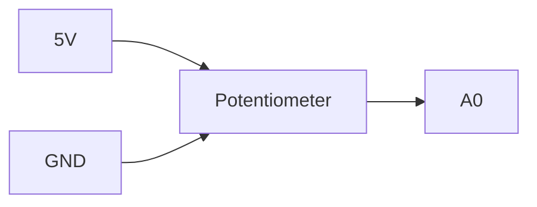

# Project 8 - PID Control, Damping and Stability

## Prerequisites

Complete:

- 00_Introduction.md
- 00A_DSO_Nano_Familiarisation.md
- 01_PWM_Fundamentals.md
- 02_RC_Circuits.md
- 03_RLC_Circuits.md
- 04_MOSFET_Fundamentals.md
- 05_PWM_Motor_Control.md
- 06_P_Controller.md
- 07_PI_Controller.md

---

# Objective

In this project you will learn:

- What derivative action is
- Why overshoot occurs
- How derivative action improves stability
- How a PID controller works
- How to tune PID gains
- How to observe system behaviour as gains change
- Why PID controllers are widely used in engineering

The PID controller is often considered the most important controller in classical control engineering.

Many industrial systems are controlled using:

```text
PID Controllers
```

because they provide:

- Fast response
- Good stability
- Small overshoot
- Zero steady-state error

---

# Learning Outcomes

At the end of this project you should be able to:

✅ Explain derivative action

✅ Explain overshoot

✅ Explain damping

✅ Implement a PID controller

✅ Tune Kp, Ki and Kd

✅ Understand PID trade-offs

✅ Explain stability improvements

---

# Review of Previous Controllers

## Proportional Controller

$$
u(t)=K_Pe(t)
$$

Provides immediate response.

---

## PI Controller

$$
u(t)=K_Pe(t)+K_I\int e(t)\,dt
$$

Advantages:

- Eliminates steady-state error

Limitation:

- Can produce overshoot
- Can increase oscillation

---

# Why Do We Need Derivative Action?

Consider the following response:

```text
Output

100 |          /\
    |         /  \__
    |        /
    |       /
    |      /
  0 +-----------------
           Time
```

The output exceeds the target.

This is called:

```text
Overshoot
```

---

# Overshoot

Overshoot occurs when the controller reacts too aggressively.

A highly responsive controller may:

- Reach the target quickly
- Continue moving past the target

Result:

```text
Oscillation
```

or

```text
Long settling time
```

---

# Derivative Action

Derivative action predicts future behaviour.

It monitors:

```text
How fast the error is changing
```

rather than simply how large the error is.

---

# Derivative Term

The derivative term is:

$$
\frac{de(t)}{dt}
$$

Where:

- $e(t)$ = Error Signal

This represents:

```text
Rate of Change of Error
```

---

# Intuition

If the error is changing very rapidly:

```text
Derivative Action Increases
```

The controller applies a braking effect.

---

# Vehicle Analogy

Imagine driving toward a red traffic light.

A proportional controller behaves like:

```text
Push accelerator based on distance.
```

A derivative controller behaves like:

```text
Apply brakes when approaching too quickly.
```

The derivative term anticipates future behaviour.

---

# PID Controller Equation

A PID controller combines:

- Proportional Action
- Integral Action
- Derivative Action

The controller equation is:

$$
u(t)=
K_Pe(t)
+
K_I\int e(t)\,dt
+
K_D\frac{de(t)}{dt}
$$

Where:

- $u(t)$ = Controller Output
- $K_P$ = Proportional Gain
- $K_I$ = Integral Gain
- $K_D$ = Derivative Gain
- $e(t)$ = Error Signal

---

# What Each Term Does

## Proportional Action

$$
K_Pe(t)
$$

Provides:

```text
Immediate Correction
```

---

## Integral Action

$$
K_I\int e(t)\,dt
$$

Provides:

```text
Long-Term Correction
```

Eliminates steady-state error.

---

## Derivative Action

$$
K_D\frac{de(t)}{dt}
$$

Provides:

```text
Predictive Damping
```

Reduces overshoot.

---

# Summary Table

| Term | Purpose |
|--------|---------|
| P | React to Error |
| I | Remove Steady-State Error |
| D | Reduce Overshoot and Oscillation |

---

# Components Required

From the SparkFun Inventor Kit:

- Arduino Uno
- Potentiometer
- Breadboard
- LED
- 220 Ω resistor
- Jumper wires

Equipment:

- DSO Nano Oscilloscope

---

# Experiment 1 - Implement a PID Controller

## Objective

Create a simple PID controller in Arduino.

---

# Wiring

Potentiometer:



LED:


---

# Arduino Code

```cpp
float Kp = 0.2;
float Ki = 0.02;
float Kd = 0.05;

float integral = 0;
float previousError = 0;

void setup()
{
    pinMode(9, OUTPUT);
}

void loop()
{
    int reference = analogRead(A0);

    int feedback = 0;

    float error = reference - feedback;

    integral = integral + error;

    integral = constrain(integral,-1000,1000);

    float derivative =
        error - previousError;

    float output =
          Kp * error
        + Ki * integral
        + Kd * derivative;

    output = constrain(output,0,255);

    analogWrite(9,(int)output);

    previousError = error;

    delay(10);
}
```

---

# Understanding the Code

Proportional Term:

```cpp
Kp * error
```

Reacts immediately.

---

Integral Term:

```cpp
Ki * integral
```

Removes steady-state error.

---

Derivative Term:

```cpp
Kd * derivative
```

Provides damping.

---

# Experiment 2 - Effect of Derivative Gain

## Objective

Observe how changing Kd affects behaviour.

---

## Test A

```cpp
Kd = 0;
```

This becomes:

```text
PI Control
```

Observation:

```text
______________________
```

---

## Test B

```cpp
Kd = 0.02;
```

Observation:

```text
______________________
```

---

## Test C

```cpp
Kd = 0.10;
```

Observation:

```text
______________________
```

---

## Test D

```cpp
Kd = 0.50;
```

Observation:

```text
______________________
```

---

# Results Table

| Kd | Behaviour |
|----|-----------|
| 0 | |
| 0.02 | |
| 0.10 | |
| 0.50 | |

---

# Understanding Damping

In Project 3 we studied:

```text
RLC Circuits
```

and:

```text
Damping Ratio
```

Derivative action behaves similarly.

Increasing:

$$
K_D
$$

typically increases damping.

This often reduces:

- Overshoot
- Oscillation

and improves:

- Stability

---

# Experiment 3 - Controller Tuning

## Objective

Investigate the effects of all three gains.

---

# Case 1

Large Kp

```cpp
Kp = 2.0;
Ki = 0.0;
Kd = 0.0;
```

Expected:

```text
Very Responsive
```

Possible:

```text
Overshoot
```

---

# Case 2

Large Ki

```cpp
Kp = 0.5;
Ki = 0.5;
Kd = 0.0;
```

Expected:

```text
Eliminates Error
```

Possible:

```text
Oscillation
```

---

# Case 3

Add Derivative

```cpp
Kp = 0.5;
Ki = 0.5;
Kd = 0.2;
```

Expected:

```text
Improved Stability
```

---

# Tuning Guidelines

## If Response Is Too Slow

Increase:

$$
K_P
$$

---

## If Steady-State Error Exists

Increase:

$$
K_I
$$

---

## If Overshoot Is Excessive

Increase:

$$
K_D
$$

---

# DSO Nano Exercise

Observe the PWM output.

---

# Probe Connections

Probe Tip:

```text
Pin 9
```

Probe Ground:

```text
GND
```

---

# DSO Nano Settings

Vertical:

```text
2 V/div
```

Horizontal:

```text
500 us/div
```

Trigger:

```text
Rising Edge
```

---

# Observation

Adjust gains and observe changes in PWM duty cycle.

Record:

```text
__________________________________
```

---

# Controller Performance Metrics

When evaluating a controller we often examine:

---

## Rise Time

Time required to reach the target.

---

## Overshoot

Amount by which the output exceeds the target.

---

## Settling Time

Time required for oscillations to disappear.

---

## Steady-State Error

Remaining error after the system settles.

---

# Desired Response

A well-tuned PID controller typically produces:

```text
Output

100 |        ________
    |      /
    |     /
    |    /
    |   /
  0 +----------------
          Time
```

Characteristics:

- Fast response
- Minimal overshoot
- Small settling time
- Zero steady-state error

---

# MATLAB Exercise

Create example controller responses.

```matlab
t = 0:0.01:10;

y1 = 1-exp(-t);

y2 = 1-exp(-t).*cos(5*t);

plot(t,y1,'LineWidth',2)

hold on

plot(t,y2,'LineWidth',2)

grid on

legend('Well Damped','Oscillatory')

xlabel('Time (s)')
ylabel('Response')

title('Closed Loop Response Comparison')
```

---

# Expected Result

Compare:

```text
Well Damped Response
```

with:

```text
Oscillatory Response
```

The goal of derivative action is to make the response more damped.

---

# Typical Controller Applications

PID controllers are widely used in:

## Motor Control

Speed and position control.

---

## Robotics

Motion systems.

---

## Process Control

Temperature, pressure and flow regulation.

---

## Power Electronics

Converter regulation.

---

## Industrial Automation

Closed-loop control systems.

---

# Knowledge Check

## Question 1

What does derivative action measure?

Answer:

```text
____________________
```

---

## Question 2

Write the PID controller equation.

Answer:

```text
____________________
```

---

## Question 3

What does the integral term do?

Answer:

```text
____________________
```

---

## Question 4

What does the derivative term do?

Answer:

```text
____________________
```

---

## Question 5

Which gain is primarily used to reduce overshoot?

Answer:

```text
____________________
```

---

# Common Mistakes

## Excessive Oscillation

Reduce:

- Kp
- Ki

or increase:

- Kd

---

## Very Slow Response

Increase:

- Kp

carefully.

---

## Controller Saturation

Check:

- Output limits
- Integral windup

---

## No Visible PWM Changes

Check:

- Probe connections
- Gain values
- Arduino code

---

# Troubleshooting Checklist

✅ PWM output present

✅ DSO Nano connected

✅ Kp set correctly

✅ Ki set correctly

✅ Kd set correctly

✅ Integral windup limited

✅ PWM changes when gains change

---

# Project Summary

In this project you learned:

✅ PID control

✅ Derivative action

✅ Damping

✅ Overshoot reduction

✅ Controller tuning

✅ Stability concepts

✅ Closed-loop performance metrics

✅ Practical PID implementation

You now understand the most widely used controller in classical control engineering.

---

# Next Project

**09_Buck_Converter.md**

Topics:

- DC-DC Conversion
- Inductors in Power Electronics
- MOSFET Switching
- Energy Transfer
- Output Ripple
- Converter Efficiency
- Practical Power Electronics