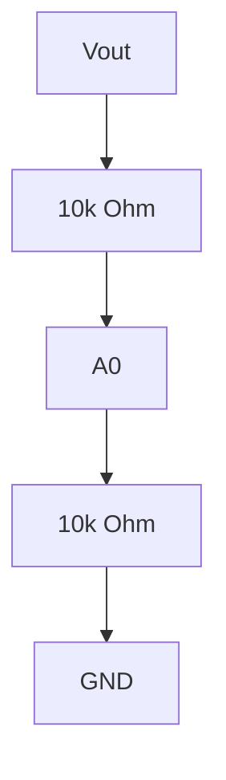

# Project 10 - Closed-Loop Buck Converter Control

## Prerequisites

Complete:

- 00_Introduction.md
- 00B_Oscilloscope_Familiarisation.md
- 01_PWM_Fundamentals.md
- 02_RC_Circuits.md
- 03_RLC_Circuits.md
- 04_MOSFET_Fundamentals.md
- 05_PWM_Motor_Control.md
- 06_P_Controller.md
- 07_PI_Controller.md
- 08_PID_Controller.md
- 09_Buck_Converter.md

---

# Objective

In this project you will learn:

- Why open-loop Buck Converters have limitations
- How voltage feedback works
- How PI controllers regulate output voltage
- How disturbances affect converter performance
- How feedback improves regulation
- How to tune a closed-loop converter
- How control theory and power electronics work together

This project combines:

```text
Power Electronics
+
Control Systems
```

to create a practical regulated power supply.

---

# Learning Outcomes

At the end of this project you should be able to:

✅ Explain closed-loop regulation

✅ Implement voltage feedback

✅ Calculate voltage error

✅ Implement a PI controller

✅ Explain disturbance rejection

✅ Tune PI gains

✅ Analyse converter performance

---

# Introduction

In Project 9 the Buck Converter operated in:

```text
Open Loop
```

The Arduino generated a fixed duty cycle.

Example:

```text
Duty Cycle = 50%
```

The converter output depended entirely on:

- Input voltage
- Component values
- Load conditions

No automatic correction occurred.

---

# Problem with Open-Loop Operation

Suppose:

$$
V_{OUT}=5V
$$

and the load increases.

The voltage may fall to:

$$
4.5V
$$

An open-loop controller does not detect the error.

Therefore:

```text
No Correction Occurs
```

---

# Closed-Loop Control

Closed-loop control measures the output voltage continuously.

The measured voltage is compared to a desired value.

The controller then adjusts duty cycle automatically.

---

# Closed-Loop Block Diagram


---

# Reference Voltage

The desired output voltage is called the:

```text
Reference
```

Symbol:

$$
r(t)
$$

Example:

$$
r=5V
$$

---

# Measured Output Voltage

The actual converter output is:

$$
y(t)
$$

Example:

$$
y=4.7V
$$

---

# Error Signal

The controller calculates:

$$
e(t)=r(t)-y(t)
$$

Where:

- $e(t)$ = Error
- $r(t)$ = Reference
- $y(t)$ = Measured Output

---

# Example Error Calculation

Given:

$$
r=5V
$$

and:

$$
y=4.7V
$$

Then:

$$
e=r-y
$$

$$
e=5-4.7
$$

$$
e=0.3V
$$

---

# Controller Response

If:

```text
Output Voltage Too Low
```

the controller:

```text
Increases Duty Cycle
```

---

If:

```text
Output Voltage Too High
```

the controller:

```text
Reduces Duty Cycle
```

---

# Why PI Control Is Common

Buck Converters are frequently regulated using:

```text
PI Controllers
```

because they:

✅ Eliminate steady-state error

✅ Provide good regulation

✅ Are easy to implement

✅ Work well in practical systems

---

# PI Controller Equation

$$
u(t)=K_Pe(t)+K_I\int e(t)\,dt
$$

Where:

- $u(t)$ = Controller Output
- $K_P$ = Proportional Gain
- $K_I$ = Integral Gain
- $e(t)$ = Error Signal

---

# Converter Control Strategy

```text
Measure Output
      ↓
Calculate Error
      ↓
PI Controller
      ↓
Adjust Duty Cycle
      ↓
Correct Output Voltage
```

---

# Measuring Converter Output Voltage

Arduino inputs can only measure voltages within:

```text
0V to 5V
```

A voltage divider is therefore required.

---

# Voltage Divider Circuit



---

# Divider Equation

$$
V_{A0}
=
V_{OUT}
\cdot
\frac{R_2}{R_1+R_2}
$$

For:

$$
R_1=R_2
$$

the divider becomes:

$$
V_{A0}
=
\frac{V_{OUT}}{2}
$$

---

# Components Required

- Arduino Uno
- Buck Converter from Project 9
- 10 kΩ resistor
- 10 kΩ resistor
- DSO Nano Oscilloscope

---

# Experiment 1 - Measure Converter Output

## Objective

Read the converter output voltage using the Arduino ADC.

---

# Arduino Code

```cpp
void setup()
{
    Serial.begin(9600);
}

void loop()
{
    int adc = analogRead(A0);

    Serial.println(adc);

    delay(100);
}
```

---

# Expected Behaviour

The ADC value should vary with:

- Output voltage
- Duty cycle
- Load conditions

---

# Convert ADC Reading to Voltage

Arduino ADC range:

```text
0 to 1023
```

represents:

```text
0V to 5V
```

Measured ADC input voltage:

$$
V_{A0}
=
\frac{ADC}{1023}
\cdot
5
$$

---

# Experiment 2 - Implement PI Regulation

## Objective

Automatically regulate output voltage.

---

# Arduino Code

```cpp
float Kp = 10.0;
float Ki = 1.0;

float integral = 0;

float reference = 2.5;

void setup()
{
    pinMode(9, OUTPUT);
}

void loop()
{
    int adc = analogRead(A0);

    float feedback =
        (adc / 1023.0) * 5.0;

    float error =
        reference - feedback;

    integral =
        integral + error;

    integral =
        constrain(integral,-100,100);

    float control =
          Kp * error
        + Ki * integral;

    control =
        constrain(control,0,255);

    analogWrite(9,(int)control);

    delay(10);
}
```

---

# Understanding the Controller

Reference:

$$
r=2.5V
$$

Feedback:

$$
y
$$

Error:

$$
e=r-y
$$

Controller:

$$
u=K_Pe+K_I\int e(t)\,dt
$$

Controller Output:

```text
PWM Duty Cycle Command
```

---

# Experiment 3 - Disturbance Rejection

## Objective

Observe how feedback corrects disturbances.

---

# Procedure

Operate the converter normally.

Then:

```text
Change the Load
```

or

```text
Change the Input Voltage Slightly
```

---

# Observation

The output voltage will deviate briefly.

The controller will then:

```text
Adjust Duty Cycle
```

and return the voltage toward the target value.

---

# Disturbance Rejection

The ability to recover from disturbances is called:

```text
Disturbance Rejection
```

This is one of the primary advantages of closed-loop control.

---

# Experiment 4 - PI Gain Tuning

## Objective

Observe how controller gains affect system behaviour.

---

# Test A

```cpp
Kp = 2;
Ki = 0.2;
```

Expected:

```text
Slow Response
```

---

# Test B

```cpp
Kp = 10;
Ki = 1;
```

Expected:

```text
Balanced Response
```

---

# Test C

```cpp
Kp = 50;
Ki = 5;
```

Expected:

```text
Very Aggressive Response
```

Possible:

```text
Oscillation
```

---

# Results Table

| Kp | Ki | Behaviour |
|----|----|------------|
| 2 | 0.2 | |
| 10 | 1 | |
| 50 | 5 | |

---

# DSO Nano Exercise

## PWM Signal

Probe Tip:

```text
Gate Signal
```

Probe Ground:

```text
Ground
```

Observe the PWM duty cycle.

---

## Output Voltage

Probe Tip:

```text
Vout
```

Probe Ground:

```text
Ground
```

Observe output voltage and ripple.

---

# DSO Nano Settings

PWM Measurement:

```text
2 V/div
500 µs/div
```

---

Output Ripple Measurement:

```text
200 mV/div
500 µs/div
```

---

# Observe

As the controller regulates voltage:

- Duty cycle changes automatically
- Ripple changes with operating conditions
- Output voltage remains close to the reference value

---

# Control Performance Metrics

Several metrics are commonly used to evaluate controller performance.

---

## Rise Time

Time required to approach the target voltage.

---

## Overshoot

Amount by which the voltage exceeds the target value.

---

## Settling Time

Time required to remain within an acceptable error band.

---

## Steady-State Error

Final difference between:

```text
Reference Voltage
```

and

```text
Output Voltage
```

---

# Desired Response

```text
Voltage

5V |         _______
   |       /
   |     /
   |   /
   | /
0V +-----------------
           Time
```

Characteristics:

- Fast rise time
- Low overshoot
- Small settling time
- Zero steady-state error

---

# MATLAB Exercise

Simulate a typical closed-loop response.

```matlab
t = 0:0.01:5;

tau = 0.3;

y = 5*(1-exp(-t/tau));

plot(t,y,'LineWidth',2)

grid on

xlabel('Time (s)')
ylabel('Output Voltage (V)')

title('Closed Loop Voltage Response')
```

---

# Expected Result

The voltage should smoothly reach:

$$
5V
$$

with minimal error.

---

# Engineering Applications

Closed-loop Buck Converters are widely used in:

## Computer Power Supplies

Stable voltage rails.

---

## Telecommunications Equipment

Regulated DC supplies.

---

## Industrial Electronics

Power conversion systems.

---

## Electric Vehicles

Battery management and auxiliary power.

---

## Robotics

Logic and actuator power regulation.

---

# Knowledge Check

## Question 1

What is the purpose of voltage feedback?

Answer:

```text
____________________
```

---

## Question 2

Write the PI controller equation.

Answer:

```text
____________________
```

---

## Question 3

What is disturbance rejection?

Answer:

```text
____________________
```

---

## Question 4

Why is a voltage divider required?

Answer:

```text
____________________
```

---

## Question 5

What happens if the gains are too large?

Answer:

```text
____________________
```

---

# Common Mistakes

## Output Voltage Oscillates

Check:

- Kp too high
- Ki too high

---

## No Feedback Reading

Check:

- Voltage divider wiring
- ADC input

---

## PWM Saturated

Check:

- Controller limits
- Reference voltage

---

## No Regulation

Check:

- Error calculation
- Feedback polarity
- Controller implementation

---

# Troubleshooting Checklist

✅ Voltage divider functioning

✅ ADC value changes correctly

✅ PWM signal present

✅ PI controller running

✅ Output responds to disturbances

✅ Stable regulation achieved

✅ Output voltage remains near target

---

# Project Summary

In this project you learned:

✅ Closed-loop regulation

✅ Voltage feedback

✅ PI control

✅ Disturbance rejection

✅ Controller tuning

✅ Converter dynamics

✅ Stability concepts

✅ Practical voltage regulation

This project brings together power electronics and control theory to create a practical regulated power supply.

---

# Next Project

**11_Boost_Converter.md**

Topics:

- Step-Up Conversion
- Boost Converter Operation
- Inductor Energy Transfer
- Duty Cycle Relationships
- Converter Efficiency
- Practical Measurements
