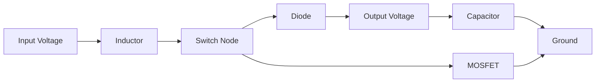
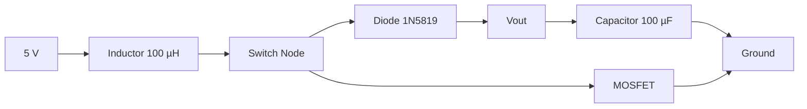

# Project 11 - Boost Converter Fundamentals

## Prerequisites

Complete:

- 00_Introduction.md
- 00A_DSO_Nano_Familiarisation.md
- 01_PWM_Fundamentals.md
- 02_RC_Circuits.md
- 03_RLC_Circuits.md
- 04_MOSFET_Fundamentals.md
- 05_PWM_Motor_Control.md
- 06_P_Controller.md
- 07_PI_Controller.md
- 08_PID_Controller.md
- 09_Buck_Converter.md
- 10_Closed_Loop_Buck.md

---

# Objective

In this project you will learn:

- What a Boost Converter is
- How a Boost Converter increases voltage
- How inductors store and transfer energy
- Why the output voltage can exceed the input voltage
- How duty cycle controls output voltage
- How to measure switching waveforms
- How Boost Converters compare to Buck Converters

This project introduces the second major non-isolated DC-DC converter topology.

---

# Learning Outcomes

At the end of this project you should be able to:

✅ Explain Boost Converter operation

✅ Explain inductor energy storage

✅ Calculate ideal output voltage

✅ Understand duty cycle effects

✅ Measure PWM switching signals

✅ Measure output ripple

✅ Compare Buck and Boost Converters

---

# Introduction

A Boost Converter is a:

```text
Step-Up DC-DC Converter
```

It converts a lower DC voltage into a higher DC voltage.

Examples:

```text
5 V → 12 V

12 V → 24 V

24 V → 48 V
```

Unlike a transformer:

```text
No AC Input Is Required
```

Voltage conversion is achieved using:

- PWM
- MOSFET switching
- Inductor energy storage

---

# Why Are Boost Converters Useful?

Many systems require a voltage higher than the available battery or supply.

Examples:

- LED drivers
- Portable electronics
- Electric vehicles
- Solar energy systems
- Power supplies

---

# Energy Conversion Concept

A Boost Converter operates in two stages:

```text
Store Energy
     ↓
Release Energy
```

The inductor stores energy and then releases it into the output circuit.

---

# Main Components

A Boost Converter contains:

1. Inductor
2. MOSFET
3. Diode
4. Capacitor
5. Load

---

# Basic Circuit



---

# Role of the Inductor

The inductor stores energy in a magnetic field.

Stored energy:

$$
E=\frac{1}{2}LI^2
$$

Where:

- $E$ = Energy (J)
- $L$ = Inductance (H)
- $I$ = Current (A)

As current increases:

```text
Stored Energy Increases
```

---

# Role of the MOSFET

The MOSFET acts as a PWM-controlled switch.

The duty cycle determines:

```text
How Long Energy Is Stored
```

inside the inductor.

---

# Role of the Diode

The diode provides a path for inductor current when the MOSFET turns OFF.

The diode also prevents:

```text
Reverse Current Flow
```

from the output back to the input.

---

# Role of the Capacitor

The capacitor smooths the output voltage.

Stored energy:

$$
E=\frac{1}{2}CV^2
$$

The capacitor reduces ripple and supports the load between switching intervals.

---

# Operating Principle

## Phase 1 - MOSFET ON

Current path:

```text
Input
  ↓
Inductor
  ↓
MOSFET
  ↓
Ground
```

During this phase:

- Inductor current increases
- Magnetic energy is stored
- Diode is reverse biased

---

# Phase 2 - MOSFET OFF

When the MOSFET switches OFF:

```text
Inductor Current Continues Flowing
```

The inductor generates a voltage that forces current through:

```text
Inductor
  ↓
Diode
  ↓
Output Capacitor
  ↓
Load
```

The output voltage becomes higher than the input voltage.

---

# Why Can Output Voltage Exceed Input Voltage?

Recall:

$$
V_L=L\frac{di}{dt}
$$

An inductor resists sudden current change.

When the MOSFET turns OFF, the inductor produces a voltage that adds to the supply voltage.

Therefore:

```text
Output Voltage > Input Voltage
```

is possible.

---

# Ideal Boost Converter Equation

For an ideal Boost Converter:

$$
V_{OUT}
=
\frac{V_{IN}}{1-D}
$$

Where:

- $V_{OUT}$ = Output Voltage
- $V_{IN}$ = Input Voltage
- $D$ = Duty Cycle

---

# Example 1

Given:

$$
V_{IN}=5V
$$

and:

$$
D=0.5
$$

Then:

$$
V_{OUT}
=
\frac{5}{1-0.5}
$$

$$
V_{OUT}=10V
$$

---

# Example 2

Given:

$$
V_{IN}=5V
$$

and:

$$
D=0.75
$$

Then:

$$
V_{OUT}
=
\frac{5}{1-0.75}
$$

$$
V_{OUT}=20V
$$

---

# Important Practical Note

Real converters are not ideal.

Actual output voltage is lower because of:

- Diode voltage drop
- MOSFET losses
- Inductor resistance
- Switching losses

---

# Components Required

Additional Components:

- 100 µH Inductor
- 1N5819 Schottky Diode
- 100 µF Capacitor
- IRLZ44N MOSFET

Existing Equipment:

- Arduino Uno
- Breadboard
- Jumper Wires
- DSO Nano Oscilloscope

---

# Safety Notice

Begin with:

```text
5 V Input Supply
```

and low power loads.

Do not connect sensitive electronics directly to an untested converter output.

---

# Experimental Boost Converter



---

# Experiment 1 - Generate PWM

## Objective

Observe the switching signal that drives the converter.

---

# Arduino Code

```cpp
void setup()
{
    pinMode(9, OUTPUT);
}

void loop()
{
    analogWrite(9,128);
}
```

---

# Oscilloscope Connections

Probe Tip:

```text
MOSFET Gate
```

Probe Ground:

```text
Ground
```

---

# DSO Nano Settings

Vertical:

```text
2 V/div
```

Horizontal:

```text
500 µs/div
```

Trigger:

```text
Rising Edge
```

---

# Expected Waveform

```text
5V ─────      ─────
         │      │
         │      │
0V ______│______│______
```

---

# Measurements

| Parameter | Expected | Measured |
|------------|-----------|-----------|
| Frequency | ~490 Hz | |
| Duty Cycle | ~50% | |
| Gate Voltage | ~5 V | |

---

# Experiment 2 - Duty Cycle Investigation

## Objective

Observe how duty cycle affects output voltage.

---

# Test A

```cpp
analogWrite(9,64);
```

Expected Duty Cycle:

```text
25%
```

Measure:

```text
Output Voltage = __________
```

---

# Test B

```cpp
analogWrite(9,128);
```

Expected Duty Cycle:

```text
50%
```

Measure:

```text
Output Voltage = __________
```

---

# Test C

```cpp
analogWrite(9,192);
```

Expected Duty Cycle:

```text
75%
```

Measure:

```text
Output Voltage = __________
```

---

# Results Table

| PWM Value | Duty Cycle | Output Voltage |
|------------|------------|---------------|
| 64 | 25% | |
| 128 | 50% | |
| 192 | 75% | |

---

# Experiment 3 - Measure Output Ripple

## Objective

Observe output voltage ripple.

---

# Probe Location

Probe Tip:

```text
Vout
```

Probe Ground:

```text
Ground
```

---

# DSO Nano Settings

Vertical:

```text
200 mV/div
```

Horizontal:

```text
500 µs/div
```

Trigger:

```text
Rising Edge
```

---

# Expected Observation

The output should contain:

```text
Average DC Voltage
```

plus:

```text
Small Ripple Voltage
```

Ripple occurs because the capacitor continuously charges and discharges.

---

# Reducing Ripple

Ripple can often be reduced by:

- Increasing capacitance
- Increasing inductance
- Increasing switching frequency

---

# Comparing Buck and Boost Converters

| Property | Buck Converter | Boost Converter |
|-----------|---------------|----------------|
| Purpose | Step Down Voltage | Step Up Voltage |
| Uses PWM | Yes | Yes |
| Uses MOSFET | Yes | Yes |
| Uses Inductor | Yes | Yes |
| Uses Capacitor | Yes | Yes |
| Output Voltage | Lower Than Input | Higher Than Input |

---

# Relationship to Previous Projects

## Project 1

PWM controls duty cycle.

---

## Project 2

Capacitors smooth voltage.

---

## Project 3

Inductors store energy.

---

## Project 4

MOSFETs provide efficient switching.

---

## Projects 6 to 8

Controllers regulate converter output.

---

## Project 9

Buck Converters perform step-down conversion.

---

## Project 10

Closed-loop control automatically regulates voltage.

---

# MATLAB Exercise

Plot ideal Boost Converter output voltage.

```matlab
D = 0:0.01:0.9;

Vin = 5;

Vout = Vin ./ (1 - D);

plot(D,Vout,'LineWidth',2)

grid on

xlabel('Duty Cycle')
ylabel('Output Voltage (V)')

title('Ideal Boost Converter')
```

---

# Expected Result

As duty cycle increases:

```text
Output Voltage Increases
```

according to:

$$
V_{OUT}
=
\frac{V_{IN}}{1-D}
$$

---

# Engineering Applications

Boost Converters are used in:

## LED Drivers

Generating higher output voltages.

---

## Portable Electronics

Battery voltage conversion.

---

## Electric Vehicles

Power conversion systems.

---

## Solar Energy Systems

Maximum power point applications.

---

## Industrial Power Supplies

Generating multiple voltage rails.

---

# Knowledge Check

## Question 1

Write the ideal Boost Converter equation.

Answer:

```text
____________________
```

---

## Question 2

Why can the output voltage exceed the input voltage?

Answer:

```text
____________________
```

---

## Question 3

What is the role of the diode?

Answer:

```text
____________________
```

---

## Question 4

What stores energy in a Boost Converter?

Answer:

```text
____________________
```

---

## Question 5

What happens when duty cycle increases?

Answer:

```text
____________________
```

---

# Common Mistakes

## Output Voltage Does Not Increase

Check:

- MOSFET wiring
- Diode orientation
- Inductor connections

---

## Excessive Ripple

Check:

- Capacitor value
- Capacitor polarity
- Load conditions

---

## No PWM Observed

Check:

- Arduino sketch
- Probe connection
- Trigger settings

---

# Troubleshooting Checklist

✅ PWM present

✅ MOSFET switching correctly

✅ Inductor installed

✅ Diode orientation verified

✅ Capacitor polarity correct

✅ Output voltage measured

✅ Duty cycle affects output voltage

---

# Project Summary

In this project you learned:

✅ Boost Converter operation

✅ Step-up voltage conversion

✅ Inductor energy storage

✅ PWM-controlled energy transfer

✅ Diode operation

✅ Output ripple

✅ Practical DC-DC conversion

You have now studied the two most important non-isolated converter topologies:

- Buck Converter
- Boost Converter

These converters form the foundation of many modern power electronic systems.

---

# Next Project

**12_System_Identification.md**

Topics:

- Dynamic System Modelling
- Experimental Measurements
- Time Constant Estimation
- Transfer Functions
- Model Validation
- Control-Oriented Modelling