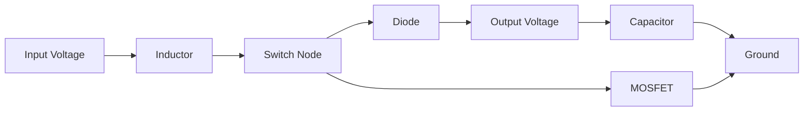
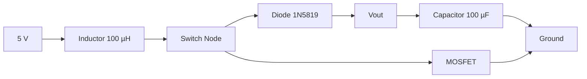

# Project 11 - Boost Converter Fundamentals

### Prerequisites

Complete:

- 00_Introduction.md
- 00B_Oscilloscope_Familiarisation.md
- 01_PWM_Fundamentals.md
- 02_RC_Circuits.md
- 03_RLC_Circuits.md
- 04_MOSFET_Fundamentals.md
- 05_PWM_Motor_Control.md
- 06_P_Controller.md
- 07_PI_Controller.md
- 08_PID_Controller.md
- 09_Buck_Converter.md
- 10_Closed_Loop_Buck.md

---

## Objective

In this project you will learn:

- What a Boost Converter is
- How a Boost Converter increases voltage
- How inductors store and transfer energy
- Why the output voltage can exceed the input voltage
- How duty cycle controls output voltage
- How to measure switching waveforms
- How Boost Converters compare to Buck Converters

This project introduces the second major non-isolated DC-DC converter topology.

---

## Learning Outcomes

At the end of this project you should be able to:

✅ Explain Boost Converter operation

✅ Explain inductor energy storage

✅ Calculate ideal output voltage

✅ Understand duty cycle effects

✅ Measure PWM switching signals

✅ Measure output ripple

✅ Compare Buck and Boost Converters

---

## Introduction

A Boost Converter is a:

```text
Step-Up DC-DC Converter
```

It converts a lower DC voltage into a higher DC voltage.

Examples:

```text
5 V → 12 V

12 V → 24 V

24 V → 48 V
```

Unlike a transformer:

```text
No AC Input Is Required
```

Voltage conversion is achieved using:

- PWM
- MOSFET switching
- Inductor energy storage

---

## Why Are Boost Converters Useful?

Many systems require a voltage higher than the available battery or supply.

Examples:

- LED drivers
- Portable electronics
- Electric vehicles
- Solar energy systems
- Power supplies

---

## Energy Conversion Concept

A Boost Converter operates in two stages:

```text
Store Energy
     ↓
Release Energy
```

The inductor stores energy and then releases it into the output circuit.

---

## Main Components

A Boost Converter contains:

1. Inductor
2. MOSFET
3. Diode
4. Capacitor
5. Load

---

## Basic Circuit



---

## Role of the Inductor

The inductor stores energy in a magnetic field.

Stored energy:

$$
E=\frac{1}{2}LI^2
$$

Where:

- $E$ = Energy (J)
- $L$ = Inductance (H)
- $I$ = Current (A)

As current increases:

```text
Stored Energy Increases
```

---

## Role of the MOSFET

The MOSFET acts as a PWM-controlled switch.

The duty cycle determines:

```text
How Long Energy Is Stored
```

inside the inductor.

---

## Role of the Diode

The diode provides a path for inductor current when the MOSFET turns OFF.

The diode also prevents:

```text
Reverse Current Flow
```

from the output back to the input.

---

## Role of the Capacitor

The capacitor smooths the output voltage.

Stored energy:

$$
E=\frac{1}{2}CV^2
$$

The capacitor reduces ripple and supports the load between switching intervals.

---

## Operating Principle

### Phase 1 - MOSFET ON

Current path:

```text
Input
  ↓
Inductor
  ↓
MOSFET
  ↓
Ground
```

During this phase:

- Inductor current increases
- Magnetic energy is stored
- Diode is reverse biased

---

## Phase 2 - MOSFET OFF

When the MOSFET switches OFF:

```text
Inductor Current Continues Flowing
```

The inductor generates a voltage that forces current through:

```text
Inductor
  ↓
Diode
  ↓
Output Capacitor
  ↓
Load
```

The output voltage becomes higher than the input voltage.

---

## Why Can Output Voltage Exceed Input Voltage?

Recall:

$$
V_L=L\frac{di}{dt}
$$

An inductor resists sudden current change.

When the MOSFET turns OFF, the inductor produces a voltage that adds to the supply voltage.

Therefore:

```text
Output Voltage > Input Voltage
```

is possible.

---

## Ideal Boost Converter Equation

For an ideal Boost Converter:

$$
V_{OUT}
=
\frac{V_{IN}}{1-D}
$$

Where:

- $V_{OUT}$ = Output Voltage
- $V_{IN}$ = Input Voltage
- $D$ = Duty Cycle

---

## Example 1

Given:

$$
V_{IN}=5V
$$

and:

$$
D=0.5
$$

Then:

$$
V_{OUT}
=
\frac{5}{1-0.5}
$$

$$
V_{OUT}=10V
$$

---

## Example 2

Given:

$$
V_{IN}=5V
$$

and:

$$
D=0.75
$$

Then:

$$
V_{OUT}
=
\frac{5}{1-0.75}
$$

$$
V_{OUT}=20V
$$

---

## Important Practical Note

Real converters are not ideal.

Actual output voltage is lower because of:

- Diode voltage drop
- MOSFET losses
- Inductor resistance
- Switching losses

---

## MATLAB Simulation

Before building the circuit, simulate the ideal Boost Converter characteristics to predict what you will measure.

### Vout vs Duty Cycle — Nonlinear Gain

```matlab
Vin = 5;
D   = 0:0.001:0.95;          % avoid D=1 (infinite gain)
Vout_ideal = Vin ./ (1 - D);

D_exp    = [0.25, 0.50, 0.75];
Vout_exp = Vin ./ (1 - D_exp);

figure;
plot(D, Vout_ideal, 'b', 'LineWidth', 2); hold on;
scatter(D_exp, Vout_exp, 80, 'r', 'filled', 'DisplayName', 'Experiment points');
xline(0.75, 'r--', 'Max safe D for 5V in / 20V out');
yline(20, 'k:', '20V practical limit');
grid on;
xlabel('Duty Cycle'); ylabel('Output Voltage (V)');
title('Ideal Boost Converter \mdash V_{IN} = 5V');
legend('Ideal V_{OUT}', 'Experiment points', 'Location', 'northwest');
ylim([0 30]);
```

### Simulate Inductor Current Waveform

In a Boost Converter the inductor current ramps up during MOSFET ON (energy storage) and ramps down during MOSFET OFF (energy transfer to output):

```matlab
Vin  = 5;
D    = 0.5;
Vout = Vin / (1 - D);    % ideal
L    = 100e-6;
fsw  = 490;
Ts   = 1 / fsw;
Iavg = 0.05;             % assumed average inductor current (A)

delta_iL = Vin * D * Ts / L;

t_on  = linspace(0,    D*Ts, 100);
t_off = linspace(D*Ts, Ts,   100);

iL_on  = (Iavg - delta_iL/2) + Vin/L .* t_on;
iL_off = (Iavg + delta_iL/2) - (Vout - Vin)/L .* (t_off - D*Ts);

figure;
plot([t_on, t_off]*1e3, [iL_on, iL_off]*1e3, 'b', 'LineWidth', 2);
grid on;
xlabel('Time (ms)'); ylabel('Inductor Current (mA)');
title(sprintf('Boost Inductor Current \mdash D=%.0f%%, L=%d\muH', D*100, L*1e6));
yline(Iavg*1e3, 'r--', sprintf('I_{avg} = %.0f mA', Iavg*1e3));
```

### Prediction Table

Record your predicted output voltages before measuring:

| PWM Value | Duty Cycle | Predicted V\_{OUT} (V) |
|-----------|------------|------------------------|
| 64 | 25% | |
| 128 | 50% | |
| 192 | 75% | |

> Note: At D = 75% the ideal equation predicts 20V from a 5V supply. Real output will be lower due to losses, but take care with your multimeter range.

---

## Components Required

Additional Components:

- 100 µH Inductor
- 1N5819 Schottky Diode
- 100 µF Capacitor
- IRLZ44N MOSFET

Existing Equipment:

- Arduino Uno
- Breadboard
- Jumper Wires
- DSO Nano Oscilloscope

---

## Safety Notice

Begin with:

```text
5 V Input Supply
```

and low power loads.

Do not connect sensitive electronics directly to an untested converter output.

---

## Experimental Boost Converter



---

## Experiment 1 - Generate PWM

### Objective

Observe the switching signal that drives the converter.

---

## Arduino Code

```cpp
void setup()
{
    pinMode(9, OUTPUT);
}

void loop()
{
    analogWrite(9,128);
}
```

---

## Oscilloscope Connections

Probe Tip:

```text
MOSFET Gate
```

Probe Ground:

```text
Ground
```

---

## DSO Nano Settings

Vertical:

```text
2 V/div
```

Horizontal:

```text
500 µs/div
```

Trigger:

```text
Rising Edge
```

---

## Expected Waveform

```text
5V ─────      ─────
         │      │
         │      │
0V ______│______│______
```

---

## Measurements

| Parameter | Expected | Measured |
|------------|-----------|-----------|
| Frequency | ~490 Hz | |
| Duty Cycle | ~50% | |
| Gate Voltage | ~5 V | |

---

## Experiment 2 - Duty Cycle Investigation

### Objective

Observe how duty cycle affects output voltage.

---

## Test A

```cpp
analogWrite(9,64);
```

Expected Duty Cycle:

```text
25%
```

Measure:

```text
Output Voltage = __________
```

---

## Test B

```cpp
analogWrite(9,128);
```

Expected Duty Cycle:

```text
50%
```

Measure:

```text
Output Voltage = __________
```

---

## Test C

```cpp
analogWrite(9,192);
```

Expected Duty Cycle:

```text
75%
```

Measure:

```text
Output Voltage = __________
```

---

## Results Table

| PWM Value | Duty Cycle | Output Voltage |
|------------|------------|---------------|
| 64 | 25% | |
| 128 | 50% | |
| 192 | 75% | |

---

## Experiment 3 - Measure Output Ripple

### Objective

Observe output voltage ripple.

---

## Probe Location

Probe Tip:

```text
Vout
```

Probe Ground:

```text
Ground
```

---

## DSO Nano Settings

Vertical:

```text
200 mV/div
```

Horizontal:

```text
500 µs/div
```

Trigger:

```text
Rising Edge
```

---

## Expected Observation

The output should contain:

```text
Average DC Voltage
```

plus:

```text
Small Ripple Voltage
```

Ripple occurs because the capacitor continuously charges and discharges.

---

## Reducing Ripple

Ripple can often be reduced by:

- Increasing capacitance
- Increasing inductance
- Increasing switching frequency

---

## Comparing Buck and Boost Converters

| Property | Buck Converter | Boost Converter |
|-----------|---------------|----------------|
| Purpose | Step Down Voltage | Step Up Voltage |
| Uses PWM | Yes | Yes |
| Uses MOSFET | Yes | Yes |
| Uses Inductor | Yes | Yes |
| Uses Capacitor | Yes | Yes |
| Output Voltage | Lower Than Input | Higher Than Input |

---

## Relationship to Previous Projects

### Project 1

PWM controls duty cycle.

---

### Project 2

Capacitors smooth voltage.

---

### Project 3

Inductors store energy.

---

### Project 4

MOSFETs provide efficient switching.

---

### Projects 6 to 8

Controllers regulate converter output.

---

### Project 9

Buck Converters perform step-down conversion.

---

### Project 10

Closed-loop control automatically regulates voltage.

---

## MATLAB Comparison

Now overlay your measured output voltages against the ideal Boost Converter curve and compare with the Buck Converter results from Project 9.

### Enter Your Measured Values

```matlab
Vin = 5;

D_measured    = [0.25,  0.50,  0.75];   % duty cycles tested
Vout_measured = [0.00,  0.00,  0.00];   % replace with your measured voltages (V)

D_ideal  = 0:0.001:0.95;
Vout_ideal = Vin ./ (1 - D_ideal);

figure; hold on;
plot(D_ideal, Vout_ideal, 'b--', 'LineWidth', 2, ...
    'DisplayName', 'Ideal: V_{OUT} = V_{IN}/(1-D)');
scatter(D_measured, Vout_measured, 80, 'r', 'filled', ...
    'DisplayName', 'Measured');
grid on;
xlabel('Duty Cycle'); ylabel('Output Voltage (V)');
title('Boost Converter \mdash Ideal vs Measured');
legend('Location', 'northwest');
ylim([0 25]);

% Calculate conversion ratio error at each point
fprintf('%-8s %-12s %-12s %-14s %-12s\n', ...
    'D', 'V_ideal(V)', 'V_meas(V)', 'Ratio_ideal', 'Ratio_meas');
for i = 1:3
    V_ideal  = Vin / (1 - D_measured(i));
    M_ideal  = V_ideal / Vin;
    M_meas   = Vout_measured(i) / Vin;
    fprintf('%-8.2f %-12.2f %-12.2f %-14.2f %-12.2f\n', ...
        D_measured(i), V_ideal, Vout_measured(i), M_ideal, M_meas);
end
```

### Buck vs Boost Comparison

```matlab
Vin = 5;
D   = 0:0.001:0.95;

Vout_buck  = Vin .* D;
Vout_boost = Vin ./ (1 - D);

figure; hold on;
plot(D, Vout_buck,  'b', 'LineWidth', 2, 'DisplayName', 'Buck: D \cdot V_{IN}');
plot(D, Vout_boost, 'r', 'LineWidth', 2, 'DisplayName', 'Boost: V_{IN}/(1-D)');
yline(Vin, 'k--', sprintf('V_{IN} = %.0fV', Vin));
grid on;
xlabel('Duty Cycle'); ylabel('Output Voltage (V)');
title('Buck vs Boost \mdash Voltage Conversion');
legend('Location', 'north');
ylim([0 20]);
```

### Reflection

- Is the measured Vout lower than ideal at all three duty cycles? Which duty cycle shows the largest absolute error?
- The Boost conversion ratio M = Vout/Vin becomes very sensitive to D near D = 1. Why is this a practical problem for control?
- How does the inductor current waveform shape differ between the Buck (Project 9) and Boost converters?

---

## Engineering Applications

Boost Converters are used in:

### LED Drivers

Generating higher output voltages.

---

### Portable Electronics

Battery voltage conversion.

---

### Electric Vehicles

Power conversion systems.

---

### Solar Energy Systems

Maximum power point applications.

---

### Industrial Power Supplies

Generating multiple voltage rails.

---

## Knowledge Check

### Question 1

Write the ideal Boost Converter equation.

Answer:

```text
____________________
```

---

### Question 2

Why can the output voltage exceed the input voltage?

Answer:

```text
____________________
```

---

### Question 3

What is the role of the diode?

Answer:

```text
____________________
```

---

### Question 4

What stores energy in a Boost Converter?

Answer:

```text
____________________
```

---

### Question 5

What happens when duty cycle increases?

Answer:

```text
____________________
```

---

### Question 6

The ideal Boost equation predicts Vout = 20V at D = 0.75 with Vin = 5V. Your measured value was lower. Apart from component losses, explain why the nonlinear gain curve makes the Boost Converter harder to control at high duty cycles than the Buck Converter.

Answer:

```text
____________________
```

---

## Common Mistakes

### Output Voltage Does Not Increase

Check:

- MOSFET wiring
- Diode orientation
- Inductor connections

---

### Excessive Ripple

Check:

- Capacitor value
- Capacitor polarity
- Load conditions

---

### No PWM Observed

Check:

- Arduino sketch
- Probe connection
- Trigger settings

---

## Troubleshooting Checklist

✅ PWM present

✅ MOSFET switching correctly

✅ Inductor installed

✅ Diode orientation verified

✅ Capacitor polarity correct

✅ Output voltage measured

✅ Duty cycle affects output voltage

---

## Project Summary

In this project you learned:

✅ Boost Converter operation

✅ Step-up voltage conversion

✅ Inductor energy storage

✅ PWM-controlled energy transfer

✅ Diode operation

✅ Output ripple

✅ Practical DC-DC conversion

You have now studied the two most important non-isolated converter topologies:

- Buck Converter
- Boost Converter

These converters form the foundation of many modern power electronic systems.

---

## Next Project

**11B_DC_Chopper_Converters.md**

Topics:

- Chopper Converter Fundamentals
- DC Motor Drives
- Average Voltage Control
- Quadrant Operation
- Buck and Boost Chopper Relationships
