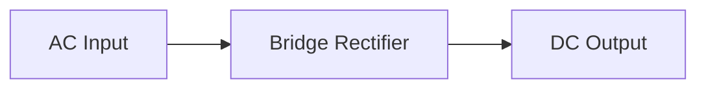
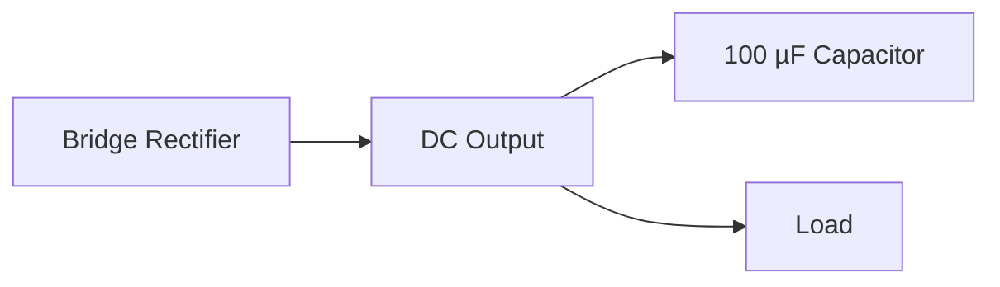

# Project 12 - AC-DC Rectifiers and Power Supplies

## Prerequisites

Complete:

- 00_Introduction.md
- 00A_DSO_Nano_Familiarisation.md
- 01_PWM_Fundamentals.md
- 02_RC_Circuits.md
- 03_RLC_Circuits.md
- 04_MOSFET_Fundamentals.md
- 05_PWM_Motor_Control.md
- 06_P_Controller.md
- 07_PI_Controller.md
- 08_PID_Controller.md
- 09_Buck_Converter.md
- 10_Closed_Loop_Buck.md
- 11_Boost_Converter.md
- 11B_DC_Chopper_Converters.md

---

# Objective

In this project you will learn:

- The difference between AC and DC
- How diodes convert AC into DC
- Half-wave rectification
- Full-wave rectification
- Bridge rectifiers
- Smoothing capacitors
- Ripple voltage
- Basic power supply design

This project introduces one of the most important circuits in electronics:

```text
AC Power Supply
        ↓
  Rectifier
        ↓
     DC Power
```

---

# Learning Outcomes

At the end of this project you should be able to:

✅ Explain AC and DC voltages

✅ Explain diode rectification

✅ Explain half-wave rectifiers

✅ Explain bridge rectifiers

✅ Measure ripple voltage

✅ Explain capacitor smoothing

✅ Understand basic DC power supplies

---

# Introduction

Most electrical distribution systems use:

```text
Alternating Current (AC)
```

Most electronic devices require:

```text
Direct Current (DC)
```

Therefore power conversion is required:

```text
AC
↓
DC
```

This conversion process is called:

```text
Rectification
```

---

# What Is DC?

Direct current flows in a single direction.

Examples:

- Batteries
- USB supplies
- Arduino power rails

Typical waveform:

```text
Voltage

5V |--------------------
   |
0V +--------------------
           Time
```

---

# What Is AC?

Alternating current continuously changes polarity.

Typical waveform:

```text
Voltage

 +V       /\
         /  \
 0V ----/----\----/----
       /      \  /
 -V   /        \/
```

The voltage repeatedly becomes positive and negative.

---

# AC Frequency

AC voltage repeats periodically.

Examples:

| Region | Frequency |
|----------|----------|
| Europe | 50 Hz |
| North America | 60 Hz |

---

# RMS Voltage

AC voltages are normally specified using the RMS value.

For a sinewave:

$$
V_{RMS}
=
\frac{V_{PEAK}}{\sqrt{2}}
$$

---

# Example

Given:

$$
V_{PEAK}=10V
$$

Then:

$$
V_{RMS}
=
\frac{10}{1.414}
$$

$$
V_{RMS}
\approx 7.07V
$$

---

# Review of Diodes

A diode allows current flow in one direction.

Symbol:

```text
---->|----
```

---

# Forward Bias

When forward biased:

```text
Current Flows
```

---

# Reverse Bias

When reverse biased:

```text
Current Is Blocked
```

---

# Why Diodes Can Rectify AC

Because a diode blocks current in one direction, it can remove portions of an AC waveform.

This converts:

```text
Alternating Voltage
```

into:

```text
Pulsating DC Voltage
```

---

# Half-Wave Rectifier

The simplest rectifier uses:

```text
One Diode
```

---

# Circuit


---

# Half-Wave Operation

## Positive Half-Cycle

The diode conducts.

Output voltage appears across the load.

---

## Negative Half-Cycle

The diode blocks current.

Output voltage becomes approximately zero.

---

# Half-Wave Output

Input:

```text
      /\      /\
     /  \    /  \
____/    \__/    \____
```

Output:

```text
      /\      /\
     /  \    /  \
____/    \__/    \____

______________________
```

Negative portions are removed.

---

# Limitations of Half-Wave Rectification

Disadvantages:

- Large ripple
- Low efficiency
- Lower average DC voltage

---

# Full-Wave Rectification

A better approach uses both halves of the AC waveform.

This is achieved using:

```text
Bridge Rectifier
```

---

# Bridge Rectifier

A bridge rectifier contains:

```text
Four Diodes
```

arranged in a bridge configuration.

---

# Simplified Block Diagram



---

# Full-Wave Operation

Negative half cycles are inverted.

The output remains positive during both halves of the AC cycle.

---

# Full-Wave Output

Input:

```text
      /\      /\
     /  \    /  \
____/    \__/    \____
```

Output:

```text
     /\      /\      /\
    /  \    /  \    /  \
___/    \__/    \__/    \___
```

---

# Advantages of Full-Wave Rectification

✅ Higher average voltage

✅ Lower ripple

✅ Better efficiency

✅ Better utilization of the AC source

---

# Capacitor Smoothing

The output of a bridge rectifier is not pure DC.

A capacitor is added across the output.

---

# Smoothing Capacitor Circuit



---

# How the Capacitor Works

When the rectified voltage rises:

```text
Capacitor Charges
```

When the rectified voltage falls:

```text
Capacitor Discharges
```

The capacitor supplies energy to the load and helps keep the output voltage stable.

---

# Output Without Capacitor

```text
     /\      /\      /\
    /  \    /  \    /  \
___/    \__/    \__/    \___
```

---

# Output With Capacitor

```text
───────────────
~~~~~~~~~~~~~~~
───────────────
```

The average voltage becomes smoother.

---

# Ripple Voltage

Ripple voltage is the small AC variation remaining on a DC output.

Ideal output:

```text
Perfect DC
```

Practical output:

```text
DC + Ripple
```

---

# Factors Affecting Ripple

Ripple increases when:

- Load current increases
- Capacitance decreases

Ripple decreases when:

- Capacitance increases
- Load current decreases
- Ripple frequency increases

---

# Components Required

## Additional Components

- 4 × 1N4001 to 1N4007 Diodes
- 100 µF Capacitor
- 470 µF Capacitor
- Low-Voltage AC Source or Function Generator
- Load Resistor

---

## Equipment

- DSO Nano Oscilloscope
- Multimeter
- Breadboard
- Jumper Wires

---

# Safety Notice

```text
DO NOT CONNECT DIRECTLY TO MAINS VOLTAGE
```

For laboratory work use only:

- Low-voltage AC supplies
- Isolated function generators

---

# Experiment 1 - Measure AC Voltage

## Objective

Observe an AC waveform.

---

# Probe Connections

Probe Tip:

```text
AC Source
```

Probe Ground:

```text
Reference Ground
```

---

# DSO Nano Settings

Vertical:

```text
2 V/div
```

Horizontal:

```text
5 ms/div
```

Trigger:

```text
Rising Edge
```

---

# Expected Waveform

```text
      /\
     /  \
----/----\----
   /      \
  /        \
```

---

# Record Measurements

| Parameter | Measured Value |
|-----------|---------------|
| Frequency | |
| Peak Voltage | |
| RMS Voltage | |

---

# Experiment 2 - Half-Wave Rectifier

## Objective

Observe half-wave rectification.

---

# Circuit

One diode and one load resistor.

---

# Expected Output

```text
      /\      /\
     /  \    /  \
____/    \__/    \____

______________________
```

---

# Record Measurements

| Parameter | Measured Value |
|-----------|---------------|
| Peak Voltage | |
| Average Voltage | |
| Frequency | |

---

# Experiment 3 - Bridge Rectifier

## Objective

Observe full-wave rectification.

---

# Circuit

Bridge rectifier plus load resistor.

---

# Expected Output

```text
     /\      /\      /\
    /  \    /  \    /  \
___/    \__/    \__/    \___
```

---

# Record Measurements

| Parameter | Measured Value |
|-----------|---------------|
| Peak Voltage | |
| Average Voltage | |
| Ripple Frequency | |

---

# Why Is Full-Wave Rectification Better?

Advantages:

✅ Higher average voltage

✅ Lower ripple

✅ Better transformer utilisation

✅ Improved efficiency

---

# Experiment 4 - Capacitor Smoothing

## Objective

Reduce ripple voltage.

---

# Add Capacitor

Connect:

```text
100 µF Capacitor
```

across the rectifier output.

---

# Observe

Compare:

```text
Without Capacitor
```

and

```text
With Capacitor
```

---

# DSO Nano Measurement

## Probe Connections

Probe Tip:

```text
DC Output
```

Probe Ground:

```text
Circuit Ground
```

---

# DSO Nano Settings

Vertical:

```text
500 mV/div
```

Horizontal:

```text
5 ms/div
```

Trigger:

```text
Rising Edge
```

---

# Record Observations

```text
_____________________________________

_____________________________________

_____________________________________
```

---

# Results Table

| Configuration | Ripple Voltage |
|---------------|---------------|
| Half-Wave | |
| Full-Wave | |
| Full-Wave + 100 µF Capacitor | |
| Full-Wave + 470 µF Capacitor | |

---

# Relationship to Previous Projects

## Project 2

Capacitor charging and discharging.

---

## Project 3

Energy storage concepts.

---

## Project 9

Output ripple in Buck Converters.

---

## Project 11

Energy transfer using inductors.

---

# MATLAB Exercise

Generate a full-wave rectified waveform.

```matlab
t = 0:0.0001:0.1;

v = 10*sin(2*pi*50*t);

v_rect = abs(v);

plot(t,v,'LineWidth',1)

hold on

plot(t,v_rect,'LineWidth',2)

grid on

xlabel('Time (s)')
ylabel('Voltage (V)')

legend('AC Input','Full-Wave Rectified')

title('Full-Wave Rectification')
```

---

# Expected Result

The negative half cycles are reflected above the horizontal axis.

---

# Engineering Applications

Rectifiers are used in:

## Power Supplies

AC-to-DC conversion.

---

## Battery Chargers

Charging DC batteries.

---

## Industrial Drives

Generating DC bus voltage.

---

## Renewable Energy Systems

Power conversion stages.

---

## Consumer Electronics

Phone chargers and adapters.

---

# Knowledge Check

## Question 1

What is rectification?

Answer:

```text
____________________
```

---

## Question 2

What does a diode do?

Answer:

```text
____________________
```

---

## Question 3

Why is a bridge rectifier better than a half-wave rectifier?

Answer:

```text
____________________
```

---

## Question 4

What is ripple voltage?

Answer:

```text
____________________
```

---

## Question 5

Why is a smoothing capacitor used?

Answer:

```text
____________________
```

---

# Common Mistakes

## No Output Voltage

Check:

- Diode polarity
- Wiring connections
- AC source

---

## Excessive Ripple

Check:

- Capacitor value
- Capacitor polarity
- Load current

---

## Incorrect Waveform

Check:

- Oscilloscope trigger
- Ground connection
- Time scale

---

# Troubleshooting Checklist

✅ AC source connected

✅ Diodes oriented correctly

✅ Load resistor connected

✅ Capacitor polarity verified

✅ Oscilloscope triggering correctly

✅ Ripple measured

✅ Rectification verified

---

# Project Summary

In this project you learned:

✅ AC and DC fundamentals

✅ Diode operation

✅ Half-wave rectification

✅ Full-wave rectification

✅ Bridge rectifiers

✅ Ripple voltage

✅ Capacitor smoothing

✅ Power supply fundamentals

You have now studied:

```text
AC → DC Conversion
```

which is the first stage of many practical power electronic systems.

---

# Next Project

**13_DC_AC_Inverters.md**

Topics:

- H-Bridge Circuits
- MOSFET Switching
- Square-Wave Inverters
- PWM Inverters
- Sinusoidal PWM (SPWM)
- Generating AC from DC