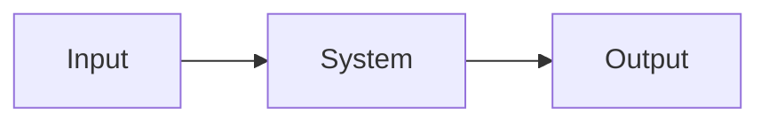

# Project 14 - System Identification and Dynamic Modelling

### Prerequisites

Complete:

- 00_Introduction.md
- 00B_Oscilloscope_Familiarisation.md
- 01_PWM_Fundamentals.md
- 02_RC_Circuits.md
- 03_RLC_Circuits.md
- 04_MOSFET_Fundamentals.md
- 05_PWM_Motor_Control.md
- 06_P_Controller.md
- 07_PI_Controller.md
- 08_PID_Controller.md
- 09_Buck_Converter.md
- 10_Closed_Loop_Buck.md
- 11_Boost_Converter.md
- 11B_DC_Chopper_Converters.md
- 12_AC_DC_Rectifiers.md
- 13_DC_AC_Inverters.md

---

## Objective

In this project you will learn:

- What system identification is
- Why mathematical models are useful
- How engineers model real systems
- First-order system behaviour
- Second-order system behaviour
- Time constants
- Step response analysis
- Experimental parameter estimation

System identification provides the bridge between:

```text
Real Hardware
```

and:

```text
Control System Design
```

---

## Learning Outcomes

At the end of this project you should be able to:

✅ Explain system identification

✅ Measure a step response

✅ Estimate a time constant

✅ Identify first-order behaviour

✅ Identify second-order behaviour

✅ Create simple mathematical models

✅ Validate a model using measurements

---

## Introduction

Control engineers rarely design controllers directly from hardware.

Instead they first create a:

```text
Mathematical Model
```

of the system.

The process of obtaining a model from measurements is called:

```text
System Identification
```

---

## Why Do We Need Models?

Models allow engineers to:

- Predict behaviour
- Design controllers
- Simulate systems
- Improve performance
- Reduce development time

Without a model:

```text
Controller Design Becomes Difficult
```

---

## What Is a Dynamic System?

A dynamic system changes over time.

Examples:

- RC circuits
- RLC circuits
- Electric motors
- Buck converters
- Temperature systems

---

## Input and Output

A system receives:

```text
Input
```

and produces:

```text
Output
```

Example:

```text
PWM Duty Cycle
      ↓
     Motor
      ↓
 Motor Speed
```

---

## Black Box Representation



The internal details may be unknown.

System identification attempts to determine how the system behaves.

---

## What Is a Step Input?

A step input changes suddenly.

Example:

```text
0 V → 5 V
```

or:

```text
0% → 100% PWM
```

---

## Why Use a Step Input?

Step responses are easy to generate and contain valuable information about system dynamics.

---

## First-Order Systems

Many engineering systems can be approximated as first-order systems.

Examples:

- RC circuits
- Thermal systems
- Some motor systems

---

## First-Order Transfer Function

A first-order transfer function is:

$$
G(s)=\frac{K}{\tau s+1}
$$

Where:

- $K$ = System Gain
- $\tau$ = Time Constant

---

## Time Constant

The time constant describes how quickly a system responds.

Symbol:

$$
\tau
$$

Units:

```text
Seconds
```

---

## First-Order Step Response

A first-order system responds according to:

$$
y(t)
=
K\left(1-e^{-t/\tau}\right)
$$

---

## Time Constant Rule

At:

$$
t=\tau
$$

the output reaches approximately:

$$
63.2\%
$$

of its final value.

---

## Example

If the final value is:

$$
10V
$$

then at:

$$
t=\tau
$$

the output is:

$$
6.32V
$$

---

## Typical First-Order Response

```text
Output

100% |                 ______
      |              /
      |           /
      |        /
63.2% |-----*
      |   /
      | /
  0%  +--------------------
            Time
```

---

## Reviewing RC Circuits

Recall Project 2.

The capacitor charging equation is:

$$
V_C(t)
=
V_S
\left(
1-e^{-t/(RC)}
\right)
$$

The RC circuit is a first-order system.

---

## Second-Order Systems

Many systems exhibit oscillation.

Examples:

- RLC circuits
- Mechanical systems
- Motor drive systems
- Closed-loop controllers

---

## Second-Order Transfer Function

A common form is:

$$
G(s)
=
\frac{\omega_n^2}
{s^2+2\zeta\omega_n s+\omega_n^2}
$$

Where:

- $\omega_n$ = Natural Frequency
- $\zeta$ = Damping Ratio

---

## Damping Ratio

The damping ratio determines the response shape.

---

### Underdamped

```text
Oscillatory
```

---

### Critically Damped

```text
Fast Response
Without Oscillation
```

---

### Overdamped

```text
Slow Response
```

---

## Step Response Characteristics

Important measurements include:

---

### Rise Time

Time required to reach the target.

---

### Overshoot

Amount exceeding the target value.

---

### Settling Time

Time required to stabilize.

---

### Steady-State Error

Final difference between reference and output.

---

## MATLAB Simulation

Before measuring, simulate first-order and second-order step responses across parameter ranges to build intuition for what you will observe.

### First-Order: Effect of Time Constant

```matlab
tau_values = [0.2, 0.5, 1.0, 2.0];
K = 1;
t = 0:0.01:8;

figure; hold on;
for i = 1:4
    y = K * (1 - exp(-t / tau_values(i)));
    plot(t, y, 'LineWidth', 2, ...
        'DisplayName', sprintf('\\tau = %.1fs', tau_values(i)));
end
yline(0.632, 'k--', '63.2%');
grid on;
xlabel('Time (s)'); ylabel('Normalised Output');
title('First-Order Step Response \mdash Effect of \tau');
legend('Location', 'southeast');
```

### Second-Order: Effect of Damping Ratio

```matlab
wn   = 5;    % natural frequency (rad/s)
zeta_values = [0.1, 0.3, 0.7, 1.0, 2.0];
t = 0:0.001:4;

figure; hold on;
for i = 1:5
    z = zeta_values(i);
    G = tf(wn^2, [1, 2*z*wn, wn^2]);
    [y, ~] = step(G, t);
    plot(t, y, 'LineWidth', 2, ...
        'DisplayName', sprintf('\\zeta = %.1f', z));
end
yline(1.0, 'k--', 'Final value');
grid on;
xlabel('Time (s)'); ylabel('Output');
title('Second-Order Step Response \mdash Effect of \zeta');
legend('Location', 'southeast');
```

### Curve Fitting Preview — How to Extract τ from Data

This is the technique you will apply to your measurements:

```matlab
% Simulate "measured" data with noise
tau_true = 1.0; K_true = 5.0;
t = 0:0.05:6;
y_measured = K_true*(1 - exp(-t/tau_true)) + 0.05*randn(size(t));

% Fit first-order model by minimising sum of squared errors
cost = @(p) sum((p(1)*(1-exp(-t/p(2))) - y_measured).^2);
p0   = [4.0, 0.5];                    % initial guess [K, tau]
p_fit = fminsearch(cost, p0);

K_fit   = p_fit(1);
tau_fit = p_fit(2);
y_fit   = K_fit * (1 - exp(-t / tau_fit));

figure; hold on;
scatter(t, y_measured, 30, 'b', 'DisplayName', 'Measured (with noise)');
plot(t, y_fit, 'r', 'LineWidth', 2, 'DisplayName', ...
    sprintf('Fit: K=%.2f, \\tau=%.2fs', K_fit, tau_fit));
grid on;
xlabel('Time (s)'); ylabel('Output');
title('First-Order Curve Fit \mdash fminsearch');
legend('Location', 'southeast');
fprintf('True:  K=%.2f  tau=%.2fs\n', K_true, tau_true);
fprintf('Fitted: K=%.2f  tau=%.2fs\n', K_fit, tau_fit);
```

### Prediction Table

| System | Expected τ | Expected K | Response type |
|--------|-----------|-----------|---------------|
| RC (10kΩ, 100µF) | | | |
| RC (10kΩ, 220µF) | | | |
| RC (22kΩ, 100µF) | | | |
| Motor (from Project 5) | | | |

---

## Components Required

- Arduino Uno
- Breadboard
- 10 kΩ resistor
- 22 kΩ resistor
- 100 µF capacitor
- 220 µF capacitor (needed for Experiment 2 Test B — add to shopping list if not already purchased)
- DC motor + IRLZ44N MOSFET + flyback diode (from Project 5)
- Jumper wires
- DSO Nano Oscilloscope

Optional (frequency response identification):

- Signal generator

---

## Experiment 1 - Identify an RC Circuit

### Objective

Measure the time constant of an RC circuit.

---

## Circuit

Use:

- 10 kΩ resistor
- 100 µF capacitor

---

## RC Time Constant

Calculate:

$$
\tau=RC
$$

Substituting:

$$
\tau
=
10000 \times 100 \times 10^{-6}
$$

$$
\tau=1s
$$

---

## Arduino Step Input

```cpp
void setup()
{
    pinMode(9, OUTPUT);

    digitalWrite(9, LOW);

    delay(2000);

    digitalWrite(9, HIGH);
}

void loop()
{
}
```

---

## DSO Nano Connections

Probe Tip:

```text
Capacitor Voltage
```

Probe Ground:

```text
GND
```

---

## DSO Nano Settings

Vertical:

```text
1 V/div
```

Horizontal:

```text
500 ms/div
```

Trigger:

```text
Rising Edge
```

---

## Measurement Procedure

1. Apply the step input.
2. Observe the capacitor charging curve.
3. Record the final voltage.
4. Calculate 63.2% of the final value.
5. Measure the time required to reach that point.

---

## Results Table

| Parameter | Value |
|-----------|-------|
| Final Voltage | |
| 63.2% Voltage | |
| Measured Time Constant | |
| Calculated Time Constant | |

---

## Experiment 2 - Vary Component Values

### Objective

Observe how component values affect system dynamics.

---

## Test A

```text
10 kΩ
100 µF
```

---

## Test B

```text
10 kΩ
220 µF
```

---

## Test C

```text
22 kΩ
100 µF
```

---

## Results Table

| Resistance | Capacitance | Time Constant |
|------------|-------------|--------------|
| 10 kΩ | 100 µF | |
| 10 kΩ | 220 µF | |
| 22 kΩ | 100 µF | |

---

## Experiment 3 - Identify Motor Dynamics

### Objective

Observe dynamic motor response.

---

## Procedure

Apply a PWM step change:

```text
0% → 50%
```

Observe:

```text
Motor Response
```

---

## Record

- Initial Speed
- Final Speed
- Rise Time
- Settling Time

---

## Model Validation

Once a model is identified:

```text
Model Output
```

should be compared against:

```text
Measured Output
```

---

## Why Validation Matters

A model is only useful if it accurately predicts real behaviour.

---

## Identification Procedure Summary

```text
Apply Input
      ↓
Measure Output
      ↓
Determine Model
      ↓
Compare Results
      ↓
Refine Model
```

---

## MATLAB Comparison

Now fit first-order models to your measured RC and motor step responses and validate them.

### RC Circuit Model Fit

```matlab
% Enter your measured RC step response
% t_data: time vector (s), y_data: capacitor voltage (V)
t_data = [0, 0.2, 0.4, 0.6, 0.8, 1.0, 1.5, 2.0, 3.0, 4.0, 5.0]; % replace
y_data = [0, 0.9, 1.6, 2.2, 2.7, 3.1, 3.7, 4.1, 4.6, 4.8, 5.0]; % replace (V)

Vfinal = max(y_data);

% Fit first-order model: y = K*(1 - exp(-t/tau))
cost   = @(p) sum((p(1)*(1-exp(-t_data/p(2))) - y_data).^2);
p_fit  = fminsearch(cost, [Vfinal, 0.5]);
K_fit  = p_fit(1);
tau_fit = p_fit(2);

t_model = 0:0.01:max(t_data);
y_model = K_fit * (1 - exp(-t_model / tau_fit));

figure; hold on;
scatter(t_data, y_data, 50, 'b', 'filled', 'DisplayName', 'Measured');
plot(t_model, y_model, 'r', 'LineWidth', 2, 'DisplayName', ...
    sprintf('Fit: K=%.2fV, \\tau=%.3fs', K_fit, tau_fit));
xline(tau_fit, 'k--', sprintf('\\tau=%.3fs', tau_fit));
yline(0.632*K_fit, 'k:', '63.2%');
grid on;
xlabel('Time (s)'); ylabel('Capacitor Voltage (V)');
title('RC Circuit \mdash First-Order Model Fit');
legend('Location', 'southeast');

tau_theory = 10000 * 100e-6;
fprintf('Theoretical \\tau: %.3f s\n', tau_theory);
fprintf('Fitted      \\tau: %.3f s\n', tau_fit);
fprintf('Error:            %.1f%%\n', 100*abs(tau_fit-tau_theory)/tau_theory);
```

### Motor Step Response Model Fit

```matlab
% Enter your motor step response from Project 5 (or re-measure here)
% Normalise speed: 0 = stopped, 1 = full speed
t_motor = [0, 0.1, 0.2, 0.3, 0.5, 0.7, 1.0, 1.5, 2.0]; % replace (s)
y_motor = [0, 0.3, 0.5, 0.6, 0.8, 0.9, 0.95, 0.99, 1.0]; % replace (normalised)

cost_m  = @(p) sum((p(1)*(1-exp(-t_motor/p(2))) - y_motor).^2);
p_motor = fminsearch(cost_m, [1.0, 0.3]);
K_m     = p_motor(1);
tau_m   = p_motor(2);

t_m = 0:0.01:max(t_motor);
y_m = K_m * (1 - exp(-t_m / tau_m));

figure; hold on;
scatter(t_motor, y_motor, 50, 'b', 'filled', 'DisplayName', 'Measured');
plot(t_m, y_m, 'r', 'LineWidth', 2, 'DisplayName', ...
    sprintf('Fit: K=%.2f, \\tau=%.3fs', K_m, tau_m));
xline(tau_m, 'k--', sprintf('\\tau=%.3fs', tau_m));
yline(0.632*K_m, 'k:', '63.2%');
grid on;
xlabel('Time (s)'); ylabel('Normalised Speed');
title('Motor \mdash First-Order Model Fit');
legend('Location', 'southeast');

fprintf('Motor model: G(s) = %.2f / (%.3f*s + 1)\n', K_m, tau_m);
fprintf('Compare with Project 5 estimate: tau = ?\n');
```

### Reflection

- How close is your fitted RC τ to the theoretical value RC = 1.0s? What causes the difference?
- Does the motor step response fit well to a first-order model, or do you see a delay or second-order behaviour?
- How does the motor τ identified here compare to your informal estimate from Project 5?

---

## Relationship to Previous Projects

### Project 2

RC circuit dynamics.

---

### Project 3

RLC circuit dynamics.

---

### Projects 6 to 8

Closed-loop controller behaviour.

---

### Projects 9 to 13

Power electronic system dynamics.

---

## Engineering Applications

System identification is used in:

### Robotics

Motion control models.

---

### Aerospace

Aircraft modelling.

---

### Automotive Systems

Engine and vehicle dynamics.

---

### Industrial Automation

Process modelling.

---

### Power Electronics

Converter modelling and control.

---

## Knowledge Check

### Question 1

What is system identification?

Answer:

```text
____________________
```

---

### Question 2

What is a time constant?

Answer:

```text
____________________
```

---

### Question 3

What percentage of the final value is reached after one time constant?

Answer:

```text
____________________
```

---

### Question 4

What is a step input?

Answer:

```text
____________________
```

---

### Question 5

Why is model validation important?

Answer:

```text
____________________
```

---

### Question 6

Your curve fit gives τ = 1.12s for the RC circuit but the theoretical value is 1.0s. Name two physical reasons that could explain this, and explain how you would use the fitted model (rather than the theoretical one) in controller design.

Answer:

```text
____________________
```

---

## Common Mistakes

### Incorrect Time Constant

Check:

- Component values
- Oscilloscope scaling
- Trigger location

---

### Poor Measurements

Check:

- Probe grounding
- Trigger settings
- Timebase settings

---

### Model Does Not Match Data

Check:

- Assumptions
- Measurement accuracy
- System nonlinearities

---

## Troubleshooting Checklist

✅ Step input applied correctly

✅ Output waveform captured

✅ Final value measured

✅ 63.2% point calculated

✅ Time constant measured

✅ Model compared with measurements

---

## Project Summary

In this project you learned:

✅ System identification

✅ Dynamic system modelling

✅ First-order systems

✅ Second-order systems

✅ Time constants

✅ Step response analysis

✅ Model validation

✅ Experimental parameter estimation

You now have the foundation required to move from measuring system behaviour to designing controllers based on mathematical models.

---

## Next Project

**15_Controller_Design.md**

Topics:

- Controller Design Process
- Model-Based Design
- Stability
- Controller Tuning
- Performance Optimization
- Practical Control Engineering
