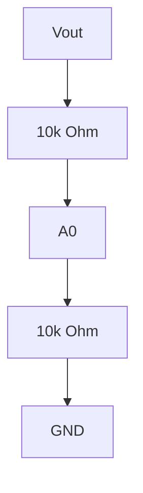

# Project 15 - Closed-Loop Buck Converter Control

### Prerequisites

Complete:

- 00_Introduction.md
- 00B_Oscilloscope_Familiarisation.md
- 01_PWM_Fundamentals.md
- 02_RC_Circuits.md
- 03_RLC_Circuits.md
- 04_MOSFET_Fundamentals.md
- 10_PWM_Motor_Control.md
- 12_P_Controller.md
- 13_PI_Controller.md
- 14_PID_Controller.md
- 08_Buck_Converter.md

---

## Objective

In this project you will learn:

- Why open-loop Buck Converters have limitations
- How voltage feedback works
- How PI controllers regulate output voltage
- How disturbances affect converter performance
- How feedback improves regulation
- How to tune a closed-loop converter
- How control theory and power electronics work together

This project combines:

```text
Power Electronics
+
Control Systems
```

to create a practical regulated power supply.

---

## Learning Outcomes

At the end of this project you should be able to:

✅ Explain closed-loop regulation

✅ Implement voltage feedback

✅ Calculate voltage error

✅ Implement a PI controller

✅ Explain disturbance rejection

✅ Tune PI gains

✅ Analyse converter performance

---

## Introduction

In Project 9 the Buck Converter operated in:

```text
Open Loop
```

The controller generated a fixed duty cycle.

Example:

```text
Duty Cycle = 50%
```

The converter output depended entirely on:

- Input voltage
- Component values
- Load conditions

No automatic correction occurred.

---

## Problem with Open-Loop Operation

Suppose:

$$
V_{OUT}=5V
$$

and the load increases.

The voltage may fall to:

$$
4.5V
$$

An open-loop controller does not detect the error.

Therefore:

```text
No Correction Occurs
```

---

## Closed-Loop Control

Closed-loop control measures the output voltage continuously.

The measured voltage is compared to a desired value.

The controller then adjusts duty cycle automatically.

---

## Closed-Loop Block Diagram


---

## Reference Voltage

The desired output voltage is called the:

```text
Reference
```

Symbol:

$$
r(t)
$$

Example:

$$
r=5V
$$

---

## Measured Output Voltage

The actual converter output is:

$$
y(t)
$$

Example:

$$
y=4.7V
$$

---

## Error Signal

The controller calculates:

$$
e(t)=r(t)-y(t)
$$

Where:

- $e(t)$ = Error
- $r(t)$ = Reference
- $y(t)$ = Measured Output

---

## Example Error Calculation

Given:

$$
r=5V
$$

and:

$$
y=4.7V
$$

Then:

$$
e=r-y
$$

$$
e=5-4.7
$$

$$
e=0.3V
$$

---

## Controller Response

If:

```text
Output Voltage Too Low
```

the controller:

```text
Increases Duty Cycle
```

---

If:

```text
Output Voltage Too High
```

the controller:

```text
Reduces Duty Cycle
```

---

## Why PI Control Is Common

Buck Converters are frequently regulated using:

```text
PI Controllers
```

because they:

✅ Eliminate steady-state error

✅ Provide good regulation

✅ Are easy to implement

✅ Work well in practical systems

---

## PI Controller Equation

$$
u(t)=K_Pe(t)+K_I\int e(t)\,dt
$$

Where:

- $u(t)$ = Controller Output
- $K_P$ = Proportional Gain
- $K_I$ = Integral Gain
- $e(t)$ = Error Signal

---

## Converter Control Strategy

```text
Measure Output
      ↓
Calculate Error
      ↓
PI Controller
      ↓
Adjust Duty Cycle
      ↓
Correct Output Voltage
```

---

## Measuring Converter Output Voltage

Controller ADC inputs can only measure voltages within their supported range.

```text
0V to ADC full scale
```

A voltage divider is therefore required.

---

## Voltage Divider Circuit



---

## Divider Equation

$$
V_{A0}
=
V_{OUT}
\cdot
\frac{R_2}{R_1+R_2}
$$

For:

$$
R_1=R_2
$$

the divider becomes:

$$
V_{A0}
=
\frac{V_{OUT}}{2}
$$

---

## MATLAB Simulation

Before building the circuit, simulate the closed-loop PI voltage regulator applied to the Buck Converter plant.

### Buck Converter Plant Model

The LC output filter of a Buck Converter is a second-order plant:

$$
G(s) = \frac{1}{LCs^2 + \frac{L}{R}s + 1}
$$

For a resistive load R and the voltage divider scaling the feedback by 0.5:

```matlab
L   = 100e-6;      % 100 uH
C   = 100e-6;      % 100 uF
R   = 100;         % assumed load resistance (Ohm)
Vin = 5;           % supply voltage

% Open-loop plant (LC filter)
G = tf(1, [L*C, L/R, 1]);

% Voltage divider scales feedback by 0.5
H = 0.5;

t = 0:0.0001:0.5;

figure;
[y_ol, ~] = step(Vin * G, t);
plot(t*1e3, y_ol, 'k--', 'LineWidth', 2, 'DisplayName', 'Open-loop');
hold on;
```

### Closed-Loop PI Response — Three Gain Sets

```matlab
gain_sets = [2, 0.2; 10, 1.0; 50, 5.0];
labels    = {'Kp=2  Ki=0.2', 'Kp=10 Ki=1', 'Kp=50 Ki=5'};

for i = 1:3
    Kp = gain_sets(i,1);
    Ki = gain_sets(i,2);
    C_pi = tf([Kp, Ki], [1, 0]);
    T    = feedback(C_pi * G * Vin, H);
    [y, ~] = step(T, t);
    plot(t*1e3, y, 'LineWidth', 2, 'DisplayName', labels{i});
end

yline(2.5, 'r:', 'Reference 2.5V');
grid on;
xlabel('Time (ms)'); ylabel('Output Voltage (V)');
title('Closed-Loop Buck Converter - PI Gain Comparison');
legend('Location', 'southeast');
```

### Simulate Disturbance Rejection

```matlab
Kp = 10; Ki = 1;
C_pi  = tf([Kp, Ki], [1, 0]);
T_cl  = feedback(C_pi * G * Vin, H);
T_ol  = G * Vin * 0.5;              % open-loop at D=0.5

% Disturbance: step load change modelled as output disturbance
T_dist_cl = feedback(G * Vin, H * C_pi);   % disturbance to output
T_dist_ol = G * Vin;                        % no correction

t = 0:0.0001:0.5;
[y_cl, ~] = step(T_dist_cl * 0.1, t);      % 0.1V disturbance step
[y_ol_d, ~] = step(T_dist_ol * 0.1, t);

figure; hold on;
plot(t*1e3, y_ol_d, 'b--', 'LineWidth', 2, 'DisplayName', 'Open-loop');
plot(t*1e3, y_cl,   'r',   'LineWidth', 2, 'DisplayName', 'Closed-loop PI');
grid on;
xlabel('Time (ms)'); ylabel('Voltage Deviation (V)');
title('Disturbance Rejection - Open vs Closed Loop');
legend('Location', 'northeast');
```

### Prediction Table

| Kp | Ki | Predicted behaviour | Predicted ess |
|----|----|--------------------|--------------|
| 2 | 0.2 | | |
| 10 | 1 | | |
| 50 | 5 | | |

---

## Components Required

- Arduino Uno
- ESP32 DevKit V1 (alternative controller)
- Buck Converter from Project 9
- 10 kΩ resistor
- 10 kΩ resistor
- Oscilloscope (OWON HDS272S recommended, DSO Nano compatible)

---

## Experiment 1 - Measure Converter Output

### Objective

Read the converter output voltage using the controller ADC.

---

## Arduino Code

```cpp
void setup()
{
    Serial.begin(9600);
}

void loop()
{
    int adc = analogRead(A0);

    Serial.println(adc);

    delay(100);
}
```

### ESP32 Equivalent

```cpp
const int FBK_PIN = 34;  // divider midpoint to ADC pin

void setup()
{
    Serial.begin(115200);
}

void loop()
{
    int adc = analogRead(FBK_PIN);   // 0-4095 on 12-bit ADC

    Serial.println(adc);

    delay(100);
}
```

---

## Expected Behaviour

The ADC value should vary with:

- Output voltage
- Duty cycle
- Load conditions

---

## Convert ADC Reading to Voltage

ADC range examples:

```text
0 to 1023 (Arduino Uno)
0 to 4095 (ESP32)
```

represents:

```text
0V to 5V (Arduino Uno)
0V to 3.3V (ESP32)
```

Measured ADC input voltage:

$$
V_{A0}
=
\frac{ADC}{1023}
\cdot
5
$$

---

## Experiment 2 - Implement PI Regulation

### Objective

Automatically regulate output voltage.

---

## Arduino Code

```cpp
const float dt        = 0.01;     // sample time (s) — matches delay(10)
const float Vref      = 2.5;      // target output voltage at A0 (V)
const float int_max   = 50.0;

float Kp = 10.0;
float Ki = 1.0;
float integral = 0;

void setup()
{
    pinMode(9, OUTPUT);
    Serial.begin(9600);
}

void loop()
{
    int   adc      = analogRead(A0);
    float Vfb      = (adc / 1023.0) * 5.0;   // voltage at divider midpoint
    float Vout_est = Vfb * 2.0;               // actual Vout (divider x2)
    float error    = Vref - Vfb;              // error in divider-scaled units

    integral = integral + error * dt;
    integral = constrain(integral, -int_max, int_max);

    float control = Kp * error + Ki * integral;
    control = constrain(control, 0, 255);

    analogWrite(9, (int)control);

    Serial.print("Vout: ");  Serial.print(Vout_est, 3);
    Serial.print("V  PWM: "); Serial.print((int)control);
    Serial.print("  Int: ");  Serial.println(integral, 3);

    delay(10);
}
```

### ESP32 Equivalent (LEDC + ADC Feedback)

```cpp
const int PWM_PIN  = 18;
const int PWM_CH   = 0;
const int PWM_FREQ = 500;
const int PWM_RES  = 8;
const int FBK_PIN  = 34;

const float dt      = 0.01;
const float Vref    = 1.65;    // target divider midpoint for ~3.3V output
const float int_max = 50.0;

float Kp = 10.0;
float Ki = 1.0;
float integral = 0;

void setup()
{
    ledcAttach(PWM_PIN, PWM_FREQ, PWM_RES);
    Serial.begin(115200);
}

void loop()
{
    int   adc      = analogRead(FBK_PIN);
    float Vfb      = (adc / 4095.0) * 3.3;   // voltage at divider midpoint
    float Vout_est = Vfb * 2.0;              // estimated converter output
    float error    = Vref - Vfb;

    integral = integral + error * dt;
    integral = constrain(integral, -int_max, int_max);

    float control = Kp * error + Ki * integral;
    control = constrain(control, 0, 255);

    ledcWrite(PWM_PIN, (int)control);

    Serial.print("Vout: ");  Serial.print(Vout_est, 3);
    Serial.print("V  PWM: "); Serial.print((int)control);
    Serial.print("  Int: ");  Serial.println(integral, 3);

    delay(10);
}
```

Note: if you change ADC or PWM resolution, rescale and retune Kp/Ki.

---

## Understanding the Controller

Reference:

$$
r=2.5V
$$

Feedback:

$$
y
$$

Error:

$$
e=r-y
$$

Controller:

$$
u=K_Pe+K_I\int e(t)\,dt
$$

Controller Output:

```text
PWM Duty Cycle Command
```

---

## Experiment 3 - Disturbance Rejection

### Objective

Observe how feedback corrects disturbances.

---

## Procedure

Operate the converter normally.

Then:

```text
Change the Load
```

or

```text
Change the Input Voltage Slightly
```

---

## Observation

The output voltage will deviate briefly.

The controller will then:

```text
Adjust Duty Cycle
```

and return the voltage toward the target value.

---

## Disturbance Rejection

The ability to recover from disturbances is called:

```text
Disturbance Rejection
```

This is one of the primary advantages of closed-loop control.

---

## Experiment 4 - PI Gain Tuning

### Objective

Observe how controller gains affect system behaviour.

---

## Test A

```cpp
Kp = 2;
Ki = 0.2;
```

Expected:

```text
Slow Response
```

---

## Test B

```cpp
Kp = 10;
Ki = 1;
```

Expected:

```text
Balanced Response
```

---

## Test C

```cpp
Kp = 50;
Ki = 5;
```

Expected:

```text
Very Aggressive Response
```

Possible:

```text
Oscillation
```

---

## Results Table

| Kp | Ki | Behaviour |
|----|----|------------|
| 2 | 0.2 | |
| 10 | 1 | |
| 50 | 5 | |

---

## Oscilloscope Exercise

### PWM Signal

Probe Tip:

```text
Gate Signal
```

Probe Ground:

```text
Ground
```

Observe the PWM duty cycle.

---

### Output Voltage

Probe Tip:

```text
Vout
```

Probe Ground:

```text
Ground
```

Observe output voltage and ripple.

---

## Oscilloscope Settings (OWON Baseline)

Recommended scope: OWON HDS272S.

Compatible alternative: DSO Nano.

PWM Measurement:

```text
2 V/div
500 µs/div
```

---

Output Ripple Measurement:

```text
200 mV/div
500 µs/div
```

---

## Observe

As the controller regulates voltage:

- Duty cycle changes automatically
- Ripple changes with operating conditions
- Output voltage remains close to the reference value

---

## Control Performance Metrics

Several metrics are commonly used to evaluate controller performance.

---

### Rise Time

Time required to approach the target voltage.

---

### Overshoot

Amount by which the voltage exceeds the target value.

---

### Settling Time

Time required to remain within an acceptable error band.

---

### Steady-State Error

Final difference between:

```text
Reference Voltage
```

and

```text
Output Voltage
```

---

## Desired Response

```text
Voltage

5V |         _______
   |       /
   |     /
   |   /
   | /
0V +-----------------
           Time
```

Characteristics:

- Fast rise time
- Low overshoot
- Small settling time
- Zero steady-state error

---

## MATLAB Comparison

Now compare your measured steady-state output voltages against the simulated closed-loop responses.

### Enter Your Measured Values

```matlab
L = 100e-6; C = 100e-6; R = 100; Vin = 5; H = 0.5;
G = tf(1, [L*C, L/R, 1]);

gain_sets = [2, 0.2; 10, 1.0; 50, 5.0];
labels    = {'Kp=2 Ki=0.2', 'Kp=10 Ki=1', 'Kp=50 Ki=5'};

% Replace with your measured steady-state Vout for each gain set
Vout_measured = [0.0, 0.0, 0.0];   % (V)

t = 0:0.0001:0.5;

figure; hold on;
for i = 1:3
    Kp = gain_sets(i,1); Ki = gain_sets(i,2);
    C_pi = tf([Kp, Ki], [1, 0]);
    T    = feedback(C_pi * G * Vin, H);
    [y, ~] = step(T, t);
    info = stepinfo(T);
    plot(t*1e3, y, 'LineWidth', 2, 'DisplayName', ...
        sprintf('%s | OS=%.1f%% Ts=%.1fms', labels{i}, ...
        info.Overshoot, info.SettlingTime*1e3));
end
yline(2.5, 'k--', 'Reference 2.5V');
scatter([50, 50, 50], Vout_measured, 80, 'r', 'filled', ...
    'DisplayName', 'Measured Vout');
grid on;
xlabel('Time (ms)'); ylabel('Output Voltage (V)');
title('Closed-Loop Buck - Simulation vs Measurement');
legend('Location', 'southeast');

% Print steady-state error for each case
fprintf('%-14s %-14s %-14s\n', 'Gains', 'Sim Vout(V)', 'Meas Vout(V)');
for i = 1:3
    Kp = gain_sets(i,1); Ki = gain_sets(i,2);
    C_pi = tf([Kp, Ki], [1, 0]);
    T    = feedback(C_pi * G * Vin, H);
    y_ss = dcgain(T);
    fprintf('%-14s %-14.3f %-14.3f\n', labels{i}, y_ss, Vout_measured(i));
end
```

### Reflection

- Does the PI controller eliminate steady-state error in both simulation and measurement?
- Which gain set gave the best balance of speed and stability on the real converter?
- Why might the real converter oscillate at lower gains than the simulation predicts? (parasitic inductance, ADC noise, sample time effects)

---

## Engineering Applications

Closed-loop Buck Converters are widely used in:

### Computer Power Supplies

Stable voltage rails.

---

### Telecommunications Equipment

Regulated DC supplies.

---

### Industrial Electronics

Power conversion systems.

---

### Electric Vehicles

Battery management and auxiliary power.

---

### Robotics

Logic and actuator power regulation.

---

## Knowledge Check

### Question 1

What is the purpose of voltage feedback?

Answer:

```text
____________________
```

---

### Question 2

Write the PI controller equation.

Answer:

```text
____________________
```

---

### Question 3

What is disturbance rejection?

Answer:

```text
____________________
```

---

### Question 4

Why is a voltage divider required?

Answer:

```text
____________________
```

---

### Question 5

What happens if the gains are too large?

Answer:

```text
____________________
```

---

### Question 6

The voltage divider scales Vout by 0.5 before the ADC. The reference in the code is set to 2.5V. What actual output voltage is the controller regulating to, and what would you change in the code to regulate to 3.0V instead?

Answer:

```text
____________________
```

---

## Common Mistakes

### Output Voltage Oscillates

Check:

- Kp too high
- Ki too high

---

### No Feedback Reading

Check:

- Voltage divider wiring
- ADC input

---

### PWM Saturated

Check:

- Controller limits
- Reference voltage

---

### No Regulation

Check:

- Error calculation
- Feedback polarity
- Controller implementation

---

## Troubleshooting Checklist

✅ Voltage divider functioning

✅ ADC value changes correctly

✅ PWM signal present

✅ PI controller running

✅ Output responds to disturbances

✅ Stable regulation achieved

✅ Output voltage remains near target

---

## Project Summary

In this project you learned:

✅ Closed-loop regulation

✅ Voltage feedback

✅ PI control

✅ Disturbance rejection

✅ Controller tuning

✅ Converter dynamics

✅ Stability concepts

✅ Practical voltage regulation

This project brings together power electronics and control theory to create a practical regulated power supply.

---

## Next Project

**09_Boost_Converter.md**

Topics:

- Step-Up Conversion
- Boost Converter Operation
- Inductor Energy Transfer
- Duty Cycle Relationships
- Converter Efficiency
- Practical Measurements
