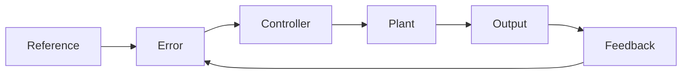

# Project 16 - Controller Design and Practical Control Engineering

### Prerequisites

Complete:

- 00_Introduction.md
- 00B_Oscilloscope_Familiarisation.md
- 01_PWM_Fundamentals.md
- 02_RC_Circuits.md
- 03_RLC_Circuits.md
- 04_MOSFET_Fundamentals.md
- 10_PWM_Motor_Control.md
- 12_P_Controller.md
- 13_PI_Controller.md
- 14_PID_Controller.md
- 08_Buck_Converter.md
- 15_Closed_Loop_Buck.md
- 09_Boost_Converter.md
- 07_DC_Chopper_Converters.md
- 05_AC_DC_Rectifiers.md
- 06_DC_AC_Inverters.md
- 11_System_Identification.md

---

## Objective

In this project you will learn:

- The controller design process
- How mathematical models are used
- Performance specifications
- Stability concepts
- Controller tuning methods
- Model-based control design
- Practical implementation considerations

This project brings together everything learned throughout the course.

---

## Learning Outcomes

At the end of this project you should be able to:

✅ Follow a structured controller design process

✅ Define performance requirements

✅ Design a P controller

✅ Design a PI controller

✅ Design a PID controller

✅ Evaluate controller performance

✅ Understand design trade-offs

✅ Apply control engineering principles to real systems

---

## Introduction

Control engineering is the process of designing systems that automatically achieve desired performance.

Examples include:

- Motor speed control
- Temperature regulation
- Voltage regulation
- Position control
- Process control

---

## Review of the Control Loop

A feedback control system consists of:

```text
Reference
    ↓
Controller
    ↓
Plant
    ↓
Output
    ↓
Feedback
```

The controller continually adjusts the plant input to reduce error.

---

## Closed-Loop Block Diagram



---

## Controller Design Process

A typical design process consists of:

```text
Define Requirements
         ↓
Model System
         ↓
Design Controller
         ↓
Simulate
         ↓
Implement
         ↓
Test and Refine
```

---

## Step 1 - Define Requirements

Before designing a controller, performance requirements must be specified.

Typical requirements include:

- Response speed
- Accuracy
- Stability
- Overshoot limits
- Disturbance rejection

---

## Example Requirements

Suppose we want a motor speed controller.

Requirements:

```text
Target Speed = 1000 RPM

Overshoot < 10%

Settling Time < 2 s

Steady-State Error = 0
```

---

## Step 2 - Obtain a Model

The system must be modelled.

From Project 14:

```text
System Identification
```

provides mathematical models using experimental measurements.

---

## Example First-Order Model

$$
G(s)
=
\frac{K}{\tau s+1}
$$

Where:

- $K$ = Gain
- $\tau$ = Time Constant

---

## Why Models Matter

Models allow engineers to:

- Predict performance
- Tune gains
- Evaluate stability
- Simulate behaviour

without risking hardware damage.

---

## Step 3 - Select a Controller

Common controller choices include:

| Controller | Characteristics |
|------------|----------------|
| P | Simple |
| PI | Eliminates steady-state error |
| PID | Improved overall performance |

---

## Review of P Control

P control uses:

$$
u(t)=K_Pe(t)
$$

Advantages:

✅ Simple

✅ Fast

Disadvantages:

❌ Steady-state error

---

## Review of PI Control

PI control uses:

$$
u(t)
=
K_Pe(t)
+
K_I\int e(t)\,dt
$$

Advantages:

✅ Eliminates steady-state error

✅ Widely used

Disadvantages:

❌ Can increase overshoot

---

## Review of PID Control

PID control uses:

$$
u(t)
=
K_Pe(t)
+
K_I\int e(t)\,dt
+
K_D\frac{de(t)}{dt}
$$

Advantages:

✅ Fast response

✅ Good stability

✅ Zero steady-state error

Disadvantages:

❌ More difficult to tune

---

## Step 4 - Evaluate Performance

Controllers are evaluated using performance metrics.

---

### Rise Time

The time required for the output to approach its target value.

---

### Overshoot

The amount by which the output exceeds the desired value.

---

### Settling Time

The time required to remain within an acceptable error band.

---

### Steady-State Error

The final difference between:

```text
Reference
```

and

```text
Output
```

---

## Typical Response

```text
Output

120% |       /\
      |      /  \
100% |-----/----\-------
      |   /
      |  /
  0%  +------------------
             Time
```

Important measurements:

- Rise Time
- Overshoot
- Settling Time

---

## Stability

A stable control system eventually settles to a predictable value.

---

## Stable Response

```text
Output

100% |-----------
      |
      |
  0%  +----------------
            Time
```

---

## Unstable Response

```text
Output

      /\
     /  \     /\
    /    \   /  \
---/------\-/----\----
```

Oscillations continue growing or never settle.

---

## Controller Tuning

Controller tuning means selecting suitable gain values.

---

## Effect of Increasing Kp

Increasing:

$$
K_P
$$

typically:

✅ Speeds up response

❌ May increase overshoot

❌ May reduce stability margin

---

## Effect of Increasing Ki

Increasing:

$$
K_I
$$

typically:

✅ Reduces steady-state error

❌ Increases oscillation risk

---

## Effect of Increasing Kd

Increasing:

$$
K_D
$$

typically:

✅ Improves damping

✅ Reduces overshoot

❌ Can increase sensitivity to noise

---

## Practical Tuning Procedure

A common approach is:

### Step 1

Set:

```text
Ki = 0

Kd = 0
```

Increase:

```text
Kp
```

until the response becomes sufficiently fast.

---

### Step 2

Increase:

```text
Ki
```

to eliminate steady-state error.

---

### Step 3

Increase:

```text
Kd
```

if overshoot or oscillation is excessive.

---

## Controller Saturation

Real actuators have limits.

Example:

```text
PWM Range:
0 to 255
```

The controller output cannot exceed these limits.

---

## Integral Windup

If the controller saturates, the integral term may continue accumulating.

This is called:

```text
Integral Windup
```

---

## Anti-Windup

A simple solution is:

```cpp
integral = constrain(integral,-100,100);
```

This limits integral growth.

---

## Design Trade-Offs

Control systems always involve compromises.

| Improve | Possible Consequence |
|----------|---------------------|
| Faster Response | More Overshoot |
| Lower Error | More Oscillation |
| Higher Stability | Slower Response |
| Higher Gain | Reduced Robustness |

---

## Experiment 1 - Manual Controller Tuning

### Objective

Observe how gain values affect behaviour.

---

## Initial Values

```cpp
Kp = 1.0;
Ki = 0.0;
Kd = 0.0;
```

Record observations.

---

## Increase Kp

Test:

```cpp
Kp = 5.0;
```

Record:

- Rise time
- Overshoot
- Stability

---

## Add Integral Action

Test:

```cpp
Kp = 5.0;
Ki = 0.5;
```

Observe:

- Steady-state error
- Oscillation

---

## Add Derivative Action

Test:

```cpp
Kp = 5.0;
Ki = 0.5;
Kd = 0.1;
```

Observe:

- Settling time
- Damping
- Overshoot

---

## Results Table

| Kp | Ki | Kd | Behaviour |
|----|----|----|-----------|
| 1.0 | 0.0 | 0.0 | |
| 5.0 | 0.0 | 0.0 | |
| 5.0 | 0.5 | 0.0 | |
| 5.0 | 0.5 | 0.1 | |

---

## Experiment 2 - Disturbance Rejection

### Objective

Observe controller response to disturbances.

---

## Procedure

Operate the system normally.

Introduce a disturbance such as:

```text
Speed Change

Load Change

Supply Change
```

Observe the response.

---

## Questions

Does the controller:

- Recover quickly?
- Overshoot?
- Oscillate?
- Eliminate error?

Record observations.

---

## Robustness

Robustness refers to the ability of a controller to tolerate:

- Parameter changes
- Disturbances
- Noise
- Uncertainty

without significant degradation.

---

## Engineering Workflow

A typical industrial workflow is:

```text
System Identification
         ↓
Model Development
         ↓
Controller Design
         ↓
Simulation
         ↓
Hardware Testing
         ↓
Optimization
```

---

## MATLAB Simulation

Before building, use the motor model identified in Project 14 to predict how P, PI, and PID controllers will perform.

Run this script and observe the step responses and pole-zero map before touching the hardware.

```matlab
% Motor model from Project 14 (replace with your identified values)
K  = 1.0;    % DC gain
tau = 0.5;   % time constant (s)

s = tf('s');
G = K / (tau*s + 1);

% --- Controller gains ---
Kp = 3;   Ki = 4;   Kd = 0.05;

Cp  = Kp;
Cpi = Kp + Ki/s;
Cpid = Kp + Ki/s + Kd*s;

Tp   = feedback(Cp*G,   1);
Tpi  = feedback(Cpi*G,  1);
Tpid = feedback(Cpid*G, 1);

t = 0:0.01:3;

% --- Subplot 1: step responses ---
figure;
subplot(2,1,1);
[yp,  ~] = step(Tp,   t);
[ypi, ~] = step(Tpi,  t);
[ypid,~] = step(Tpid, t);
plot(t, yp, 'b', t, ypi, 'r', t, ypid, 'g', 'LineWidth', 1.5);
yline(1, 'k--');
legend('P','PI','PID'); grid on;
xlabel('Time (s)'); ylabel('Output');
title(sprintf('Closed-Loop Step Response  K=%.2f  \tau=%.2fs', K, tau));

% --- Subplot 2: pole-zero map ---
subplot(2,1,2);
pzmap(Tp, Tpi, Tpid); grid on;
legend('P','PI','PID');
title('Pole-Zero Map');

% --- Print stepinfo metrics ---
fprintf('\n--- P Controller ---\n');   disp(stepinfo(Tp));
fprintf('--- PI Controller ---\n');  disp(stepinfo(Tpi));
fprintf('--- PID Controller ---\n'); disp(stepinfo(Tpid));
```

Record the predicted rise time, overshoot, and settling time for each controller before proceeding to the experiments.

---

## MATLAB Comparison

Enter your identified motor model and the gains you settled on during the experiments. Overlay the simulated step response against your measured Serial data to quantify how well the model predicted real behaviour.

```matlab
% --- Enter your identified values from Project 14 ---
K   = 1.0;    % replace with your fitted K
tau = 0.5;    % replace with your fitted tau (s)

% --- Enter gains that worked best in Experiment 1 ---
Kp = 3;  Ki = 4;  Kd = 0.05;

% --- Enter measured step response (time in s, output 0-1 normalised) ---
t_meas = [0, 0.1, 0.2, 0.3, 0.5, 0.8, 1.0, 1.5, 2.0];  % replace
y_meas = [0, 0.2, 0.5, 0.8, 1.05, 1.02, 1.0, 1.0, 1.0]; % replace

s = tf('s');
G    = K / (tau*s + 1);
Cpid = Kp + Ki/s + Kd*s;
T    = feedback(Cpid*G, 1);

t = 0:0.01:3;
[y_sim, ~] = step(T, t);

figure;
plot(t, y_sim, 'b-', 'LineWidth', 1.5); hold on;
plot(t_meas, y_meas, 'ro--', 'MarkerSize', 6);
yline(1, 'k--');
legend('Simulated PID','Measured'); grid on;
xlabel('Time (s)'); ylabel('Normalised Output');
title(sprintf('PID Controller: Simulated vs Measured  Kp=%.1f Ki=%.1f Kd=%.2f', Kp, Ki, Kd));

% --- Metrics ---
si = stepinfo(T);
fprintf('Simulated rise time:    %.3f s\n', si.RiseTime);
fprintf('Simulated overshoot:    %.1f %%\n', si.Overshoot);
fprintf('Simulated settling time:%.3f s\n', si.SettlingTime);

% Estimate measured settling time (first index within 2% of final value)
final = y_meas(end);
within2 = find(abs(y_meas - final) <= 0.02*final, 1);
if ~isempty(within2)
    fprintf('Measured settling time: %.3f s\n', t_meas(within2(1)));
end
```

Reflection questions:

1. Does the simulated overshoot match the measured overshoot? If not, what physical effects are missing from the model?
2. Did the gains designed from the model work well on the hardware, or did you need to retune? Why?
3. How would a second-order motor model (with inductance) change the predicted response?

---

## Relationship to Previous Projects

### Projects 6 to 8

Controller implementation.

---

### Projects 9 to 13

Practical power electronic systems.

---

### Project 14

System identification and modelling.

---

## Engineering Applications

Controller design is used in:

### Robotics

Motion control.

---

### Aerospace

Flight control systems.

---

### Automotive Systems

Cruise control and engine management.

---

### Industrial Automation

Process regulation.

---

### Power Electronics

Converter and inverter control.

---

## Knowledge Check

### Question 1

Why is a mathematical model useful?

Answer:

```text
____________________
```

---

### Question 2

What does integral action do?

Answer:

```text
____________________
```

---

### Question 3

What does derivative action do?

Answer:

```text
____________________
```

---

### Question 4

What is integral windup?

Answer:

```text
____________________
```

---

### Question 5

What is the purpose of controller tuning?

Answer:

```text
____________________
```

---

### Question 6

Your MATLAB simulation predicted zero steady-state error and 8% overshoot with a PI controller, but the physical motor showed 20% overshoot and a small residual error. List two physical effects that could explain each discrepancy, and describe how you would update the model to reduce the gap.

Answer:

```text
____________________
```

---

## Common Mistakes

### Gains Too Large

Symptoms:

- Oscillation
- Instability
- Saturation

---

### Gains Too Small

Symptoms:

- Slow response
- Large error

---

### Ignoring Actuator Limits

Can result in:

- Saturation
- Windup
- Poor performance

---

### Ignoring Measurement Noise

Can affect:

- Derivative action
- Stability
- Accuracy

---

## Troubleshooting Checklist

✅ Model identified correctly

✅ Controller selected appropriately

✅ Gains adjusted systematically

✅ Output remains stable

✅ Disturbances rejected

✅ Saturation handled

✅ Desired performance achieved

---

## Final Course Summary

Throughout this course you have studied:

✅ PWM

✅ RC Circuits

✅ RLC Circuits

✅ MOSFETs

✅ Motor Control

✅ P Control

✅ PI Control

✅ PID Control

✅ Buck Converters

✅ Boost Converters

✅ DC Choppers

✅ Rectifiers

✅ Inverters

✅ System Identification

✅ Controller Design

You now have a foundation in:

```text
Electronics

Power Electronics

Control Engineering

Embedded Systems
```

and the practical skills required to continue into more advanced topics such as:

- State-Space Control
- Digital Control Systems
- Motor Drive Design
- Power Supply Design
- Advanced Robotics
- Industrial Automation
