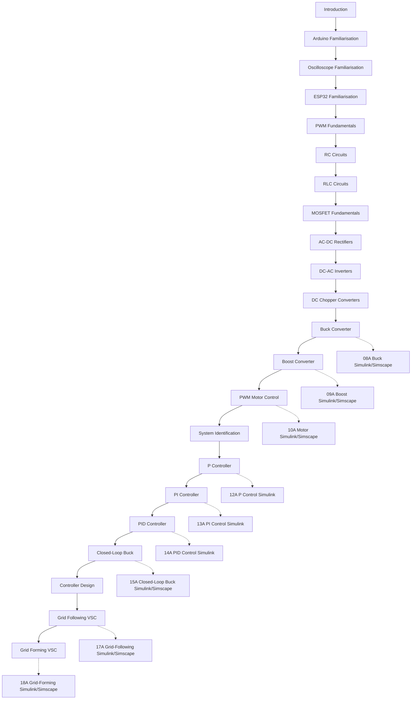

# Power Electronics and Control Training

Welcome to the course.

## Course Topics

- Electronics Fundamentals
- PWM
- RC and RLC Circuits
- MATLAB Modelling
- Simulink Control Design
- Simscape Electrical Modelling
- Control Systems
- Power Electronics
- Inverters
- System Identification
- Grid-Following VSC
- Grid-Forming VSC

## Recommended Hardware

### Controllers

- Arduino Uno
- ESP32 DevKit V1

### Test Equipment

- DSO Nano V3
- OWON HDS272S

### Software

- MATLAB
- Simulink
- Simscape Electrical

## Start Here

1. Introduction
2. Arduino Uno Familiarisation
3. DSO Nano V3 Familiarisation

## Learning Path

The main learning path remains hardware-first, with simulation companion pages added where they provide clear value.

See also:

- Simulation_Track_Overview.md

Current simulation companion pages:

- 08A_Buck_Simulink_Simscape.md
- 09A_Boost_Simulink_Simscape.md
- 10A_Motor_Simulink_Simscape.md
- 12A_P_Controller_Simulink.md
- 13A_PI_Controller_Simulink.md
- 14A_PID_Controller_Simulink.md
- 15A_Closed_Loop_Buck_Simulink_Simscape.md
- 17A_Grid_Following_Simulink_Simscape.md
- 18A_Grid_Forming_Simulink_Simscape.md

