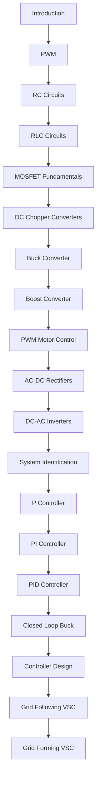

# Power Electronics and Control Training

Welcome to the course.

## Course Topics

- Electronics Fundamentals
- PWM
- RC and RLC Circuits
- Control Systems
- Power Electronics
- Inverters
- System Identification
- Grid-Following VSC
- Grid-Forming VSC

## Recommended Hardware

### Controllers

- Arduino Uno
- ESP32 DevKit V1

### Test Equipment

- DSO Nano V3
- OWON HDS272S

## Start Here

1. Introduction
2. Arduino Uno Familiarisation
3. DSO Nano V3 Familiarisation

## Learning Path

