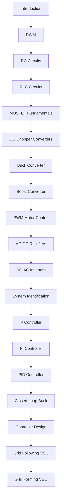

# Power Electronics and Control Training

Welcome to the course.

## Course Topics

- Electronics Fundamentals
- PWM
- RC and RLC Circuits
- Control Systems
- Power Electronics
- Inverters
- System Identification
- Grid-Following VSC
- Grid-Forming VSC

## Recommended Hardware

### Controllers

- Arduino Uno
- ESP32 DevKit V1

### Test Equipment

- DSO Nano V3
- OWON HDS272S

## Start Here

1. [Introduction](00_Introduction.md)
2. [Arduino Uno / ESP32 Familiarisation](00A_Microcontroller_Familiarisation.md)
3. [DSO Nano V3 / OWON HDS272S Familiarisation](00B_Oscilloscope_Familiarisation.md)
4. [ESP32 WiFi Controller Familiarisation](00C_WiFi_Controller_Familiarisation.md)

## Lab Index

### Foundations

| Lab | Title |
|-----|-------|
| 00 | [Introduction](00_Introduction.md) |
| 00A | [Microcontroller Familiarisation](00A_Microcontroller_Familiarisation.md) |
| 00B | [Oscilloscope Familiarisation](00B_Oscilloscope_Familiarisation.md) |
| 00C | [WiFi Controller Familiarisation](00C_WiFi_Controller_Familiarisation.md) |

### Electronics

| Lab | Title |
|-----|-------|
| 01 | [PWM Fundamentals](01_PWM_Fundamentals.md) |
| 02 | [RC Circuits](02_RC_Circuits.md) |
| 03 | [RLC Circuits](03_RLC_Circuits.md) |
| 04 | [MOSFET Fundamentals](04_MOSFET_Fundamentals.md) |

### Power Electronics

| Lab | Title |
|-----|-------|
| 05 | [DC Chopper Converters](05_DC_Chopper_Converters.md) |
| 06 | [Buck Converter](06_Buck_Converter.md) |
| 07 | [Boost Converter](07_Boost_Converter.md) |
| 08 | [PWM Motor Control](08_PWM_Motor_Control.md) |
| 09 | [AC-DC Rectifiers](09_AC_DC_Rectifiers.md) |
| 10 | [DC-AC Inverters](10_DC_AC_Inverters.md) |

### Control Systems

| Lab | Title |
|-----|-------|
| 11 | [System Identification](11_System_Identification.md) |
| 12 | [P Controller](12_P_Controller.md) |
| 13 | [PI Controller](13_PI_Controller.md) |
| 14 | [PID Controller](14_PID_Controller.md) |
| 15 | [Closed-Loop Buck Converter](15_Closed_Loop_Buck.md) |
| 16 | [Controller Design](16_Controller_Design.md) |

### Advanced Topics

| Lab | Title |
|-----|-------|
| 17 | [Grid-Following VSC](17_Grid_Following_VSC.md) |
| 18 | [Grid-Forming VSC](18_Grid_Forming_VSC.md) |

## Learning Path

