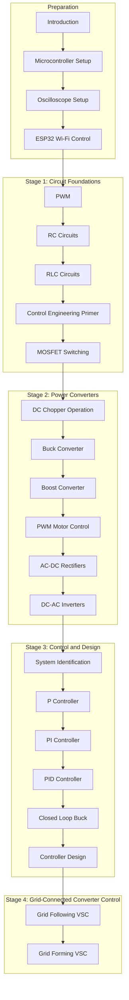

# Power Electronics and Control Training

Welcome to the course.

## Course Topics

- Circuit Foundations
- PWM
- RC and RLC Circuits
- Control Systems
- Power Electronics
- Inverters
- System Identification
- Grid-Following VSC
- Grid-Forming VSC

## Recommended Hardware

### Controllers

- Arduino Uno
- ESP32 DevKit V1

### Test Equipment

- DSO Nano V3
- OWON HDS272S

## Start Here

1. [Introduction](00_Introduction.md)
2. [Microcontroller Setup (Arduino Uno / ESP32)](00A_Microcontroller_Setup.md)
3. [Oscilloscope Setup (DSO Nano V3 / OWON HDS272S)](00B_Oscilloscope_Setup.md)
4. [ESP32 Wi-Fi Control](00C_ESP32_WiFi_Control.md)
5. [Control Engineering Primer](00D_Control_Engineering_Primer.md)

## Lab Index

### Foundations

| Lab | Title |
|-----|-------|
| 00 | [Introduction](00_Introduction.md) |
| 00A | [Microcontroller Setup](00A_Microcontroller_Setup.md) |
| 00B | [Oscilloscope Setup](00B_Oscilloscope_Setup.md) |
| 00C | [ESP32 Wi-Fi Control](00C_ESP32_WiFi_Control.md) |
| 00D | [Control Engineering Primer](00D_Control_Engineering_Primer.md) |

### Electronics

| Lab | Title |
|-----|-------|
| 01 | [PWM Operation](01_PWM_Operation.md) |
| 02 | [RC Circuits](02_RC_Circuits.md) |
| 03 | [RLC Circuits](03_RLC_Circuits.md) |
| 04 | [MOSFET Switching](04_MOSFET_Switching.md) |

### Power Electronics

| Lab | Title |
|-----|-------|
| 05 | [DC Chopper Operation](05_DC_Chopper_Converters.md) |
| 06 | [Buck Converter](06_Buck_Converter.md) |
| 07 | [Boost Converter](07_Boost_Converter.md) |
| 08 | [PWM Motor Control](08_PWM_Motor_Control.md) |
| 09 | [AC-DC Rectifiers](09_AC_DC_Rectifiers.md) |
| 10 | [DC-AC Inverters](10_DC_AC_Inverters.md) |

### Control Systems

| Lab | Title |
|-----|-------|
| 11 | [System Identification](11_System_Identification.md) |
| 12 | [P Controller](12_P_Controller.md) |
| 13 | [PI Controller](13_PI_Controller.md) |
| 14 | [PID Controller](14_PID_Controller.md) |
| 15 | [Closed-Loop Buck Converter](15_Closed_Loop_Buck.md) |
| 16 | [Controller Design](16_Controller_Design.md) |

### Advanced Topics

| Lab | Title |
|-----|-------|
| 17 | [Grid-Following VSC](17_Grid_Following_VSC.md) |
| 18 | [Grid-Forming VSC](18_Grid_Forming_VSC.md) |

## Textbook Reading Path

Use the [Textbook Reading Path](Textbook_Resources.md) before each lab. It provides a lab-first roadmap, book titles, chapter mappings, prediction prompts, and the differences between textbook assumptions and practical lab models.

## Learning Path

```mermaid
flowchart TD

subgraph S0[Preparation]
A[Introduction]
--> A1[Microcontroller Setup]

A1 --> A2[Oscilloscope Setup]

A2 --> A3[ESP32 Wi-Fi Control]
end

subgraph S1[Stage 1: Circuit Foundations]
A3 --> B[PWM]

B --> C[RC Circuits]

C --> D[RLC Circuits]

D --> CP[Control Engineering Primer]

CP --> E[MOSFET Switching]
end

subgraph S2[Stage 2: Power Converters]
E --> F[DC Chopper Operation]

F --> G[Buck Converter]

G --> H[Boost Converter]

H --> I[PWM Motor Control]

I --> J[AC-DC Rectifiers]

J --> K[DC-AC Inverters]
end

subgraph S3[Stage 3: Control and Design]
K --> L[System Identification]

L --> M[P Controller]

M --> N[PI Controller]

N --> O[PID Controller]

O --> P[Closed Loop Buck]

P --> Q[Controller Design]
end

subgraph S4[Stage 4: Grid-Connected Converter Control]
Q --> R[Grid Following VSC]

R --> S[Grid Forming VSC]
end
```
